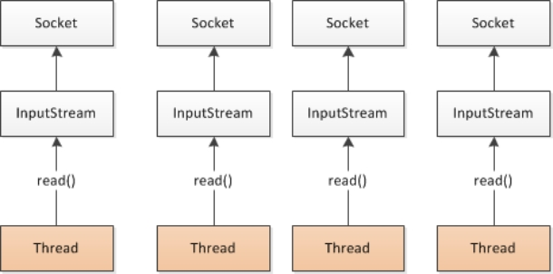

# 一、基础知识

## 分布式基础理论

### 什么是分布式系统？

《分布式系统原理与范型》定义：

分布式系统是若干独立计算机的集合，这些计算机对于用户来说就像单个相关系统”

分布式系统（distributed system）是建立在网络之上的软件系统。


随着互联网的发展，网站应用的规模不断扩大，常规的垂直应用架构已无法应对，分布式服务架构以及流动计算架构势在必行，亟需**一个治理系统**确保架构有条不紊的演进。

### 发展演变

 

 

#### **单一应用架构**

当网站流量很小时，只需一个应用，将所有功能都部署在一起，以减少部署节点和成本。此时，用于简化增删改查工作量的数据访问框架(ORM)是关键。

 

适用于小型网站，小型管理系统，将所有功能都部署到一个功能里，简单易用。

==缺点：== 

1. 性能扩展比较难 

2. 协同开发问题

3. 不利于升级维护

 

#### **垂直应用架构**

当访问量逐渐增大，单一应用增加机器带来的加速度越来越小，将应用拆成互不相干的几个应用，以提升效率。此时，用于加速前端页面开发的Web框架(MVC)是关键。

 

通过切分业务来实现各个模块独立部署，降低了维护和部署的难度，团队各司其职更易管理，性能扩展也更方便，更有针对性。

==缺点：== 公用模块无法重复利用，开发性的浪费

#### **分布式服务架构**

当垂直应用越来越多，应用之间交互不可避免，将核心业务抽取出来，作为独立的服务，逐渐形成稳定的服务中心，使前端应用能更快速的响应多变的市场需求。此时，用于提高业务复用及整合的**分布式服务框架(RPC)**是关键。

 

 

#### **流动计算架构**

当服务越来越多，容量的评估，小服务资源的浪费等问题逐渐显现，此时需增加一个调度中心基于访问压力实时管理集群容量，提高集群利用率。此时，用于**提高机器利用率的资源调度和治理中心***是关键。

 

 

### RPC

#### **什么叫RPC**

RPC【Remote Procedure Call】是指远程过程调用，是一种进程间通信方式，他是一种技术的思想，而不是规范。它允许程序调用另一个地址空间（通常是共享网络的另一台机器上）的过程或函数，而不用程序员显式编码这个远程调用的细节。即程序员无论是调用本地的还是远程的函数，本质上编写的调用代码基本相同。

#### **RPC基本原理**

 

 

RPC两个核心模块：通讯，序列化。

 

## dubbo核心概念

### 简介

Apache Dubbo (incubating) |ˈdʌbəʊ| 是一款高性能、轻量级的开源Java RPC框架，它提供了三大核心能力：面向接口的远程方法调用，智能容错和负载均衡，以及服务自动注册和发现。

官网：

http://dubbo.apache.org/

### 基本概念

 

 **服务提供者**（Provider）：暴露服务的服务提供方，服务提供者在启动时，向注册中心注册自己提供的服务。

**服务消费者**（Consumer）: 调用远程服务的服务消费方，服务消费者在启动时，向注册中心订阅自己所需的服务，服务消费者，从提供者地址列表中，基于软负载均衡算法，选一台提供者进行调用，如果调用失败，再选另一台调用。

**注册中心**（Registry）：注册中心返回服务提供者地址列表给消费者，如果有变更，注册中心将基于长连接推送变更数据给消费者

**监控中心**（Monitor）：服务消费者和提供者，在内存中累计调用次数和调用时间，定时每分钟发送一次统计数据到监控中心

==调用关系说明==

-  服务容器负责启动，加载，运行服务提供者。

-  服务提供者在启动时，向注册中心注册自己提供的服务。

-  服务消费者在启动时，向注册中心订阅自己所需的服务。

-  注册中心返回服务提供者地址列表给消费者，如果有变更，注册中心将基于长连接推送变更数据给消费者。

- 服务消费者，从提供者地址列表中，基于软负载均衡算法，选一台提供者进行调用，如果调用失败，再选另一台调用。

- 服务消费者和提供者，在内存中累计调用次数和调用时间，定时每分钟发送一次统计数据到监控中心。

## dubbo环境搭建

### **安装jdk**

[下载jdk](http://www.oracle.com/technetwork/java/javase/downloads/jdk8-downloads-2133151.html)

```shell
#解压
tar -zxvf jdk-8u301-linux-x64.tar.gz
mv jdk-8u301-linux-x64/  /opt/java

#配置环境标量
export JAVA_HOME=/opt/jdk
export PATH=$JAVA_HOME/bin:$PATH
#刷新环境
source /etc/profile
```

 

### **安装zookeeper**

[下载zookeeper网址](https://archive.apache.org/dist/zookeeper/zookeeper-3.4.11/) 

```shell
#下载
wget https://archive.apache.org/dist/zookeeper/zookeeper-3.4.11/zookeeper-3.4.11.tar.gz 
#解压 
tar -zxvf zookeeper-3.4.11.tar.gz 
#移动到指定位置并改名为zookeeper
mv zookeeper-3.4.11 /usr/local/zookeeper
 
```

 

### **开机启动zookeeper**

1. 复制如下脚本

```shell
#!/bin/bash
#chkconfig:2345 20 90
#description:zookeeper
#processname:zookeeper
ZK_PATH=/usr/local/zookeeper
export JAVA_HOME=/opt/jdk
case $1 in
         start) sh  $ZK_PATH/bin/zkServer.sh start;;
         stop)  sh  $ZK_PATH/bin/zkServer.sh stop;;
         status) sh  $ZK_PATH/bin/zkServer.sh status;;
         restart) sh $ZK_PATH/bin/zkServer.sh restart;;
         *)  echo "require start|stop|status|restart"  ;;
esac
```

2. 把脚本注册为Service

3. 增加权限

### **配置zookeeper**

1. [下载zookeeper网址](https://archive.apache.org/dist/zookeeper/zookeeper-3.4.13/ ) 
2. 修改zoo.cfg配置文件将conf下的zoo_sample.cfg复制一份改名为**zoo.cfg**即可。注意几个重要位置：dataDir=./  临时数据存储的目录（可写相对路径）clientPort=2181  zookeeper的端口号修改完成后再次启动zookeeper
3. 运行bin目录下 ./zkServer.sh


## dubbo-helloworld

### 提出需求

某个电商系统，订单服务需要调用用户服务获取某个用户的所有地址；

我们现在 需要创建两个服务模块进行测试 

| 模块                | 功能           |
| ------------------- | -------------- |
| 订单服务web模块     | 创建订单等     |
| 用户服务service模块 | 查询用户地址等 |

测试预期结果：

​	订单服务web模块在A服务器，用户服务模块在B服务器，A可以远程调用B的功能。

### 工程架构

根据 dubbo《服务化最佳实践》 

#### **分包**

**建议将服务接口，服务模型，服务异常等均放在 API 包中**，因为服务模型及异常也是 API 的一部分，同时，这样做也符合分包原则：重用发布等价原则(REP)，共同重用原则(CRP)。

如果需要，也可以考虑在 API 包中放置一份 spring 的引用配置

#### **粒度**

服务接口尽可能大粒度，每个服务方法应代表一个功能，而不是某功能的一个步骤，否则将面临分布式事务问题，Dubbo 暂未提供分布式事务支持。

服务接口建议以业务场景为单位划分，并对相近业务做抽象，防止接口数量爆炸。

不建议使用过于抽象的通用接口，如：Map query(Map)，这样的接口没有明确语义，会给后期维护带来不便。

###  创建模块

> 创建父工程(只需要留iml、pom)

```xml
<!--pom依赖-->
<modelVersion>4.0.0</modelVersion>
    <modules>
        <module>model-api</module>
        <module>model-user</module>
        <module>model-order</module>
    </modules>

    <groupId>com.xa</groupId>
    <artifactId>demo_parser</artifactId>
    <version>0.0.1-SNAPSHOT</version>
    <packaging>pom</packaging>

    <properties>
        <java.version>1.8</java.version>
    </properties>

        <dependencies>
            <dependency>
                <groupId>org.springframework.boot</groupId>
                <artifactId>spring-boot-dependencies</artifactId>
                <version>2.5.4</version>
                <type>pom</type>
                <scope>import</scope>
            </dependency>
            <dependency>
                <groupId>org.springframework.boot</groupId>
                <artifactId>spring-boot-starter-web</artifactId>
                <version>2.5.4</version>
            </dependency>
            <dependency>
                <groupId>org.projectlombok</groupId>
                <artifactId>lombok</artifactId>
                <version>1.18.20</version>
            </dependency>
            <dependency>
                <groupId>org.apache.dubbo</groupId>
                <artifactId>dubbo-spring-boot-starter</artifactId>
                <version>2.7.3</version>
            </dependency>
            <dependency>
                <groupId>org.apache.dubbo</groupId>
                <artifactId>dubbo-dependencies-zookeeper</artifactId>
                <version>2.7.3</version>
                <type>pom</type>
            </dependency>
        </dependencies>
```

> 创建 子工程

1. model-api:公共接口层(bean、service、exception)

```java
//bean
public class UserAddress implements Serializable{//必须序列化
    private Integer id;
    private String userAddress;
    private String userId;
    private String consignee;
    private String phoneNum;
    private String isDefault;
}
//service
public interface UserService{
    public List<UserAddress> getUserAddressList(String userId);
}

```

2. model-user：用户模块(**生产者**)

```xml
<!--pom引入公共接口-->
 <dependencies>
  	<dependency>
  		<groupId>com.atguigu.dubbo</groupId>
  		<artifactId>gmall-interface</artifactId>
  		<version>0.0.1-SNAPSHOT</version>
  	</dependency>
     
     可以使用父工程引入的依赖，在公共接口层引入依赖，消费者、生产者在引入公共接口层pom的时候，相当于引用了公共接口层的pom
  </dependencies>
```

```java
@Component //spring注解
@Service //dubbo注解 暴露服务  需要在启动类启动dubbo注解支持 @EnableDubbo
//import org.apache.dubbo.config.annotation.Service;
public class UserServiceImpl implements UserService {

    @Autowird
    UserAddressDao userAddressDao;
    
	@Override
	public List<UserAddress> getUserAddressList(String userId) {
		// TODO Auto-generated method stub
		return userAddressDao.getUserAddressById(userId);
	}

}
```

3. model-order：订单模块（**消费者**）

```xml
<!--公共接口-->
<dependencies>
  	<dependency>
  		<groupId>com.atguigu.dubbo</groupId>
  		<artifactId>gmall-interface</artifactId>
  		<version>0.0.1-SNAPSHOT</version>
  	</dependency>
   </dependencies>
```

```java
public class OrderService {
	 @Reference //引用远程服务
	UserService userService;
	
	/**
	 * 初始化订单，查询用户的所有地址并返回
	 * @param userId
	 * @return
	 */
	public List<UserAddress> initOrder(String userId){
		return userService.getUserAddressList(userId);
	}

}
```

## 5、监控中心

### dubbo-admin

图形化的服务管理页面；安装时需要指定注册中心地址，即可从注册中心中获取到所有的提供者/消费者进行配置管理


### dubbo-monitor-simple

简单的监控中心；

#### **安装**

1. [下载 dubbo-ops](https://github.com/apache/incubator-dubbo-ops)
2. 修改配置指定注册中心地址进入 dubbo-monitor-simple修改 dubbo.properties文件，*端口*也可以修改 

#### **2、监控中心配置**

所有服务配置连接监控中心，进行监控统计 

 <!-- 监控中心协议，如果为protocol="registry"，表示从注册中心发现监控中心地址，否则直连监控中心 -->

​	<dubbo:monitor protocol=**"registry"**></dubbo:monitor> 

Simple Monitor 挂掉不会影响到 Consumer 和 Provider 之间的调用，所以用于生产环境不会有风险。

Simple Monitor 采用磁盘存储统计信息，请注意安装机器的磁盘限制，如果要集群，建议用mount共享磁盘。

 


# 二、dubbo配置

## 1、配置原则

 

JVM 启动 -D 参数优先，这样可以使用户在部署和启动时进行参数重写，比如在启动时需改变协议的端口。

XML 次之，如果在 XML 中有配置，则 dubbo.properties 中的相应配置项无效。

Properties 最后，相当于缺省值，只有 XML 没有配置时，dubbo.properties 的相应配置项才会生效，通常用于共享公共配置，比如应用名。

## 2、重试次数

失败自动切换，当出现失败，重试其它服务器，但重试会带来更长延迟。可通过 retries="2" 来设置重试次数(不含第一次)。

重试次数配置如下：<dubbo:service retries="2" />或<dubbo:reference retries="2" />或<dubbo:reference>  <dubbo:method name="findFoo" retries="2" /></dubbo:reference>

 

## 3、超时时间

由于网络或服务端不可靠，会导致调用出现一种不确定的中间状态（超时）。为了避免超时导致客户端资源（线程）挂起耗尽，必须设置超时时间。

### 1、Dubbo消费端 

全局超时配置<dubbo:consumer timeout="5000" /> 指定接口以及特定方法超时配置<dubbo:reference interface="com.foo.BarService" timeout="2000">  <dubbo:method name="sayHello" timeout="3000" /></dubbo:reference>

 

### 2、Dubbo服务端 

全局超时配置<dubbo:provider timeout="5000" /> 指定接口以及特定方法超时配置<dubbo:provider interface="com.foo.BarService" timeout="2000">  <dubbo:method name="sayHello" timeout="3000" /></dubbo:provider>

 

### 3、配置原则

dubbo推荐在Provider上尽量多配置Consumer端属性：

1、作服务的提供者，比服务使用方更清楚服务性能参数，如调用的超时时间，合理的重试次数，等等2、在Provider配置后，Consumer不配置则会使用Provider的配置值，即Provider配置可以作为Consumer的缺省值。否则，Consumer会使用Consumer端的全局设置，这对于Provider不可控的，并且往往是不合理的

 

配置的覆盖规则：

\1) 方法级配置别优于接口级别，即小Scope优先 

\2) Consumer端配置 优于 Provider配置 优于 全局配置，

\3) 最后是Dubbo Hard Code的配置值（见配置文档）

 

 

## 4、版本号

当一个接口实现，出现不兼容升级时，可以用版本号过渡，版本号不同的服务相互间不引用。

可以按照以下的步骤进行版本迁移：

在低压力时间段，先升级一半提供者为新版本

再将所有消费者升级为新版本

然后将剩下的一半提供者升级为新版本

老版本服务提供者配置：<dubbo:service interface="com.foo.BarService" version="1.0.0" /> 新版本服务提供者配置：<dubbo:service interface="com.foo.BarService" version="2.0.0" /> 老版本服务消费者配置：<dubbo:reference id="barService" interface="com.foo.BarService" version="1.0.0" /> 新版本服务消费者配置：<dubbo:reference id="barService" interface="com.foo.BarService" version="2.0.0" /> 如果不需要区分版本，可以按照以下的方式配置：<dubbo:reference id="barService" interface="com.foo.BarService" version="*" />

 

 

# 三、高可用

## 1、zookeeper宕机与dubbo直连

现象：zookeeper注册中心宕机，还可以消费dubbo暴露的服务。

原因：

健壮性l 监控中心宕掉不影响使用，只是丢失部分采样数据l 数据库宕掉后，注册中心仍能通过缓存提供服务列表查询，但不能注册新服务l 注册中心对等集群，任意一台宕掉后，将自动切换到另一台l **注册中心全部宕掉后，服务提供者和服务消费者仍能通过本地缓存通讯**l 服务提供者无状态，任意一台宕掉后，不影响使用l 服务提供者全部宕掉后，服务消费者应用将无法使用，并无限次重连等待服务提供者恢复 

高可用：通过设计，减少系统不能提供服务的时间；

## 2、集群下dubbo负载均衡配置

在集群负载均衡时，Dubbo 提供了多种均衡策略，缺省为 random 随机调用。

负载均衡策略

**Random LoadBalance**随机，按权重设置随机概率。在一个截面上碰撞的概率高，但调用量越大分布越均匀，而且按概率使用权重后也比较均匀，有利于动态调整提供者权重。**RoundRobin LoadBalance**轮循，按公约后的权重设置轮循比率。存在慢的提供者累积请求的问题，比如：第二台机器很慢，但没挂，当请求调到第二台时就卡在那，久而久之，所有请求都卡在调到第二台上。**LeastActive LoadBalance**最少活跃调用数，相同活跃数的随机，活跃数指调用前后计数差。使慢的提供者收到更少请求，因为越慢的提供者的调用前后计数差会越大。**ConsistentHash LoadBalance**一致性 Hash，相同参数的请求总是发到同一提供者。当某一台提供者挂时，原本发往该提供者的请求，基于虚拟节点，平摊到其它提供者，不会引起剧烈变动。算法参见：http://en.wikipedia.org/wiki/Consistent_hashing缺省只对第一个参数 Hash，如果要修改，请配置 <dubbo:parameter key="hash.arguments" value="0,1" />缺省用 160 份虚拟节点，如果要修改，请配置 <dubbo:parameter key="hash.nodes" value="320" />

 

## 3、整合hystrix，服务熔断与降级处理

### 1、服务降级

**什么是服务降级？**

**当服务器压力剧增的情况下，根据实际业务情况及流量，对一些服务和页面有策略的不处理或换种简单的方式处理，从而释放服务器资源以保证核心交易正常运作或高效运作。**

可以通过服务降级功能临时屏蔽某个出错的非关键服务，并定义降级后的返回策略。

向注册中心写入动态配置覆盖规则：

RegistryFactory registryFactory = ExtensionLoader.getExtensionLoader(RegistryFactory.class).getAdaptiveExtension();Registry registry = registryFactory.getRegistry(URL.valueOf("zookeeper://10.20.153.10:2181"));registry.register(URL.valueOf("override://0.0.0.0/com.foo.BarService?category=configurators&dynamic=false&application=foo&mock=force:return+null"));

 

其中：

l mock=force:return+null 表示消费方对该服务的方法调用都直接返回 null 值，不发起远程调用。用来屏蔽不重要服务不可用时对调用方的影响。

l 还可以改为 mock=fail:return+null 表示消费方对该服务的方法调用在失败后，再返回 null 值，不抛异常。用来容忍不重要服务不稳定时对调用方的影响。

 

 

### 2、集群容错

在集群调用失败时，Dubbo 提供了多种容错方案，缺省为 failover 重试。

**集群容错模式**

**Failover Cluster**失败自动切换，当出现失败，重试其它服务器。通常用于读操作，但重试会带来更长延迟。可通过 retries="2" 来设置重试次数(不含第一次)。 重试次数配置如下：<dubbo:service retries="2" />或<dubbo:reference retries="2" />或<dubbo:reference>  <dubbo:method name="findFoo" retries="2" /></dubbo:reference> **Failfast Cluster**快速失败，只发起一次调用，失败立即报错。通常用于非幂等性的写操作，比如新增记录。 **Failsafe Cluster**失败安全，出现异常时，直接忽略。通常用于写入审计日志等操作。 **Failback Cluster**失败自动恢复，后台记录失败请求，定时重发。通常用于消息通知操作。 **Forking Cluster**并行调用多个服务器，只要一个成功即返回。通常用于实时性要求较高的读操作，但需要浪费更多服务资源。可通过 forks="2" 来设置最大并行数。 **Broadcast Cluster**广播调用所有提供者，逐个调用，任意一台报错则报错 [2]。通常用于通知所有提供者更新缓存或日志等本地资源信息。 **集群模式配置**按照以下示例在服务提供方和消费方配置集群模式<dubbo:service cluster="failsafe" />或<dubbo:reference cluster="failsafe" />

 

### 3、整合hystrix

Hystrix 旨在通过控制那些访问远程系统、服务和第三方库的节点，从而对延迟和故障提供更强大的容错能力。Hystrix具备拥有回退机制和断路器功能的线程和信号隔离，请求缓存和请求打包，以及监控和配置等功能

#### **1、配置spring-cloud-starter-netflix-hystrix**

spring boot官方提供了对hystrix的集成，直接在pom.xml里加入依赖：

​    <dependency>      <groupId>org.springframework.cloud</groupId>      <artifactId>spring-cloud-starter-netflix-hystrix</artifactId>      <version>1.4.4.RELEASE</version>    </dependency>

 

然后在Application类上增加@EnableHystrix来启用hystrix starter：

@SpringBootApplication@EnableHystrixpublic class ProviderApplication { 

 

#### **2、配置Provider端**

在Dubbo的Provider上增加@HystrixCommand配置，这样子调用就会经过Hystrix代理。

@Service(version = "1.0.0")public class HelloServiceImpl implements HelloService {  @HystrixCommand(commandProperties = {   @HystrixProperty(name = "circuitBreaker.requestVolumeThreshold", value = "10"),   @HystrixProperty(name = "execution.isolation.thread.timeoutInMilliseconds", value = "2000") })  @Override  public String sayHello(String name) {    // System.out.println("async provider received: " + name);    // return "annotation: hello, " + name;    throw new RuntimeException("Exception to show hystrix enabled.");  }}

 

#### **3、配置Consumer端**

对于Consumer端，则可以增加一层method调用，并在method上配置@HystrixCommand。当调用出错时，会走到fallbackMethod = "reliable"的调用里。

 

  @Reference(version = "1.0.0")  private HelloService demoService;   @HystrixCommand(fallbackMethod = "reliable")  public String doSayHello(String name) {    return demoService.sayHello(name);  }  public String reliable(String name) {    return "hystrix fallback value";  }

 

 

 

 

# 四、dubbo原理	

## 1、RPC原理

 

一次完整的RPC调用流程（同步调用，异步另说）如下： **1）服务消费方（client）调用以本地调用方式调用服务；** 2）client stub接收到调用后负责将方法、参数等组装成能够进行网络传输的消息体； 3）client stub找到服务地址，并将消息发送到服务端； 4）server stub收到消息后进行解码； 5）server stub根据解码结果调用本地的服务； 6）本地服务执行并将结果返回给server stub； 7）server stub将返回结果打包成消息并发送至消费方； 8）client stub接收到消息，并进行解码； **9）服务消费方得到最终结果。**RPC框架的目标就是要2~8这些步骤都封装起来，这些细节对用户来说是透明的，不可见的。

## 2、netty通信原理

Netty是一个异步事件驱动的网络应用程序框架， 用于快速开发可维护的高性能协议服务器和客户端。它极大地简化并简化了TCP和UDP套接字服务器等网络编程。

BIO：(Blocking IO)

 

NIO (Non-Blocking IO)

 

Selector 一般称 为**选择器** ，也可以翻译为 **多路复用器，**

Connect（连接就绪）、Accept（接受就绪）、Read（读就绪）、Write（写就绪）

Netty基本原理：

 

 

 

## 3、dubbo原理

### 1、dubbo原理	-框架设计 

 

 

l config 配置层：对外配置接口，以 ServiceConfig, ReferenceConfig 为中心，可以直接初始化配置类，也可以通过 spring 解析配置生成配置类

l proxy 服务代理层：服务接口透明代理，生成服务的客户端 Stub 和服务器端 Skeleton, 以 ServiceProxy 为中心，扩展接口为 ProxyFactory

l registry 注册中心层：封装服务地址的注册与发现，以服务 URL 为中心，扩展接口为 RegistryFactory, Registry, RegistryService

l cluster 路由层：封装多个提供者的路由及负载均衡，并桥接注册中心，以 Invoker 为中心，扩展接口为 Cluster, Directory, Router, LoadBalance

l monitor 监控层：RPC 调用次数和调用时间监控，以 Statistics 为中心，扩展接口为 MonitorFactory, Monitor, MonitorService

l protocol 远程调用层：封装 RPC 调用，以 Invocation, Result 为中心，扩展接口为 Protocol, Invoker, Exporter

l exchange 信息交换层：封装请求响应模式，同步转异步，以 Request, Response 为中心，扩展接口为 Exchanger, ExchangeChannel, ExchangeClient, ExchangeServer

l transport 网络传输层：抽象 mina 和 netty 为统一接口，以 Message 为中心，扩展接口为 Channel, Transporter, Client, Server, Codec

l serialize 数据序列化层：可复用的一些工具，扩展接口为 Serialization, ObjectInput, ObjectOutput, ThreadPool

### 2、dubbo原理	-启动解析、加载配置信息 

 

### 3、dubbo原理	-服务暴露

 

### 4、dubbo原理	-服务引用

 

### 5、dubbo原理	-服务调用

 

 


