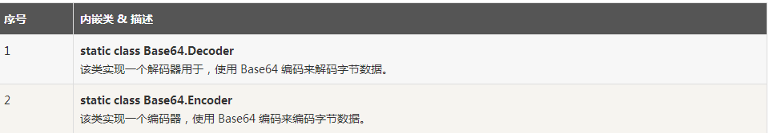
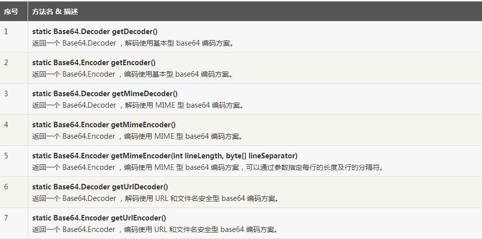
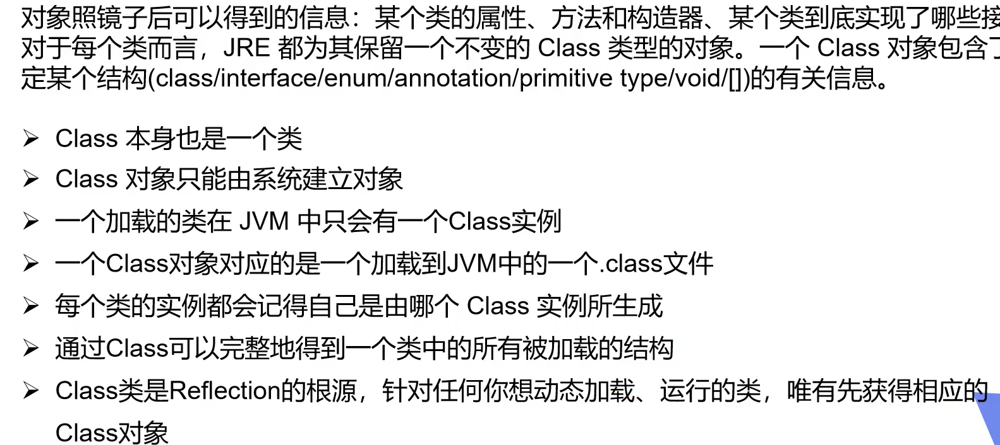
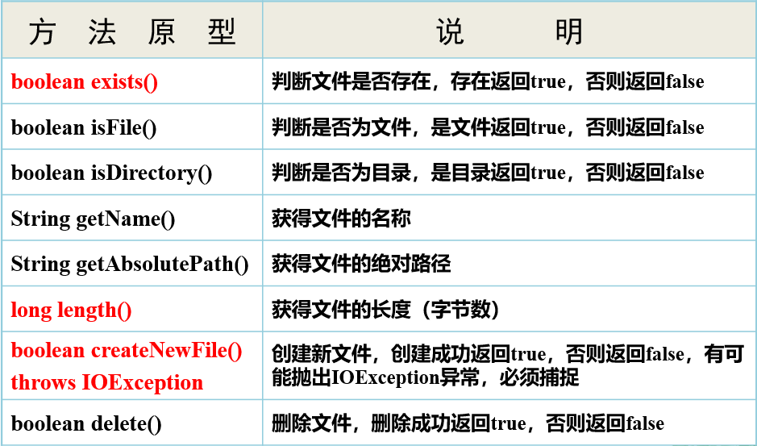
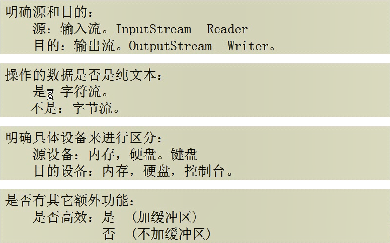

# 基础知识

## 初始化

常用初始化字段的办法：

- 在声明中赋值
- 在构造器中设置值

实际上，Java还有第三种机制，称为初始化块(initialization block)。在一个类的生命中，可以包含任意多个代码块。只要构造这个类的==对象==（调用构造方法——new A( )），这些块就会被执行。例如，

```java
public class Employee {
    private static int nextId;
    private static MyInnerClass myInnerClass = new MyInnerClass("静态变量:"+nextId++);
    private MyInnerClass getMyInnerClass = new MyInnerClass("普通变量:"+ nextId++);

    static {
        System.out.println("初始化 静态代码块："+nextId++);
    }

    {
        System.out.println("初始化 代码块: "+nextId++);
    }
    public Employee(){
        System.out.println("初始化 构造方法:"+nextId++);
    }
    public Employee(String name){
        
    }

    public static void main(String[] args) {
        new Employee();
    }
}

class MyInnerClass {
    public MyInnerClass(String description) {
        System.out.println(description);
    }
class Manager extends Employee{
    
	}
} 
```

​		在这个示例中，无论使用哪个构造器构造对象，id字段都会在这个对象初始化块中初始化。

​		==另外，需要注意的是：==java对象初始化的执行顺序为：静态变量初始化 >静态语句块>成员变量初始化>对象初始化块>构造方法，实例语句块与成员变量初始化的相对执行顺序取决于定义的先后顺序。结果如下：

```java
静态变量:0
初始化 静态代码块：1
普通变量:2
初始化 代码块: 3
初始化 构造方法:4
```

## 包名

​		使用包的主要原因是确保类名的唯一性。假如两个程序员不约而同地建立了Employee类。只要将这些类放置在不同的包中，就不会产生冲突。事实上，为了保证包名的绝对唯一性，要用一个因特网域名（这显然是唯一的）以逆序的形式作为包名，然后对于不用的工程使用不同的子包。例如horstmann.com。如果逆序来写，就得到了包名com.horstmann。然后追加一个工程名，如com.horstmann.corejava。如果再把Employee类放在这个包里，那么这个类的“完全限定”名就是com.horstmann.corejava.Employee

## 强制类型转换

指将一个类型强制转换成另外一个类型的过程。例如：

```java
double x =1.123d;
int nx = (ing)x;
```

类似浮点数转成整数一样，某个类的对象引用转换成另外一个类的对象引用。要完成对象引用的强制类型转换。

Manager a = (Manager) new Employee();   **父类**   ——>  **子类**

**子类转换为父类 属于多态的特征，可以直接转**

进行强制类型转换的唯一原因是：要在暂时忽略对象的实际类型之后使用对象的全部功能。

- ==只能在继承层次内进行强制类型转换==
- 在将超类强制转换成子类之前，应该使用 instanceof 进行检查


## 抽象类

- 即使不含抽象方法，也可以将类声明为抽象类
- 抽象类不能实例化
- 可以定义一个抽象类的对象变量，但是这样一个变量只能引用非抽象子类的对象

## 受保护

有些时候，你可能希望限制超类中的某个方法只允许子类访问，或者更少见地，可能希望允许子类的方法访问超类的某个字段。为此，需要将这些类方法或字段声明为**受保护**。例如，如果将超类Employee中的字段 xxx字段声明为proteced，而不是private，Manager方法就可以直接访问这个字段。

protected 需要从以下两个点来分析说明：

- **子类与基类在同一包中**：被声明为 protected 的变量、方法和构造器能被同一个包中的任何其他类访问；
- **子类与基类不在同一包中**：那么在子类中，子类实例可以访问其从基类继承而来的 protected 方法，而不能访问基类实例的protected方法

protected 可以修饰数据成员，构造方法，方法成员，**不能修饰类（内部类除外）**。

## Math计算知识

### 四舍五入、向上取整、向下取整

```java
Math.round(double a);
Math.ceil(double a);
Math.floor(double a);
```


### **判断各类型字符个数**

```java
public String strDir(String str){
    for(int i=str.length()-1; i>=0; i--){
            char c = str.charAt(i);
            if(Character.isLetter(c)){
                words++;//英文字母
            }else if (Character.isDigit(c)){
                numbers++;//数字
            }else if (Character.isWhitespace(c)){
                space++;//空格
            }else{
                other++;
            }               
        }
}
```


### 反转链表

```java

```


# [设计模式](https://gitee.com/xuaoGitee/design-mode.git)

<font color='green'>设计模式：</font>是对大家实际工作中写的各种代码进行**高层次抽象的总结**，其中最出名的当属Gang of Four* (*GoF*) 的分类了，他们将设计模式分类为 23 种经典的模式，根据用途我们又可以分为三大类，分别为`创建型模式`、`结构型模式`和`行为型模式`。

有一些重要的设计原则在开篇和大家分享下，这些原则将贯通全文：

1. 面向接口编程，而不是面向实现。这个很重要，也是<font color='blue'>优雅的</font>、<font color='blue'>可扩展的</font>代码的第一步，这就不需要多说了吧。
2. 职责单一原则。<font color='blue'>每个类都应该只有一个单一的功能</font>，并且该功能应该由这个类完全封装起来。
3. <font color='blue'>对修改关闭</font>，<font color='blue'>对扩展开放</font>。对修改关闭是说，我们辛辛苦苦加班写出来的代码，**该实现的功能和该修复的 bug 都完成了，别人可不能说改就改**；==对扩展开放就比较好理解了，也就是说在我们写好的代码基础上，很容易实现扩展。==


## 创建型模式

<font color='brown'>创建型模式的作用：</font>创建对象，说到创建一个对象，最熟悉的就是 new 一个对象，然后 set 相关属性。但是，在很多场景下，我们需要给客户端提供更加友好的创建对象的方式，尤其是那种我们定义了类，但是需要提供给其他开发者用的时候。

### 简单工厂模式

和名字一样简单，非常简单，直接上代码吧：

```java
public class FoodFactory {

    public static Food makeFood(String name) {
        if (name.equals("noodle")) {
            Food noodle = new LanZhouNoodle();
            noodle.addSpicy("more");
            return noodle;
        } else if (name.equals("chicken")) {
            Food chicken = new HuangMenChicken();
            chicken.addCondiment("potato");
            return chicken;
        } else {
            return null;
        }
    }
}
```

*中，LanZhouNoodle 和 HuangMenChicken 都继承自 Food。*

简单地说，简单工厂模式通常就是这样，一个工厂类 XxxFactory，里面有一个静态方法，根据我们不同的参数，返回不同的派生自同一个父类（或实现同一接口）的实例对象。

> 我们强调**职责单一**原则，一个类只提供一种功能，FoodFactory 的功能就是只要负责生产各种 Food。


### 工厂模式

简单工厂模式很简单，如果它能满足我们的需要，我觉得就不要折腾了。之所以需要引入工厂模式，是因为我们往往需要使用两个或两个以上的工厂。

```java
public interface FoodFactory {
    Food makeFood(String name);
}
public class ChineseFoodFactory implements FoodFactory {

    @Override
    public Food makeFood(String name) {
        if (name.equals("A")) {
            return new ChineseFoodA();
        } else if (name.equals("B")) {
            return new ChineseFoodB();
        } else {
            return null;
        }
    }
}
public class AmericanFoodFactory implements FoodFactory {

    @Override
    public Food makeFood(String name) {
        if (name.equals("A")) {
            return new AmericanFoodA();
        } else if (name.equals("B")) {
            return new AmericanFoodB();
        } else {
            return null;
        }
    }
}

```

其中，ChineseFoodA、ChineseFoodB、AmericanFoodA、AmericanFoodB 都派生自 Food。

客户端调用：

```java
public class APP {
    public static void main(String[] args) {
        // 先选择一个具体的工厂
        FoodFactory factory = new ChineseFoodFactory();
        // 由第一步的工厂产生具体的对象，不同的工厂造出不一样的对象
        Food food = factory.makeFood("A");
    }
}

```

虽然都是调用 makeFood(“A”) 制作 A 类食物，但是，不同的工厂生产出来的完全不一样。

第一步，我们需要选取合适的工厂，然后第二步基本上和简单工厂一样。

**核心在于，我们需要在第一步选好我们需要的工厂**。比如，我们有 LogFactory 接口，实现类有 FileLogFactory 和 KafkaLogFactory，分别对应将日志写入文件和写入 Kafka 中，显然，我们客户端第一步就需要决定到底要实例化 FileLogFactory 还是 KafkaLogFactory，这将决定之后的所有的操作。

### 抽象工厂模式

当涉及到**产品族**的时候，就需要引入抽象工厂模式了。

一个经典的例子是造一台电脑。我们先不引入抽象工厂模式，看看怎么实现。

因为电脑是由许多的构件组成的，我们将 CPU 和主板进行抽象，然后 CPU 由 CPUFactory 生产，主板由 MainBoardFactory 生产，然后，我们再将 CPU 和主板搭配起来组合在一起

这个时候的客户端调用是这样的：

```java
// 得到 Intel 的 CPU
CPUFactory cpuFactory = new IntelCPUFactory();
CPU cpu = intelCPUFactory.makeCPU();

// 得到 AMD 的主板
MainBoardFactory mainBoardFactory = new AmdMainBoardFactory();
MainBoard mainBoard = mainBoardFactory.make();

// 组装 CPU 和主板
Computer computer = new Computer(cpu, mainBoard);
12345678910
```

单独看 CPU 工厂和主板工厂，它们分别是前面我们说的**工厂模式**。这种方式也容易扩展，因为要给电脑加硬盘的话，只需要加一个 HardDiskFactory 和相应的实现即可，不需要修改现有的工厂。

<font color='red'>但是</font>，这种方式有一个问题，那就是如果 **Intel 家产的 CPU 和 AMD 产的主板不能兼容使用**，那么这代码就容易出错，因为客户端并不知道它们不兼容，也就会错误地出现随意组合。

下面就是我们要说的**产品族**的概念

当涉及到这种产品族的问题的时候，就需要抽象工厂模式来支持了。我们不再定义 CPU 工厂、主板工厂、硬盘工厂、显示屏工厂等等，我们直接定义电脑工厂，每个电脑工厂负责生产所有的设备，这样能保证肯定不存在兼容问题。

```java
public static void main(String[] args) {
    // 第一步就要选定一个“大厂”
    ComputerFactory cf = new AmdFactory();
    // 从这个大厂造 CPU
    CPU cpu = cf.makeCPU();
    // 从这个大厂造主板
    MainBoard board = cf.makeMainBoard();
  	// 从这个大厂造硬盘
  	HardDisk hardDisk = cf.makeHardDisk();
  
    // 将同一个厂子出来的 CPU、主板、硬盘组装在一起
    Computer result = new Computer(cpu, board, hardDisk);
}

```

当然，抽象工厂的问题也是显而易见的，比如我们要加个显示器，就需要修改所有的工厂，给所有的工厂都加上制造显示器的方法。这有点违反了**对修改关闭，对扩展开放**这个设计原则。


### **单例模式**

单例模式用得最多，错得最多。

饿汉模式最简单：

```java
public class Singleton {
    // 首先，将 new Singleton() 堵死
    private Singleton() {};
    // 创建私有静态实例，意味着这个类第一次使用的时候就会进行创建
    private static Singleton instance = new Singleton();
    
    public static Singleton getInstance() {
        return instance;
    }
    // 瞎写一个静态方法。这里想说的是，如果我们只是要调用 Singleton.getDate(...)，
    // 本来是不想要生成 Singleton 实例的，不过没办法，已经生成了
    public static Date getDate(String mode) {return new Date();}
}

```

> 很多人都能说出饿汉模式的缺点，可是我觉得生产过程中，很少碰到这种情况：你定义了一个单例的类，不需要其实例，可是你却把一个或几个你会用到的静态方法塞到这个类中。

饱汉模式最容易出错：

```java
public class Singleton {
    // 首先，也是先堵死 new Singleton() 这条路
    private Singleton() {}
    // 和饿汉模式相比，这边不需要先实例化出来，注意这里的 volatile，它是必须的
    private static volatile Singleton instance = null;

    public static Singleton getInstance() {
        if (instance == null) {
            // 加锁
            synchronized (Singleton.class) {
                // 这一次判断也是必须的，不然会有并发问题
                if (instance == null) {
                    instance = new Singleton();
                }
            }
        }
        return instance;
    }
}

```

> 双重检查，指的是两次检查 instance 是否为 null。
>
> volatile 在这里是需要的，希望能引起读者的关注。
>
> 很多人不知道怎么写，直接就在 getInstance() 方法签名上加上 synchronized，这就不多说了，性能太差。


枚举：

==枚举天然单例模式，且线程安全==

```java
public enum UserEnum{
    user("111");
    
    private String username;
    
    private UserEnum(String username){
        this.username = username;
    }
       
}
```


### 建造者模式

经常碰见的 XxxBuilder 的类，通常都是建造者模式的产物。建造者模式其实有很多的变种，但是对于客户端来说，我们的使用通常都是一个模式的：

```java
Food food = new FoodBuilder().a().b().c().build();
Food food = Food.builder().a().b().c().build();
```


```java
@Builder
class User {
    private String  name;
    private String password;
    private String nickName;
    private int age;
}

```


### 原型模式

这是我要说的创建型模式的最后一个设计模式了。

原型模式很简单：有一个原型**实例**，基于这个原型实例产生新的实例，也就是“克隆”了。

Object 类中有一个 clone() 方法，它用于生成一个新的对象，当然，如果我们要调用这个方法，java 要求我们的类必须先**实现 Cloneable 接口**，此接口没有定义任何方法，但是不这么做的话，在 clone() 的时候，会抛出 CloneNotSupportedException 异常。

```java
protected native Object clone() throws CloneNotSupportedException;
1
```

> java 的克隆是浅克隆，碰到对象引用的时候，克隆出来的对象和原对象中的引用将指向同一个对象。通常实现深克隆的方法是将对象进行序列化，然后再进行反序列化。

原型模式了解到这里我觉得就够了，各种变着法子说这种代码或那种代码是原型模式，没什么意义


## 结构性模式

### 适配器模式

适配器模式分接口适配器，类适配器，对象适配器。<font color = blue>例子：</font>转接口

`接口适配器`：一个接口有多个接口，现在只需要实现其中两个方法。

```java
public interface A{
    void method01();
    void method02();
    void method03();
    ....
}

class adapter implements A{
    void method01(){
        
    }
    void method02(){
        
    }
    void method03(){
        
    }
    ....
}
class B extends adapter{
    @Override
    void method01(){
        
    }
}
```


`类适配器：`

## 行为型模式

### **策略模式**

==策略模式贼贼贼常用==，应用场景：存在if - else 时就要考虑

使用场景：

 1、如果在一个系统里面有许多类，它们之间的区别仅在于它们的行为，那么使用策略模式可以动态地让一个对象在许多行为中选择一种行为。

 2、一个系统需要动态地在几种算法中选择一种。

 3、如果一个对象有很多的行为，如果不用恰当的模式，这些行为就只好使用多重的条件选择语句来实现。


==注意：==行为不同，会让你想起什么。特性，对就是他。接口`interface`

所以策略模式其实非常简单：将**特性的部分**定义为接口。不同的if，我们使用对应的实现类。

但是这好像也并没有消除if - else。我们传参不可能直接是实现类。那么我们可以使用map来将所有的实现类装起来，key对应参数。代码如下：

```java
/**
 * 策略模式
 */
@Component
@AllArgsConstructor
public class Context {

    private final List<Strategy> strategies; //所有策略类

    private Map<PayNum, Strategy> map; //使用map封装

    public @PostConstruct
    void init(){
        map = strategies.stream().collect(Collectors.toMap(p -> p.getPay(), p -> p));
    }

    public void doPay(PayNum payNum) {
        Strategy strategy = map.get(payNum);
        strategy.pay();
    }
}
```

```java
//策略接口
public interface Strategy {
    PayNum getPay();//对应策略的标志
    void pay(); //不同的特性
}
```

```java
@Component
public class Strategy01 implements Strategy{
    @Override
    public PayNum getPay() {
        return PayNum.WX;
    }

    @Override
    public void pay() {
        System.out.println("微信支付");
    }
}

```


# Java8新特性

## 一、Java 8 Lambda 表达式

Lambda 表达式，也可称为闭包，它是推动 Java 8 发布的最重要新特性。

Lambda 允许把函数作为一个方法的参数（函数作为参数传递进方法中）。

使用Lambda 表达式可以使代码变的更加简洁紧凑。

### 1.1 语法

lambda 表达式的语法格式如下：

(parameters) - > expression或(parameters) - >{statements; }

以下是lambda表达式的重要特征:

·    可选类型声明：不需要声明参数类型，编译器可以统一识别参数值。

·    可选的参数圆括号：一个参数无需定义圆括号，但多个参数需要定义圆括号。

·    可选的大括号：如果主体包含了一个语句，就不需要使用大括号。

·    可选的返回关键字：如果主体只有一个表达式返回值则编译器会自动返回值，大括号需要指定明表达式返回了一个数值。

### 1.2 Lambda 表达式实例

在Java8Tester.java 文件输入以下代码：

Java8Tester.java文件

```java
public class Java8Tester {
    public static void main(String args[]) {
        Java8Tester tester = new Java8Tester();
        // 类型声明
        MathOperation addition = (int a, int b) - > a + b;
        // 不用类型声明
        MathOperation subtraction = (a, b) - > a - b;
        // 大括号中的返回语句
        MathOperation multiplication = (int a, int b) - > {
            return a * b;
        };
        // 没有大括号及返回语句
        MathOperation division = (int a, int b) - > a / b;
        System.out.println("10 + 5 = " + tester.operate(10, 5, addition));
        System.out.println("10 - 5 = " + tester.operate(10, 5, subtraction));
        System.out.println("10 x 5 = " + tester.operate(10, 5, multiplication));
        System.out.println("10 / 5 = " + tester.operate(10, 5, division));
        // 不用括号
        GreetingService greetService1 = message - >
                System.out.println("Hello " + message);
        // 用括号
        GreetingService greetService2 = (message) - >
                System.out.println("Hello " + message);
        greetService1.sayMessage("Runoob");
        greetService2.sayMessage("Google");
    }
    interface MathOperation {
        int operation(int a, int b);
    }
    interface GreetingService {
        void sayMessage(String message);
    }
    private int operate(int a, int b, MathOperation mathOperation) {
        return mathOperation.operation(a, b);
    }
}
```

　　

执行以上脚本，输出结果为：

```sh
10+5=15
10-5=5
10 x 5=50
10/5=2
HelloRunoob
HelloGoogle
```

使用Lambda 表达式需要注意以下两点：

·    Lambda 表达式主要用来定义行内执行的方法类型接口，例如，一个简单方法接口。在上面例子中，我们使用各种类型的Lambda表达式来定义MathOperation接口的方法。然后我们定义了sayMessage的执行。

·    Lambda 表达式免去了使用匿名方法的麻烦，并且给予Java简单但是强大的函数化的编程能力。

### 1.3 变量作用域

lambda 表达式只能引用标记了 final 的外层局部变量，这就是说不能在lambda 内部修改定义在域外的局部变量，否则会编译错误。

在Java8Tester.java 文件输入以下代码：

Java8Tester.java文件

```java
public class Java8Tester {
    final static String salutation = "Hello! ";

    public static void main(String[] args) {
        GreetingService greetService1 = message ->
                System.out.println(salutation + message);
        greetService1.sayMessage("Runoob");
        //====================相当于下面==============================
        GreetingService g = new GreetingService() {
            @Override
            public void sayMessage(String message) {
                System.out.println(salutation + message);
            }
        };
    }

    @FunctionalInterface
    interface GreetingService {
        void sayMessage(String message);
    }
}
```

执行以上脚本，输出结果为：

```java
Hello! Runoob
Hello! jack
```

我们也可以直接在lambda 表达式中访问外层的局部变量：

```java

```

　　

lambda 表达式的局部变量可以不用声明为 final，但是必须不可被后面的代码修改（即隐性的具有final 的语义）

```java
public class Java8Tester {
    public static void main(String[] args) {
        final int num = 1;
        Converter<Integer, String> s = (param) -> System.out.println(param + num);
        s.convert(2);
       //
    }

    public interface Converter<T1, T2> {
        /**
         * 函数式接口
         * @param  i
          */
        void convert(int i);
    }
}
```

　　

```java
//报错信息：Local variable num defined in an enclosing scope must be final or effectively final
```

　　

```java
把num=5；注释掉就不报错了
```

　　

在Lambda 表达式当中不允许声明一个与局部变量同名的参数或者局部变量。

把String first = "";注掉就不报错了

## 二、Java 8 方法引用

方法引用通过方法的名字来指向一个方法。

方法引用可以使语言的构造更紧凑简洁，减少冗余代码。

方法引用使用一对冒号 :: 。

### 2.1方法引用

下面，我们在 Car 类中定义了 4 个方法作为例子来区分 Java 中 4 种不同方法的引用。

```java
class Car {
    @FunctionalInterface
    public interface Supplier<T> {
        T get();
    }

    //Supplier是jdk1.8的接口，这里和lamda一起使用了
    public static Car create(final Supplier<Car> supplier) {
        return supplier.get();
    }

    public static void collide(final Car car) {
        System.out.println("Collided " + car.toString());
    }

    public void follow(final Car another) {
        System.out.println("Following the " + another.toString());
    }

    public void repair() {
        System.out.println("Repaired " + this.toString());
    }

    public static void main(String[] args) {
        //构造器引用：它的语法是Class::new，或者更一般的Class< T >::new实例如下：
        Car car0 = Car.create(Car::new);
        //Car::new是实现j        //这段代码等价:
        Supplier<Car> supplier = () -> {
            Car car = new Car();
            return car;
        };
        car0 = Car.create(supplier);
        Car car1 = Car.create(Car::new);
        Car car2 = Car.create(Car::new);
        Car car3 = new Car();
        List<Car> cars = Arrays.asList(car0, car1, car2, car3);
        System.out.println("===================构造器引用========================");
        //静态方法引用：它的语法是Class::static_method，实例如下：
        cars.forEach(Car::collide);
        System.out.println("===================静态方法引用========================");
        //特定类的任意对象的方法引用：它的语法是Class::method实例如下：
        cars.forEach(Car::repair);
        System.out.println("==============特定类的任意对象的方法引用================");
        //特定对象的方法引用：它的语法是instance::method实例如下：
        final Car police = Car.create(Car::new);
        cars.forEach(police::follow);
        System.out.println("===================特定对象的方法引用===================");
    }
}
```

　　

### 2.2方法引用实例

在Java8Tester.java 文件输入以下代码：

```java
public class Java8Tester {
    public static void main(String args[]) {
        List names = new ArrayList();
        names.add("Google");
        names.add("Runoob");
        names.add("Taobao");
        names.add("Baidu");
        names.add("Sina");
        names.forEach(System.out::println);
    }
}
```

实例中我们将System.out::println 方法作为静态方法来引用。

执行以上脚本，输出结果为：

```java
	Google
    Runoob
    Taobao
    Baidu
    Sina
```

　　

## 三、Java 8 函数式接口

### 3.1 函数式接口实例

Predicate <T> 接口是一个函数式接口，它接受一个输入参数 T，返回一个布尔值结果。

该接口包含多种默认方法来将Predicate组合成其他复杂的逻辑（比如：与，或，非）。

该接口用于测试对象是 true 或 false。

我们可以通过以下实例（Java8Tester.java）来了解函数式接口 Predicate <T> 的使用：

**Java8Tester.java文件**

```java
public class Java8Tester {
    public static void main(String[] args){
        List<Integer> list = Arrays.asList(1, 2, 3, 4, 5, 6, 7, 8, 9);
        Predicate<Integer> predicate = n -> true;
        // n 是一个参数传递到 Predicate 接口的 test 方法
        // n 如果存在则 test 方法返回 true
        System.out.println("输出所有数据:");
        // 传递参数 n
         eval(list, n->true);
        Predicate<Integer> predicate1 = n -> n % 2 == 0;
        // n 是一个参数传递到 Predicate 接口的 test 方法
        // 如果 n%2 为 0 test 方法返回 true
        System.out.println("输出所有偶数:");
         eval(list, n -> n%2 == 0 );
        Predicate<Integer> predicate2 = n -> n > 3;
        // n 是一个参数传递到 Predicate 接口的 test 方法
        // 如果 n 大于 3 test 方法返回 true
        System.out.println("输出大于 3 的所有数字:");
         eval(list, n-> n > 3 );
    }
    public static void eval(List<Integer> list, Predicate<Integer> predicate) {
        for(Integer n: list) {
            if(predicate.test(n)) {
                System.out.println(n + " ");
            }
        }
    }
}
```

　　

执行以上脚本，输出结果为：

```java
123456789输出所有偶数:2468输出大于3的所有数字:456789
```

　　

## 四、Java 8 默认方法

Java 8 新增了接口的默认方法。

简单说，默认方法就是接口可以有实现方法，而且不需要实现类去实现其方法。

我们只需在方法名前面加个default关键字即可实现默认方法。

为什么要有这个特性？

首先，之前的接口是个双刃剑，好处是面向抽象而不是面向具体编程，缺陷是，当需要修改接口时候，需要修改全部实现该接口的类，目前的java 8之前的集合框架没有foreach方法，通常能想到的解决办法是在JDK里给相关的接口添加新的方法及实现。然而，==对于已经发布的版本，是没法在给接口添加新方法的同时不影响已有的实现。所以引进的默认方法。他们的目的是为了解决接口的修改与现有的实现不兼容的问题。==

### 4.1语法

默认方法语法格式如下：


```java
public interface vehicle {  
    default void print() {   
        System.out.println("我是一辆车!");  
    }
}
```

　　

### 4.2多个默认方法

一个接口有默认方法，考虑这样的情况，一个类实现了多个接口，且这些接口有相同的默认方法，以下实例说明了这种情况的解决方法

```java
public interface vehicle {    
    default void print() {   
        System.out.println("我是一辆车!");  
    }
}
```

　　

```java
public interface fourWheeler {  
    default void print() {   
        System.out.println("我是一辆四轮车!");
    }
}
```

　　

第一个解决方案是创建自己的默认方法，来覆盖重写接口的默认方法：

```java
public class Car implements vehicle, fourWheeler {   
    @Override   
    public void print() {  
        System.out.println("我是一辆四轮汽车!"); 
    }
}
```

　　

第二种解决方案可以使用 super 来调用指定接口的默认方法：

```java
public class Car implements vehicle, fourWheeler { 
    @Override   
    public void print() {    
        vehicle.super.print(); 
    }
}
```

　　

### 4.3 静态默认方法

Java 8 的另一个特性是接口可以声明（并且可以提供实现）静态方法。例如：

```java
public interface vehicle {   
    default void print() {  
        System.out.println("我是一辆车!"); 
    }    // 静态方法  
    static void blowHorn() {    
        System.out.println("按喇叭!!!"); 
    }
}
```

　　

### 4.4 默认方法实例

我们可以通过以下代码来了解关于默认方法的使用，可以将代码放入 Java8Tester.java 文件中：


```java
public class Java8Tester {  
    public static void main(String[] args) {   
        Vehicle vehicle = new Car();    
        vehicle.print();   
    }
} 
interface Vehicle {  
    default void print() {   
        System.out.println("我是一辆车!"); 
    }    
    static void blowHorn() {  
        System.out.println("按喇叭!!!"); 
    }
} 
interface FourWheeler {   
    default void print() {   
        System.out.println("我是一辆四轮车!");  
    }
} 
class Car implements Vehicle, FourWheeler { 
    public void print() {     
        Vehicle.super.print();   
        FourWheeler.super.print(); 
        Vehicle.blowHorn();   
        System.out.println("我是一辆汽车!");  
    }
}
```

　　

执行以上脚本，输出结果为：

```java
我是一辆车!我是一辆四轮车!按喇叭!!!我是一辆汽车!
```

　　

## 五、==Java 8 Stream==

Java 8 API添加了一个新的抽象称为流Stream，可以让你以一种声明的方式处理数据。

Stream使用一种类似用SQL语句从数据库查询数据的直观方式来提供一种对Java集合运算和表达的高阶抽象。

Stream API可以极大提高Java程序员的生产力，让程序员写出高效率、干净、简洁的代码。

这种风格将要处理的元素集合看作一种流，流在管道中传输，并且可以在管道的节点上进行处理，比如筛选，排序，聚合等。

元素流在管道中经过中间操作（intermediate operation）的处理，最后由最终操作(terminal operation)得到前面处理的结果。

### 5.1什么是 Stream？

Stream（流）是一个来自数据源的元素队列并支持聚合操作

元素：是特定类型的对象，形成一个队列。Java中的Stream并不会存储元素，而是按需计算。

数据源 ：流的来源。可以是集合，数组，I/O channel，产生器generator等。

聚合操作： 类似SQL语句一样的操作，比如filter, map, reduce, find,match, sorted等。

和以前的Collection操作不同，Stream操作还有两个基础的特征：

Pipelining:：中间操作都会返回流对象本身。这样多个操作可以串联成一个管道，如同流式风格（fluent style）。这样做可以对操作进行优化，比如延迟执行(laziness)和短路( short-circuiting)。

内部迭代：以前对集合遍历都是通过Iterator或者For-Each的方式,显式的在集合外部进行迭代，这叫做外部迭代。Stream提供了内部迭代的方式，通过访问者模式(Visitor)实现。

### 5.2生成流

在Java 8中,集合接口有两个方法来生成流：

stream() −为集合创建串行流。

parallelStream() − 为集合创建并行流。


```java
 public static void main(String[] args) {
        List<String> strings = Arrays.asList("abc", 
                                             "", "bc", "efg", "abcd", "", "jkl");
        List<String> filtered = strings.stream()
            .filter(string -> !string.isEmpty()).collect(Collectors.toList());
    }
```

　　

### 5.3  forEach

Stream 提供了新的方法 'forEach' 来迭代流中的每个数据。以下代码片段使用forEach 输出了10个随机数：

```java
Random random = new Random();

random.ints().limit(10).forEach(System.out::println);
```

　　

### 5.4 map

map 方法用于映射每个元素到对应的结果，以下代码片段使用 map 输出了元素对应的平方数：

```java
List<Integer> numbers = Arrays.asList(3, 2, 2, 3, 7, 3, 5);
// 获取对应的平方数
List<Integer> squaresList = numbers.stream()
    .map(i -> i * i).distinct().collect(Collectors.toList());
```

　　

### 5.5 filter

filter 方法用于通过设置条件过滤出元素。以下代码片段使用filter 方法过滤出空字符串：

```java
List<String>strings = Arrays.asList("abc", "", "bc", "efg", "abcd","", "jkl");
// 获取空字符串的数量
int count = (int) strings.stream().filter(string -> string.isEmpty()).count();
```

　　

### 5.6 limit

limit 方法用于获取指定数量的流。以下代码片段使用 limit 方法打印出 10 条数据：

```java
Random random = new Random();random.ints().limit(10).forEach(System.out::println);
```

　　

 

### 5.7 sorted

sorted 方法用于对流进行排序。以下代码片段使用 sorted 方法对输出的 10 个随机数进行排序：

```java
Random random = new Random();
random.ints().limit(10).sorted()
    .forEach(System.out::println);

// 降序 反序
Collections.reverse(salesData);
```

List倒叙排列

```java
List<类> rankList = new ArrayList<>(); 代表某个集合
 
//返回 对象集合以类属性一升序排序
 
rankList.stream().sorted(Comparator.comparing(类::属性一));
 
//返回 对象集合以类属性一降序排序 注意两种写法
 
rankList.stream().sorted(Comparator.comparing(类::属性一).reversed()); //先以属性一升序,然后对结果集进行属性一降序
 
rankList.stream().sorted(Comparator.comparing(类::属性一, Comparator.reverseOrder())); //以属性一降序
 
//返回 对象集合以类属性一升序 属性二升序
 
rankList.stream().sorted(Comparator.comparing(类::属性一).thenComparing(类::属性二));
 
//返回 对象集合以类属性一降序 属性二升序 注意两种写法
 
rankList.stream().sorted(Comparator.comparing(类::属性一).reversed().thenComparing(类::属性二));//先以属性一升序,升序结果进行属性一降序,再进行属性二升序
 
rankList.stream().sorted(Comparator.comparing(类::属性一,Comparator.reverseOrder()).thenComparing(类::属性二));//先以属性一降序,再进行属性二升序
 
//返回 对象集合以类属性一降序 属性二降序 注意两种写法
 
rankList.stream().sorted(Comparator.comparing(类::属性一).reversed().thenComparing(类::属性二,Comparator.reverseOrder()));//先以属性一升序,升序结果进行属性一降序,再进行属性二降序
 
rankList.stream().sorted(Comparator.comparing(类::属性一,Comparator.reverseOrder()).thenComparing(类::属性二,Comparator.reverseOrder()));//先以属性一降序,再进行属性二降序
 
//返回 对象集合以类属性一升序 属性二降序 注意两种写法
 
rankList.stream().sorted(Comparator.comparing(类::属性一).reversed().thenComparing(类::属性二).reversed());//先以属性一升序,升序结果进行属性一降序,再进行属性二升序,结果进行属性一降序属性二降序
 
rankList.stream().sorted(Comparator.comparing(类::属性一).thenComparing(类::属性二,Comparator.reverseOrder()));//先以属性一升序,再进行属性二降序

```

注意两种写法

1、 Comparator.comparing(类::属性一).reversed();

2、 Comparator.comparing(类::属性一,Comparator.reverseOrder());

两种排序是完全不一样的，方式1是得到排序结果后再排序，**方式2是直接进行排序！！！**


------

**场景二:含空值排序**

```java
Comparator.nullsFirst(Comparator.naturalOrder()))
空值放前面，剩下的升序排序
Comparator.nullsFirst(Comparator.reverseOrder()))
空值放前面，剩下的倒叙排序
Comparator.nullsLast(Comparator.naturalOrder()))
空值放最后，剩下的升序排序
Comparator.nullsLast(Comparator.reverseOrder()))
空值放最后，剩下的倒叙排序
```


有时候数据库会有一些错误数据，但是又要求程序不能报错，这怎么办呢？

含空值的正序（升序）排序(按创建时间排序)

```java
list=list.stream().sorted(Comparator.comparing(l -> l.getCreateTime(), Comparator.nullsFirst(Date::compareTo))).collect(Collectors.toList());
如果创建时间可能为空就会报错
```

含空值的倒序（降序）排序

nullsFirst：空值放第一位

```ja
list=list.stream().sorted(Comparator.comparing(l -> l.getCreateTime(), Comparator.nullsFirst(Date::compareTo).reversed())).collect(Collectors.toList());
```


nullsLast：空值放最后

```java
list=list.stream().sorted(Comparator.comparing(l -> l.getCreateTime(), Comparator.nullsLast(Date::compareTo).reversed())).collect(Collectors.toList());
```

------

**场景三：不用Stream**  

`解释：`stream对对象本身没有任何改变。有时候我们排序后希望是对对象本身

```java
// 正序
list.sort(Comparator.comparing(Integer::intValue));
 // 倒序
list.sort(Comparator.comparing(Integer::intValue).reversed());
 // 正序
list.sort(Comparator.comparing(Student::getAge));
  // 倒序
list.sort(Comparator.comparing(Student::getAge).reversed());
```


### 5.8 并行（parallel）程序

parallelStream 是流并行处理程序的代替方法。以下实例我们使用parallelStream 来输出空字符串的数量：

```java
List<String> strings = Arrays.asList("abc", "", "bc", "efg", "abcd", "", "jkl");
// 获取空字符串的数量
int count = (int) strings.parallelStream()
    .filter(string - > string.isEmpty()).count();
```

　　

我们可以很容易的在顺序运行和并行直接切换。

### 5.9 Collectors

Collectors 类实现了很多归约操作，例如将流转换成集合和聚合元素。Collectors可用于返回列表或字符串：

```java
List<String> strings = Arrays.asList("abc", "", "bc", "efg", "abcd", "", "jkl");
        List<String> filtered = strings.stream()
            .filter(string -> !string.isEmpty()).collect(Collectors.toList());
        System.out.println("筛选列表: " + filtered);
        String mergedString = strings.stream()
            .filter(string -> !string.isEmpty()).collect(Collectors.joining(", "));
        System.out.println("合并字符串: " + mergedString);
```


- 统计

```java
 // getAverage统计 sum() .mapToDouble()转换成double。还有其他类型转换。可以自己研究。max(),min(),average()
        double sum = list.stream().mapToDouble(Person::getAge).sum();
        Optional<Person> maxMassage = list.stream().collect(Collectors.maxBy(Comparator.comparing(Person::getId)));
        Long maxId = maxMassage.get().getId();
        LongSummaryStatistics lss = list.stream().collect(Collectors.summarizingLong(Person::getId));
        //  求和
         lss.getSum();
         //  求最大值
        lss.getMax();
        // 求最小值
         lss.getMin();
        // 求平均值
         lss.getAverage();
```

- 分组

```java
    Map<Integer, List<Person>> map = list.stream().collect(Collectors.groupingBy(Person::getAge));
        // 多重分组
         Map<String, Map<Integer, List<Person>>> map2 = list.stream()
                 .collect(Collectors.groupingBy(t ->t.getName(),Collectors.groupingBy(t ->t.getAge())));
         // 分组并计算综合      Collectors.summarizingLong()
        Map<String, Map<Integer, LongSummaryStatistics>> map3 = list.stream()
                .collect(Collectors.groupingBy(t ->t.getName(),Collectors.groupingBy(t ->t.getAge(),Collectors.summarizingLong(Person::getSize))));
   
```


　　

### 5.10 统计

另外，一些产生统计结果的收集器也非常有用。它们主要用于int、double、long等基本类型上，它们可以用来产生类似如下的统计结果。

```java
List<Integer> numbers = Arrays.asList(3, 2, 2, 3, 7, 3, 5);
IntSummaryStatistics stats = numbers.stream()
    .mapToInt((x) - > x).summaryStatistics();
System.out.println("列表中最大的数 : " + stats.getMax());
System.out.println("列表中最小的数 : " + stats.getMin());
System.out.println("所有数之和 : " + stats.getSum());
System.out.println("平均数 : " + stats.getAverage());
```

　　

### 5.11 Stream 完整实例

将以下代码放入Java8Tester.java 文件中：


```java
public class Java8Tester {
    public static void main(String args[]) {
        System.out.println("使用 Java 7: ");
        //计算空字符串
        List<String > strings = Arrays.asList("abc", "", "bc", "efg", "abcd", "", "jkl");
        System.out.println("列表: " + strings);
        long count = getCountEmptyStringUsingJava7(strings);
        System.out.println("空字符数量为: " + count);
        count = getCountLength3UsingJava7(strings);
        System.out.println("字符串长度为 3 的数量为: " + count);
        //删除空字符串
        List<String > filtered = deleteEmptyStringsUsingJava7(strings);
        System.out.println("筛选后的列表: " + filtered);
        //删除空字符串，并使用逗号把它们合并起来 
        String mergedString = getMergedStringUsingJava7(strings, ", ");
        System.out.println("合并字符串: " + mergedString);
        List<Integer> numbers = Arrays.asList(3, 2, 2, 3, 7, 3, 5);
        //获取列表元素平方数
        List<Integer > squaresList = getSquares(numbers);
        System.out.println("平方数列表: " + squaresList);
        List<Integer> integers = Arrays.asList(1, 2, 13, 4, 15, 6, 17, 8, 19);
        System.out.println("列表: " + integers);
        System.out.println("列表中最大的数 : " + getMax(integers));
        System.out.println("列表中最小的数 : " + getMin(integers));
        System.out.println("所有数之和 : " + getSum(integers));
        System.out.println("平均数 : " + getAverage(integers));
        System.out.println("随机数: ");
        //输出10个随机数 
        Random random = new Random();
        for (int i = 0; i < 10; i++) {
            System.out.println(random.nextInt());
        }
        System.out.println("使用 Java 8: ");
        System.out.println("列表: " + strings);
        count = strings.stream().filter(string -> string.isEmpty()).count(); System.out.println("空字符串数量为: " + count);
        count = strings.stream().filter(string -> string.length() == 3).count();
        System.out.println("字符串长度为 3 的数量为: " + count);
        filtered = strings.stream().filter(string -> !string.isEmpty()).collect(Collectors.toList());
        System.out.println("筛选后的列表: " + filtered);
        mergedString = strings.stream().filter(string -> !string.isEmpty()).collect(Collectors.joining(", "));
        System.out.println("合并字符串: " + mergedString);
        squaresList = numbers.stream().map(i -> i * i).distinct().collect(Collectors.toList());
        System.out.println("Squares List: " + squaresList);
        System.out.println("列表: " + integers);
        IntSummaryStatistics stats = integers.stream().mapToInt((x) -> x).summaryStatistics();
        System.out.println("列表中最大的数 : " + stats.getMax());
        System.out.println("列表中最小的数 : " + stats.getMin());
        System.out.println("所有数之和 : " + stats.getSum());
        System.out.println("平均数 : " + stats.getAverage());
        System.out.println("随机数: ");
        random.ints().limit(10).sorted().forEach(System.out::println);
        //并行处理
        count = strings.parallelStream().filter(string -> string.isEmpty()).count();
        System.out.println("空字符串的数量为: " + count);
    }

    private static int getCountEmptyStringUsingJava7(List<String> strings) {
        int count = 0;
        for (String string : strings) {
            if (string.isEmpty()) {
                count++;
            }
        }
        return count;
    }

    private static int getCountLength3UsingJava7(List<String> strings) {
        int count = 0;
        for (String string : strings) {
            if (string.length() == 3) {
                count++;
            }
        }
        return count;
    }

    private static List<String> deleteEmptyStringsUsingJava7(List<String> strings) {
        List<String> filteredList = new ArrayList<String>();
        for (String string : strings) {
            if (!string.isEmpty()) {
                filteredList.add(string);
            }
        }
        return filteredList;
    }

    private static String getMergedStringUsingJava7(List<String> strings, String separator) {
        StringBuilder stringBuilder = new StringBuilder();
        for (String string : strings) {
            if (!string.isEmpty()) {
                stringBuilder.append(string);
                stringBuilder.append(separator);
            }
        }
        String mergedString = stringBuilder.toString();
        return mergedString.substring(0, mergedString.length() - 2);
    }

    private static List<Integer> getSquares(List<Integer> numbers) {
        List<Integer> squaresList = new ArrayList<Integer>();
        for (Integer number : numbers) {
            Integer square = new Integer(number.intValue() * number.intValue());
            if (!squaresList.contains(square)) {
                squaresList.add(square);
            }
        }
        return squaresList;
    }

    private static int getMax(List<Integer> numbers) {
        int max = numbers.get(0);
        for (int i = 1; i < numbers.size(); i++) {
            Integer number = numbers.get(i);
            if (number.intValue() > max) {
                max = number.intValue();
            }
        }
        return max;
    }

    private static int getMin(List<Integer> numbers) {
        int min = numbers.get(0);
        for (int i = 1; i < numbers.size(); i++) {
            Integer number = numbers.get(i);
            if (number.intValue() < min) {
                min = number.intValue();
            }
        }
        return min;
    }

    private static int getSum(List numbers) {
        int sum = (int) (numbers.get(0));
        for (int i = 1; i < numbers.size(); i++) {
            sum += (int) numbers.get(i);
        }
        return sum;
    }

    private static int getAverage(List<Integer> numbers) {
        return getSum(numbers) / numbers.size();
    }
}
```

　　

执行以上脚本，输出结果为：

```java
使用 Java 7: 
列表: [abc, , bc, efg, abcd, , jkl]
空字符数量为: 2
字符串长度为 3 的数量为: 3
筛选后的列表: [abc, bc, efg, abcd, jkl]
合并字符串: abc, bc, efg, abcd, jkl
平方数列表: [9, 4, 49, 25]
列表: [1, 2, 13, 4, 15, 6, 17, 8, 19]
列表中最大的数 : 19
列表中最小的数 : 1
所有数之和 : 85
平均数 : 9
随机数: 
1832962300
1427144498
76473854
1385288459
-847942412
-99430140
-13868926
-893312096
658192079
1023273397
使用 Java 8: 
列表: [abc, , bc, efg, abcd, , jkl]
空字符串数量为: 2
字符串长度为 3 的数量为: 3
筛选后的列表: [abc, bc, efg, abcd, jkl]
合并字符串: abc, bc, efg, abcd, jkl
Squares List: [9, 4, 49, 25]
列表: [1, 2, 13, 4, 15, 6, 17, 8, 19]
列表中最大的数 : 19
列表中最小的数 : 1
所有数之和 : 85
平均数 : 9.444444444444445
随机数: 
-1208366741
-769458891
-76346374
109049189
127650502
509062943
1390771162
1418456813
1656510434
2129464928
空字符串的数量为: 2
```

　　

## 六、==Java 8 Optional 类==

调用一个方法得到了返回值却不能直接将返回值作为参数去调用别的方法。我们首先要判断这个返回值是否为null，只有在非空的前提下才能将其作为其他方法的参数。这正是一些类似Guava的外部API试图解决的问题。

------

这是一个可以为null的容器对象。如果值存在则isPresent()方法会返回true，调用get()方法会返回该对象。

Optional返回新的

------

### of

为`非null`的值创建一个Optional。

of方法通过工厂方法创建Optional类。需要注意的是，创建对象时传入的参数不能为null。如果传入参数为null，`则抛出NullPointerException` 。

```java
//调用工厂方法创建Optional实例
Optional<String> name = Optional.of("Sanaulla");
//传入参数为null，抛出NullPointerException.
Optional<String> someNull = Optional.of(null);
```

### **ofNullable**

为指定的值创建一个Optional，如果指定的值为null，则返回一个空的Optional。

ofNullable与of方法相似，唯一的区别是可以`接受参数为null`的情况。示例如下：

```java
//下面创建了一个不包含任何值的Optional实例
//例如，值为'null'
Optional empty = Optional.ofNullable(null);
```


### empty

一个空的Optional。

```java
Optional<String> empty = Optional.empty();

```

### isPresent

如果值存在返回true，否则返回false。

```java
//isPresent方法用来检查Optional实例中是否包含值
if (name.isPresent()) {
  //在Optional实例内调用get()返回已存在的值
  System.out.println(name.get());//输出Sanaulla
}
```

### get

如果Optional有值则将其返回，否则`抛出NoSuchElementException`。

```java
//执行下面的代码会输出：No value present 
try {
  //在空的Optional实例上调用get()，抛出NoSuchElementException
  System.out.println(empty.get());
} catch (NoSuchElementException ex) {
  System.out.println(ex.getMessage());
}
```

### **ifPresent**

如果Optional实例有值则为其调用consumer，否则不做处理

```java
//ifPresent方法接受lambda表达式作为参数。
//lambda表达式对Optional的值调用consumer进行处理。
        optional.ifPresent(s -> {
            s = s + "S";
            log.debug(s);
        });
        log.debug(optional.get());
```


​	`通过ifPresent修改的值，再次通过get获取的时候不会改变`


### **orElse**

如果有值则将其返回，否则返回指定的其它值。

如果Optional实例有值则将其返回，否则返回orElse方法传入的参数。示例如下：

```java
//如果值不为null，orElse方法返回Optional实例的值。
//如果为null，返回传入的消息。
//输出：There is no value present!
System.out.println(empty.orElse("There is no value present!"));
//输出：Sanaulla
System.out.println(name.orElse("There is some value!"));
```


### orElseGet

orElseGet与orElse方法类似，区别在于得到的默认值。orElse方法将传入的字符串作为默认值，orElseGet方法可以`接受Supplier接口的实现用来生成默认值`。示例如下：

```java
//orElseGet与orElse方法类似，区别在于orElse传入的是默认值，
//orElseGet可以接受一个lambda表达式生成默认值。
//输出：Default Value
System.out.println(empty.orElseGet(() -> "Default Value"));
//输出：Sanaulla
System.out.println(name.orElseGet(() -> "Default Value"));
```


### orElseThrow

如果有值则将其返回，否则抛出supplier接口创建的异常。

在orElseGet方法中，我们传入一个Supplier接口。然而，在orElseThrow中我们可以传入一个lambda表达式或方法，如果值不存在来抛出异常。

```java
try {
  //orElseThrow与orElse方法类似。与返回默认值不同，
  //orElseThrow会抛出lambda表达式或方法生成的异常 

  empty.orElseThrow(ValueAbsentException::new);
} catch (Throwable ex) {
  //输出: No value present in the Optional instance
  System.out.println(ex.getMessage());
}
```


### map

如果有值，则对其执行调用mapping函数得到返回值。如果返回值不为null，则创建包含mapping返回值的Optional作为map方法返回值，否则返回空Optional。

```java
//map方法执行传入的lambda表达式参数对Optional实例的值进行修改。
//为lambda表达式的返回值创建新的Optional实例作为map方法的返回值。
Optional<String> upperName = name.map((value) -> value.toUpperCase());
System.out.println(upperName.orElse("No value found"));
```


### flatMap

如果有值，为其执行mapping函数返回Optional类型返回值，否则返回空Optional。flatMap与map（Funtion）方法类似，区别在于flatMap中的mapper返回值必须是Optional。调用结束时，==flatMap不会对结果用Optional封装==。

```java
//flatMap与map（Function）非常类似，区别在于传入方法的lambda表达式的返回类型。
//map方法中的lambda表达式返回值可以是任意类型，在map函数返回之前会包装为Optional。 
//但flatMap方法中的lambda表达式返回值必须是Optionl实例。 
upperName = name.flatMap((value) -> Optional.of(value.toUpperCase()));
System.out.println(upperName.orElse("No value found"));//输出SANAULLA
```


### 　filter

如果有值并且满足断言条件返回包含该值的Optional，否则返回空Optional。

读到这里，可能你已经知道如何为filter方法传入一段代码。是的，这里可以传入一个lambda表达式。对于filter函数我们应该传入实现了Predicate接口的lambda表达式。

```java
//filter方法检查给定的Option值是否满足某些条件。
//如果满足则返回同一个Option实例，否则返回空Optional。
Optional<String> longName = name.filter((value) -> value.length() > 6);
System.out.println(longName.orElse("The name is less than 6 characters"));//输出Sanaulla

//另一个例子是Optional值不满足filter指定的条件。
Optional<String> anotherName = Optional.of("Sana");
Optional<String> shortName = anotherName.filter((value) -> value.length() > 6);
//输出：name长度不足6字符
System.out.println(shortName.orElse("The name is less than 6 characters"));
```


### 使用 Java8 Optional 的正确姿势

Java 8 增加了一些很有用的 API, 其中一个就是 Optional. 如果对它不稍假探索, 只是轻描淡写的认为它可以优雅的解决 NullPointException 的问题, 于是代码就开始这么写了

```java

Optional user = ……
if (user.isPresent()) {
return user.getOrders();
} else {
return Collections.emptyList();
}
```

==宗旨：==使用Optional.ofNullable(object)来判空，如果需要返回值就是用map，flatMap，最后结尾使用orElse、orElseGet、orElseThrow，可以直接返回里面的内容，不需要get。如果不需要返回值，就使用ifPresent做一系列操作。


<font color = orange>下面太多了，咱不看</font>

那么不得不说我们的思维仍然是在原地踏步, 只是本能的认为它不过是 User 实例的包装, 这与我们之前写成
```java
user = Optional.ofNullable(new User);
存在即返回, 无则提供默认值
return user.orElse(null);  //而不是 return user.isPresent() ? user.get() : null;
return user.orElse(UNKNOWN_USER); 


存在即返回, 无则由函数来产生
return user.orElseGet(() -> fetchAUserFromDatabase()); //而不要 return user.isPresent() ? user: fetchAUserFromDatabase();


存在才对它做点什么
user.ifPresent(System.out::println);

//而不要下边那样
if (user.isPresent()) {
  System.out.println(user.get());
}


　map 函数隆重登场
当 user.isPresent() 为真, 获得它关联的 orders, 为假则返回一个空集合时, 我们用上面的 orElse, orElseGet 方法都乏力时, 那原本就是 map 函数的责任, 我们可以这样一行

return user.map(u -> u.getOrders()).orElse(Collections.emptyList())

//上面避免了我们类似 Java 8 之前的做法
if(user.isPresent()) {
  return user.get().getOrders();
} else {
  return Collections.emptyList();
}


map 是可以无限级联的, 比如再深一层, 获得用户名的大写形式

return user.map(u -> u.getUsername())
           .map(name -> name.toUpperCase())
           .orElse(null);


这要搁在以前, 每一级调用的展开都需要放一个 null 值的判断

User user = .....
if(user != null) {
  String name = user.getUsername();
  if(name != null) {
    return name.toUpperCase();
  } else {
    return null;
  }
} else {
  return null;
}

```


## **区分**：map和flatMap

有二箱鸡蛋，每箱5个，现在要把鸡蛋加工成煎蛋，然后分给学生。

map做的事情：把二箱鸡蛋分别加工成煎蛋，还是放成原来的两箱，分给2组学生；

flatMap做的事情：把二箱鸡蛋分别加工成煎蛋，然后放到一起【10个煎蛋】，分给10个学生；


flatMap会**减少一层**集合，且返回值必须是stream类型

```java

		//list1、list2...都是List<User>
    
		List<List<User>> collect = Stream.of(list1, list2, list3, list4, list5).map(p -> p).collect(Collectors.toList());

        List<User> collect1 = Stream.of(list1, list2, list3, list4, list5).flatMap(p -> p.stream()).collect(Collectors.toList());

```


## 七、Java 8 Nashorn JavaScript

Nashorn 一个 javascript 引擎。

从JDK1.8开始，Nashorn取代Rhino(JDK 1.6, JDK1.7)成为Java的嵌入式JavaScript引擎。Nashorn完全支持ECMAScript 5.1规范以及一些扩展。它使用基于JSR292的新语言特性，其中包含在JDK 7中引入的 invokedynamic，将JavaScript编译成Java字节码。

与先前的Rhino实现相比，这带来了2到10倍的性能提升。

### 7.1 jjs

jjs是个基于Nashorn引擎的命令行工具。它接受一些JavaScript源代码为参数，并且执行这些源代码。

例如，我们创建一个具有如下内容的sample.js文件：

```js
print('Hello World!');
```

　　


打开控制台，输入以下命令：

```shell
$ jjs sample.js
```

　　


以上程序输出结果为：

```js
HelloWorld!
```

　　


### 7.2 jjs 交互式编程

打开控制台，输入以下命令：

```sh
$ jjsjjs>print("Hello, World!")Hello,World!jjs> quit()>>
```

　　


### 7.3 传递参数

```sh
打开控制台，输入以下命令： $ jjs -- a b cjjs>print('字母: '+arguments.join(", "))字母: a, b, cjjs>
```


### 7.4  Java 中调用 JavaScript

 使用ScriptEngineManager, JavaScript 代码可以在 Java 中执行，实例如下：

```java
public class Java8Tester {    public static void main(String args[]) {         ScriptEngineManager scriptEngineManager = new ScriptEngineManager();        ScriptEngine nashorn = scriptEngineManager.getEngineByName("nashorn");         String name = "Runoob";        Integer result = null;         try {            nashorn.eval("print('" + name + "')");            result = (Integer) nashorn.eval("10 + 2");         } catch (ScriptException e) {            System.out.println("执行脚本错误: " + e.getMessage());        }         System.out.println(result.toString());    }}
```

　　

执行以上脚本，输出结果为：

```
Runoob12
```

　　

### 7.5 JavaScript 中调用 Java

以下实例演示了如何在 JavaScript 中引用 Java 类：

```js
varBigDecimal=Java.type('java.math.BigDecimal');  function calculate(amount, percentage){     var result =newBigDecimal(amount).multiply(   newBigDecimal(percentage)).divide(newBigDecimal("100"),2,BigDecimal.ROUND_HALF_EVEN);       return result.toPlainString();}  var result = calculate(568000000000000000023,13.9);print(result);
```

　　

我们使用jjs 命令执行以上脚本，输出结果如下：

 

```js
$ jjs sample.js78952000000000002017.94
```

　　

## 八、Java 8 日期时间 API

Java 8通过发布新的Date-Time API (JSR 310)来进一步加强对日期与时间的处理。

在旧版的Java 中，日期时间API 存在诸多问题，其中有：

·    非线程安全 − java.util.Date 是非线程安全的，所有的日期类都是可变的，这是Java日期类最大的问题之一。

·    设计很差 − Java的日期/时间类的定义并不一致，在java.util和java.sql的包中都有日期类，此外用于格式化和解析的类在java.text包中定义。java.util.Date同时包含日期和时间，而java.sql.Date仅包含日期，将其纳入java.sql包并不合理。另外这两个类都有相同的名字，这本身就是一个非常糟糕的设计。

·    时区处理麻烦 − 日期类并不提供国际化，没有时区支持，因此Java引入了java.util.Calendar和java.util.TimeZone类，但他们同样存在上述所有的问题。

Java 8 在 java.time 包下提供了很多新的 API。以下为两个比较重要的 API：

·    Local(本地) − 简化了日期时间的处理，没有时区的问题。

·    Zoned(时区) − 通过制定的时区处理日期时间。

新的java.time包涵盖了所有处理日期，时间，日期/时间，时区，时刻（instants），过程（during）与时钟（clock）的操作。

### 8.1 本地化日期时间 API

LocalDate/LocalTime 和 LocalDateTime 类可以在处理时区不是必须的情况。代码如下：

Java8Tester.java文件


```java
public class Java8Tester {    public static void main(String args[]) {        Java8Tester java8tester = new Java8Tester();        java8tester.testLocalDateTime();    }     public void testLocalDateTime() {        // 获取当前的日期时间        LocalDateTime currentTime = LocalDateTime.now();        System.out.println("当前时间: " + currentTime);        LocalDate date1 = currentTime.toLocalDate();        System.out.println("date1: " + date1);        Month month = currentTime.getMonth();        int day = currentTime.getDayOfMonth();        int seconds = currentTime.getSecond();        System.out.println("月: " + month + ", 日: " + day + ", 秒: " + seconds);        LocalDateTime date2 = currentTime.withDayOfMonth(10).withYear(2012);        System.out.println("date2: " + date2);        // 12 december 2014        LocalDate date3 = LocalDate.of(2014, Month.DECEMBER, 12);        System.out.println("date3: " + date3);        // 22 小时 15 分钟        LocalTime date4 = LocalTime.of(22, 15);        System.out.println("date4: " + date4);        // 解析字符串        LocalTime date5 = LocalTime.parse("20:15:30");        System.out.println("date5: " + date5);    }}
```

　　

执行以上脚本，输出结果为：

当前时间: 2018-06-08T15:19:16.910

date1:2018-06-08

月: JUNE, 日: 8, 秒: 16

date2:2012-06-10T15:19:16.910

date3:2014-12-12

date4:22:15

date5:20:15:30

### 8.2 使用时区的日期时间API

如果我们需要考虑到时区，就可以使用时区的日期时间API：

Java8Tester.java文件


```java
public class Java8Tester {    public static void main(String args[]) {        Java8Tester java8tester = new Java8Tester();        java8tester.testZonedDateTime();    }     public void testZonedDateTime() {        // 获取当前时间日期        ZonedDateTime date1 = ZonedDateTime.parse("2015-12-03T10:15:30+05:30[Asia/Shanghai]");        System.out.println("date1: " + date1);        ZoneId id = ZoneId.of("Europe/Paris");        System.out.println("ZoneId: " + id);        ZoneId currentZone = ZoneId.systemDefault();        System.out.println("当期时区: " + currentZone);    }}
```

　　

执行以上脚本，输出结果为：

date1:2015-12-03T10:15:30+08:00[Asia/Shanghai]

ZoneId:Europe/Paris

当期时区: Asia/Shanghai

 

## 九、Java8 Base64

在Java8中，Base64编码已经成为Java类库的标准。

Java 8 内置了 Base64 编码的编码器和解码器。

Base64工具类提供了一套静态方法获取下面三种BASE64编解码器：

·    基本：输出被映射到一组字符A-Za-z0-9+/，编码不添加任何行标，输出的解码仅支持A-Za-z0-9+/。

·    URL：输出映射到一组字符A-Za-z0-9+_，输出是URL和文件。

·    MIME：输出隐射到MIME友好格式。输出每行不超过76字符，并且使用'\r'并跟随'\n'作为分割。编码输出最后没有行分割。

### 9.1 内嵌类



### 9.2 方法



注意：Base64 类的很多方法从 java.lang.Object 类继承。

### 9.3 Base64 实例

以下实例演示了Base64 的使用:


```java
public class Java8Tester {    public static void main(String args[]) {        try {            // 使用基本编码            String base64encodedString = Base64.getEncoder().encodeToString("runoob?java8".getBytes("utf-8"));            System.out.println("Base64 编码字符串 (基本) :" + base64encodedString);            // 解码            byte[] base64decodedBytes = Base64.getDecoder().decode(base64encodedString);            System.out.println("原始字符串: " + new String(base64decodedBytes, "utf-8"));            base64encodedString = Base64.getUrlEncoder().encodeToString("TutorialsPoint?java8".getBytes("utf-8"));            System.out.println("Base64 编码字符串 (URL) :" + base64encodedString);            StringBuilder stringBuilder = new StringBuilder();            for (int i = 0; i < 10; ++i) {                stringBuilder.append(UUID.randomUUID().toString());            }            byte[] mimeBytes = stringBuilder.toString().getBytes("utf-8");            String mimeEncodedString = Base64.getMimeEncoder().encodeToString(mimeBytes);            System.out.println("Base64 编码字符串 (MIME) :" + mimeEncodedString);        } catch (UnsupportedEncodingException e) {            System.out.println("Error :" + e.getMessage());        }    }}
```

　　

执行以上脚本，输出结果为：

```sh
Base64 编码字符串 (基本) :cnVub29iP2phdmE4原始字符串: runoob?java8Base64编码字符串(URL):VHV0b3JpYWxzUG9pbnQ_amF2YTg=Base64编码字符串(MIME):MjY5OGRlYmEtZDU0ZS00MjY0LWE3NmUtNzFiNTYwY2E4YjM1NmFmMDFlNzQtZDE2NC00MDk3LTlhZjItYzNkNGJjNmQwOWE2OWM0NDJiN2YtOGM4Ny00MjhkLWJkMzgtMGVlZjFkZjkyYjJhZDUwYzk0ZWMtNDE5ZC00MTliLWEyMTAtZGMyMjVkYjZiOTE3ZTkxMjljMTgtNjJiZC00YTFiLTg3MzAtOTA0YzdjYjgxYjQ0YTUxOWNkMTAtNjgxZi00YjQ0LWFkZGMtMzk1YzRkZjIwMjcyMzA0MTQzN2ItYzBkMy00MmQyLWJiZTUtOGM0MTlmMWIxM2MxYTY4NmNiOGEtNTkxZS00NDk1LThlN2EtM2RjMTZjMWJkZWQyZTdhNmZiNDgtNjdiYy00ZmFlLThjNTYtMjcyNDNhMTRhZTkyYjNiNWY2MmEtNTZhYS00ZDhkLWEwZDYtY2I5ZTUwNzJhNGE1
```


# 枚举

- 枚举的作用是定义==有限个==对象的一种结构，枚举属于多例设计
- 我们使用 **enum** 关键字，利用此关键字可以实现枚举的定义

- 使用枚举就是把有限个结果一一列举出来

##  ~~class类定义枚举~~

1. 私有化构造器
2. 取消set方法
3. 构造出有限个对象

```java
public class Product {

    private String username;
    private String password;
    /**
     * ------3.创建有限个对外暴露对象-----------
     */
    private static final Product P1 = new Product("x1","123");
    private static final Product P2 = new Product("x1","123");

    /** ---1.私有化构造方法-------*/
    private Product(String username,String password){
        this.username = username;
        this.username = password;
    }
    /**----2.取消set方法，防止修改------*/
/*    public void setUsername(String username) {
        this.username = username;
    }

    public void setPassword(String password) {
        this.password = password;
    }*/

    public String getUsername() {
        return username;
    }

    public String getPassword() {
        return password;
    }
}
```

==但是==，jdk5之后帮我们写好了枚举的定义方式

##  enum 类

```java
public enum Product {
    /**
     * ------3.创建有限个对象-----------
     */
    P1("x1","123"),
    P2("x1","123");
    private String username;
    private String password;
   

    /** ---1.私有化构造方法-------*/
     Product(String username,String password){
        this.username = username;
        this.password = password;
    }
    /**----2.取消set方法，防止修改------*/

    public String getUsername() {
        return username;
    }

    public String getPassword() {
        return password;
    }
}

```

- Product，枚举类
- P1，P2，是这个类的仅有的对象。**不可能再实例化多的类了**
- 默认没有set方法

##  枚举注意事项

# 多线程

## 线程池

- 示例

```java
        //线程池
        ExecutorService executorService = Executors.newFixedThreadPool(1);
        //计数器
        CountDownLatch countDownLatch = new CountDownLatch(1);
            executorService.execute(()->{
                <!---------业务------------>
                countDownLatch.countDown();
            });
        //等待子线程
        countDownLatch.await();
        //释放线程池
        executorService.shutdown();
```


# 注解

## Annotation的作用

不是程序本身，可以对程序做出解释

 可以被其他程序读取

可以附加在package、class、method、field上面，相当于给他们添加了额外的辅助信息

## 常见注解


@Override，标注重写注解。没什么实际的作用

@Deprecated,不推荐使用注解，但是可以使用，或者存在更好的

@SuppressWarnings，镇压警告注解

## 元注解

定义：负责注解其他注解(任何注解都需要元注解来定义)，Java定义了4个元注解

@Target，用于描述注解的使用范围

@Retention，表示需要在什么级别保存该注解信息

@Document，说明该注解将被包含在javadoc中

@Inherited，说明子类可以继承父类中的该注解

## 自定义注解

 

```java
//target表示注解能在什么地方使用，类、接口或方法
@Target(value = {ElementType.METHOD,ElementType.TYPE})
//Retention表示注解在什么地方有效 Runtime>class>sources   运行时>class文件>源码
@Retention(value = RetentionPolicy.RUNTIME)
@Documented //表示将注解生成在javadoc中
@Inherited //表示子类继承父类的注解
public @interface xa {
    //注解的参数：参数类型+参数名();
    String id() default "1";//没有默认值，参数必须填写
    int age() default -1;//-1表示不存在这个值
}
```

# 反射

## Java ReFlection(反射)

ReFlection(反射)是Java被视为动态语言的关键，反射机制允许程序在执行期借助        ReflectionApI取得任何类的内部信息，并能直接操作任意对象的内部属性及方法。

加载完类之后，在堆内存的方法去中就产生了一个Class类型的对象（一个类只有一个   Class对象)，这个对象就包含了完整的类的结构信息。我们可以通过这个对象看到类的结   构。这个对象就像一面镜子，透过这个镜子看到类中结构。我们形象的称之为：反射

## Class类

###   定义：



###  Class类中的常用方法

| 方法名                           | 功能                                      |
| -------------------------------- | ----------------------------------------- |
| static ClassForName(String name) | 返回指定类名的Class对象                   |
| Object newInstance()             | 调用缺省构造函数，返回Class对象的一个实例 |
|                                  |                                           |
|                                  |                                           |

### Class类的获取方式

 

```java
        /**
         * 获取class对象
         */
        //1.通过Class类中的forName(全路径)
        Class c1 = Class.forName("com.xa.Main.MinCar");
        //2.通过对象.getClass
        MinCar car = new MinCar();
        Class c2 =car.getClass(); 
        //3.通过类.Class
        Class c3 = MinCar.class;
```

## 通过Class对象获取属性

 

```java
        Class c1 = Class.forName("com.xa.Main.MinCar");
        c1.getFields();//getField只能获取public修饰的属性
        c1.getDeclaredFields();//getDeclaredFields获取所有的属性
        c1.getDeclaredField("age");//获取指定属性
        /*--------------------------------------------*/
        c1.getMethods();//获取类、父类中所有public方法
        c1.getDeclaredMethods();//获取类中所有的方法
        c1.getDeclaredMethod("getUsername",String.class);//获取指定方法，需要接参数，空为null
        /*--------------------------------------------*/
        c1.getConstructors();//获取public修饰的构造方法
        c1.getDeclaredConstructors();//获取所有构造方法
        c1.getDeclaredConstructor(String.class);//获取指定构造器
```

## 反射操作对象

  反射，首先是获取的class对象（一个类只有一个class对象，实例化的所有对象，class对象是相同的），class对象可以获取类中的所有信息。将实例化的对象当作参数传入，就可以操作这个对象。

 

```java
        Class c1 = Class.forName("com.xa.Main.MinCar");
        //1.反射创建对象
        MinCar car = (MinCar) c1.newInstance();//实质是调用了无参构造方法,没有无参方法会报错，权限修饰范围不够也会报错
        ------------------------
        Constructor declaredConstructor = c1.getDeclaredConstructor(String.class);//获取构造方法
        MinCar car2 = (MinCar) declaredConstructor.newInstance("张三");//创建对象
        //2.反射操作方法
        //获取方法
        Method setUsername = c1.getDeclaredMethod("setUsername", String.class);
        //执行方法，使用invoke(对象，参数)
        setUsername.invoke(car2, "李四");
        
        //3.反射操作属性
         Field field = c1.getDeclaredField("age");//获取指定属性
         //私有的需要取消安全检查，属性，方法，构造器都可以使用
         field.setAccessible(true);
         file.set(对象,值);
         file.get(对象);
```

## 反射操作注解

 

```java
 //3.反射操作注解
        Annotation[] annotations = c1.getAnnotations();
        for (Annotation annotation : annotations) {
            System.out.println(annotation);
            //@com.xa.annotation.ColumXa(age=18, id=1)
            //*****                     
        }
        ColumXa annotation = (ColumXa)c1.getAnnotation(ColumXa.class);
        System.out.println(annotation.age());//强转后，只获取值
        System.out.println(annotation.id());
        
        //根据类指定的注解
        Field username1 = c1.getDeclaredField("username");
        ColumXa annotation1 = username1.getAnnotation(ColumXa.class);
        System.out.println(annotation1.age());
        System.out.println(annotation1.id());
```


# Java 的 IO 编程

还没有接触 java io 的文件操作可以先看这篇文章 

[Java 文件操作](https://blog.csdn.net/caidewei121/article/details/89426032)

## 输入及输出的概念

### 什么是 I/O

- 是指程序与外部设备或其他计算机进行交互的操作。
- 几乎所有的程序都具有输入与输出操作。

- - 如从键盘上读取数据，从本地或网络_上的文件读取数据或写入数据等。
  - 通过输入和输出操作可以从外界接收信息，或者是把信息传递给外界。

- Java把这些输入与输出操作用流来实现，通过统一的接口来表示，从而使程序设计更为简单。


###  输入输出(I/0)

- 入还是出是相对于内存
- 把数据读到内存中，称为输入，即 input，进行数据的 read 操作

- 往内存外部设备写数据，称为输出，即 output，进行数据的 write 操作


## File类

###  File 类的相关概念

- File类是java. io包中很重要的一个类;
- File类的对象可以表示文件，还可以表示目录，在程序中一个File类对象可以代表一个文件或目录;

- File对象可以对文件或目录的属性进行操作，如:文件名、最后修改日期、文件大小等;
- File对象无法操作文件的具体数据，即不能直接对文件进行读/写操作。

###  File 类的构造方法

File 类的构造方法有四种重载方式，不过通常使用如下方式

```java
File(String pathname) //指定文件（或目录）名和路径创建文件对象
```


```java
File file = new File("1.txt"); // 在当前目录创建文件对象
File file = new File("Java"); // 在当前目录创建一个目录对象
File f3 = new File("D:\\Java");//指明详细的路径以及目录名，请注意双斜线
```


### File 类的常用方法




###  File 类基本操作使用


```java
import java.io.File;
import java.io.IOException;
/**
 * file 可以封装目录。也可以封装文件
 * */
public class TesyFile {
    public static void main(String[] args) throws IOException {
        // 在当前目录创建目录对象
        File dir = new File("test");
        System.out.println(dir.getAbsolutePath());
         
        // 创建目录，判断是否存在
        if (!dir.exists()) {
            System.out.println("目录不存在，正在创建中。。。");
            dir.mkdir();
        } else {
            System.out.println("目录已经存在");
        }


        // 创建文件对象
        File file = new File("test/1.txt");

        // 创建文件对象
        if (!file.exists()) {
            System.out.println("文件不存在，正在创建。。。");
            file.createNewFile();
        } else {
            System.out.println("文件已创建");
        }

        // 删除文件
        file.delete();

        System.out.println("=========== 遍历所有名字 list() ===================");
        // 文件遍历
        File dirs = new File("G://");
        String[] fileNames = dirs.list();
        for (String name:fileNames) {
            System.out.println(name);
        }

        System.out.println("=========== 遍历所有对象 listFiles() ===================");
        // 文件遍历 （使用 listFiles 的前提是 目录必须存在）
        File[] files = dirs.listFiles();
        for (File f:files) {
            System.out.println(f.getAbsolutePath());
        }
        
        // 文件过滤

        System.out.println("=========== 遍历符合条件的名字 list(FilenameFilter) 接口===================");
        // 遍历目录下所有文件名字, 打印符合过滤条件的
        String[] fileNames2 = dir.list(new MyFileNamesFilter());
        for (String names2:fileNames2) {
            System.out.println(names2);
        }

        System.out.println("=========== 遍历符合条件的名字 list(FileFilter) 接口===================");
        File[] files2 = dir.listFiles(new MyFileFilter());
        for (File f:files2) {
            System.out.println(f.getAbsolutePath()); // 打印目录
        }
    }
}
```

#### 文件过滤

```java
import java.io.File;
import java.io.FilenameFilter;

public class MyFileNamesFilter {
    @Override
    public boolean accept(File dir, String name) {
        return dir.getName.endWith(name);
}
```

## 输入流与输出流

输入流和输出流可以操作文件的内容

###  基本概念

- 流按照数据的传输方向分为：

  - 输入流：往内存中读叫输入流
  - 输出流：从内存中往外些叫输出流

- 所有输入流都是 InputStream 类或者 Reader 类的子类

  - 类名以 inputStream 结尾的类都是 InputStream 的子类
  - 类名以 Reader 结尾的类都是 Reader类的子类

- 所有输出流都是 OutputStream 类 或者 Writer类的子类

- 类名以 OutputStrean结尾的类都是 OutputStream的子类
  - 类名以 Writer结尾的类都是 Writer 类的子类


## 字节流和字符流

###  特点

- 从数据流的编码格式上划分

  - 字节流
  - 字符流

- InputStream 和 OutputStream的子类都是字节流

  - 所以字节流可以读写二进制文件，主要处理音频、图片、歌曲等，处理单元为1个字节

- Reader 和 Writer 的子类都是字符流

  - 主要处理字符或字符串，字符流处理单元为 2个字节
  - 字节流将读取到的字节数据，去指定的编码表中获取对应的文字


###  io流中分类

- 字节流中常用类(==Stream结尾==)

- - 字节输入流：FileInputStream
  - 字节输出流：FileOutputStream

- 字符流中常用类

- - 字符输入流 FileReader
  - 字符输出流 FileWriter


## 节点流与处理流

### 特点

- 根据封装类型不同流又分为

  - 节点流
  - 处理流

###  节点流

如果封装流的是某种特定的数据源，如文件、字符串、字符串数组等，则称为节点流

###  处理流

如果封装流的是其它流对象，成为处理流。

处理流提供缓冲功能，提高读写效率 


###  节点流和处理流中常用的类

#### 节点流中常用类

- 字节输入流FileInputStream
- 字节输出流FileOutputStream

- 字符输入流FileReader
- 字符输出流FileWriter .

#### 处理流中常用类

- 缓冲字节输出流BufferedOutputStream
- 缓冲字节输入流BufferedInputStream

- 缓冲字符输入流BufferedReader
- 缓冲字符输出流BufferedWriter


**注意:** 在使用字符缓冲输出流时，一定先flush(),然后再close()。避免数据的丟失。


##   基本流操作

###  BufferedReader

```java
import java.io.*;

public class TestFileReader {
    public static void main(String[] args) {
        // 把外部设备的文件 1.txt 包装成 file 对象
        File file = new File("test/1.txt");
        // 由于要做读的操作，并且对文件读，所以使用字符输入流，XXXReader
        // FileReader 可以直接封装 File 对象，所以使用 FileReader
        FileReader fr = null;
        BufferedReader br = null;
        try {
            fr = new FileReader(file);
            // 使用缓冲流，可以一行一行的读取内容
            br = new BufferedReader(fr);
			// 一步到位 br = new bufferedReader(new FileReader(file));
//          int i = fr.read();
//          while (i != -1) {
//              System.out.print((char)i);
//              i=fr.read();
//          }
            String line = br.readLine();
            while (line != null) {
                System.out.println(line);
                line = br.readLine();
            }
        } catch (FileNotFoundException e) {
            e.printStackTrace();
        } catch (IOException e){
            e.printStackTrace();
        }  finally {
            if (fr != null) {
                try {
                    // 关闭
                    fr.close();
                } catch (IOException e) {
                    e.printStackTrace();
                }
            }
        }
    }
}
```

###  BufferedWriter 

```java
import java.io.BufferedWriter;
import java.io.File;
import java.io.FileWriter;
import java.io.IOException;
import java.util.Date;

public class TestBufferWriter {
    public static void main(String[] args) {
        BufferedWriter bw = null;
        File file = new File("test/1.txt");

        try {
            bw = new BufferedWriter(new FileWriter(file,true)); // true 表示不覆盖
            bw.write("\n" + new Date() + " : 插入一条新的数据\n");
            bw.flush(); // 刷新，保证缓冲区的内容写进去
            bw.close();
        }catch (IOException e) {
            e.printStackTrace();
        }
    }
}
```

###   BufferedOutputStream

```java
public static void main(String[] args) throws Exception {    
   BufferedOutputStream bos = new BufferedOutputStream(new FileOutputStream("bos.txt")) ;
   //写数据
   bos.write("hello".getBytes());
   //释放资源
   bos.close();
}
```

###  BufferedInputStream

```java
public static void main(String[] args) {
	BufferedInputStream bufferedInput = null;
    byte[] buffer = new byte[1024];
        
    try {
            //创建BufferedInputStream 对象
			bufferedInput = new BufferedInputStream(new FileInputStream(filename));

            int bytesRead = 0;

            //从文件中按字节读取内容，到文件尾部时read方法将返回-1
            while ((bytesRead = bufferedInput.read(buffer)) != -1) {

                //将读取的字节转为字符串对象
				String chunk = new String(buffer, 0, bytesRead);
                System.out.print(chunk);
            }

        } catch (FileNotFoundException ex) {
            ex.printStackTrace();
        } catch (IOException ex) {
            ex.printStackTrace();
        } finally {
            //关闭 BufferedInputStream
            try {
                if (bufferedInput != null)
                    bufferedInput.close();
            } catch (IOException ex) {
                ex.printStackTrace();
            }
        }
}
```

### FileOutputStream 

```java
import java.io.File;
import java.io.FileOutputStream;
import java.io.IOException;

// 文件的写操作
public class TestFileOutputStream {
    public static void main(String[] args) throws IOException {
        File file = new File("test/1.txt");
        if (!file.exists()) {
            file.createNewFile();
        } else {
            System.out.println("文件已存在");
        }

        FileOutputStream fos = new FileOutputStream(file); // 覆盖,默认false
        FileOutputStream fos1 = new FileOutputStream(file, true); // 追加内容
        String str = "窗前明月光\n疑是地上霜\n举头望明月\n低头思故乡";
        if (file.exists()) {
            fos1.write(str.getBytes()); // 将字符串转换为字节数组写入
        } else {
            fos.write(str.getBytes());
        }
        System.out.println("写入成功");
    }
}
```

###  FileInputStream 

```java
import java.io.File;
import java.io.FileInputStream;
import java.io.IOException;

// 使用 FileInputStream 读取文件
public class TestFileInputStream {
    public static void main(String[] args) throws IOException {
        File file = new File("test/1.txt");
        // 文件的字节输入流
        FileInputStream fls = new FileInputStream(file);
        byte[] bs = new byte[(int) file.length()];
        // 一次性读取文件内容
        fls.read(bs);
        String str = new String(bs);
        System.out.println(str);
    }
}
```

###  FileReader、FileWriter 实现

```java
import java.io.File;
import java.io.FileReader;
import java.io.FileWriter;
import java.io.IOException;
import java.util.Date;

public class HomeWork {
    /**
     * 使用 FileReader 拷贝文件
     * */
    public static void main(String[] args) throws IOException {
        File file1 = new File("a.txt");
        File file2 = new File("copy"); //拷贝的路径
        // 创建
        File file3 = new File("copy/a_copied.txt");
        FileReader fr = null;
        FileWriter fw = null;
        // 先给 file1 写入一些数据
        fw = new FileWriter(file1);
        fw.flush();
        fw.write("春眠不觉晓\n处处闻啼鸟\n夜来风雨声\n花落知多少\n"+new Date());
        fw.close();

        // 再读取 file1 中的数据
        fr = new FileReader(file1);
        fw = new FileWriter(file3);

        // file1
        fw.flush();
        int i = fr.read();
        while (i != -1) {
            System.out.print((char)i);
            fw.write((char)i);
            i=fr.read();
        }

        fr.close();
        fw.close();
    }
}
```

###  流操作的基本规律




### 文件拷贝练习


```java
import java.io.*;

public class TestCopyFile {
    public static void main(String[] args) throws IOException {
        File file1 = new File("test/1.txt");
        File file2 = new File("test/1_copied.txt");

        // 提高效率
        BufferedReader br = null;
        BufferedWriter bw = null;

        try {
            br = new BufferedReader(new FileReader(file1));
            bw = new BufferedWriter(new FileWriter(file2));

            // 读出源文件
            String line = br.readLine();
            while (line != null) {
                // 存数据
                bw.write(line+"\n");
                System.out.println(line);
                line = br.readLine();
            }
            bw.flush();
            bw.close();
        } catch (IOException e) {
            e.printStackTrace();
        } finally {
            br.close();
        }
    }
}
```


## **SpringBoot 下载文件**

### 1、Txt（字符流）

```java
 @GetMapping(value = " /result/{taskId}")
    public String getTaskResult(@PathVariable String taskId, HttpServletResponse response) {
        String fileName = "taskResult.txt";
        PrintWriter output = null;
        try {
            response.setCharacterEncoding("UTF-8");
            response.setHeader("content-disposition", "attachment;filename=" + new String(fileName.getBytes("GBK"), "iso8859-1"));

            response.setContentType("text/plain");
            output = response.getWriter();
            output.write("xxxxxxxxxxxxxxxxxxxxxxxxxxxxxxxxx");
        } catch (Exception e) {
            return "taskResult解析错误";
        } finally {
            output.close();
        }
        return "";
    }

```

### 2、excel

```java
	ServletOutputStream out = response.getOutputStream();
        
		ExcelWriter writer = new ExcelWriter(out, ExcelTypeEnum.XLSX, true);
        String fileName = name + "-" + LocalDate.now() + ".xlsx";

        Sheet sheet = new Sheet(1, 0, dataList.get(0).getClass());
        //设置自适应宽度
        sheet.setAutoWidth(Boolean.TRUE);
        // 第一个 sheet 名称
        sheet.setSheetName("第一个sheet");
        writer.write(dataList, sheet);
        //通知浏览器以附件的形式下载处理，设置返回头要注意文件名有中文
        response.setHeader("Content-disposition", "attachment;filename=" + new String(fileName.getBytes("gb2312"), "ISO8859-1") + ".xlsx");
        writer.finish();
        response.setContentType("multipart/form-data");
        response.setCharacterEncoding("utf-8");
        out.flush();
    }
```


### 3、压缩包

```java
  
        String zipName = new String(fileNameBytes, 0, fileNameBytes.length, StandardCharsets.ISO_8859_1);

        //返回压缩包
        response.addHeader("Content-Disposition",
                "attachment;filename="+zipName);
        ServletOutputStream outputStream = response.getOutputStream();
        ZipOutputStream out = new ZipOutputStream(outputStream);
        try {
            for (List<? extends BaseRowModel> p : dataList) {
                ExcelWriter excelWriter = EasyExcel.write().excelType(ExcelTypeEnum.XLSX).build();
                Sheet sheet = new Sheet(1, 0, p.get(0).getClass());
                String fileName = null;
                //设置自适应宽度
                sheet.setAutoWidth(Boolean.TRUE);
                // 第一个 sheet 名称
                sheet.setSheetName("第一个sheet");
                if (p.get(0) instanceof ModelObj) {
                    fileName = "datasource-" + LocalDate.now() + ".xlsx";
                }
                if (p.get(0) instanceof ModelDifferent) {
                    fileName = "different-" + LocalDate.now() + ".xlsx";
                }
                excelWriter.write(p, sheet);

                Workbook workbook = excelWriter.writeContext().writeWorkbookHolder().getWorkbook();
                ZipEntry entry = new ZipEntry(fileName);
                out.putNextEntry(entry);
                //这里讲一下，workBook.write会指定关闭数据流，如果这里直接用workbook.write(out)，下次就会抛出out已被关闭的异常，所有用ByteArrayOutputStream来拷贝一下。
                ByteArrayOutputStream bos = new ByteArrayOutputStream();
                workbook.write(bos);
                bos.writeTo(out);
                // 关闭输入流
                out.closeEntry();
            }
            if (out != null) {
                out.flush();
                out.close();
            }
        } catch (IOException e) {
            e.getMessage();
        } finally {
            //关闭数据流，注意关闭的顺序
            out.close();
            out.close();
        }
```

# 面试题

## 1.HashMap排序

解析：HashMap本身是无序的，就算将里面的数据排列好了再放到hashmap，顺序也是错乱的。但是LinkedHashMap是有序的，所以我们的思路就是，用流将里面的顺序排好（这可能是个要学习的点），然后放到LinkedHashMap.

```java
Map<Integer, User> map = new HashMap<>();
        map.put(1, new User("张三", 12));
        map.put(2, new User("李四", 10));
        map.put(3, new User("王五", 20));

	
        LinkedHashMap<Integer, User> collect = map.entrySet()
                .stream()
                .sorted(Collections.reverseOrder(Map.Entry.comparingByValue((o1, o2) -> Integer.compare(o2.getAge(), o1.getAge()))))
                .collect(Collectors
                        .toMap(Map.Entry::getKey,
                                Map.Entry::getValue,
                                (e1, e2) -> e1,
                                LinkedHashMap::new));
        collect.entrySet().forEach(System.out::println);
```

## 2.集合的安全性

ArrayList、HashSet、HashMap源码都没有加锁，都不是线程安全

让他们线程的方法：

```java
1. // Collections.synchronizedCollection(c)
2. // Collections.synchronizedList(list)
3. // Collections.synchronizedMap(m)
4. // Collections.synchronizedSet(s)
```

