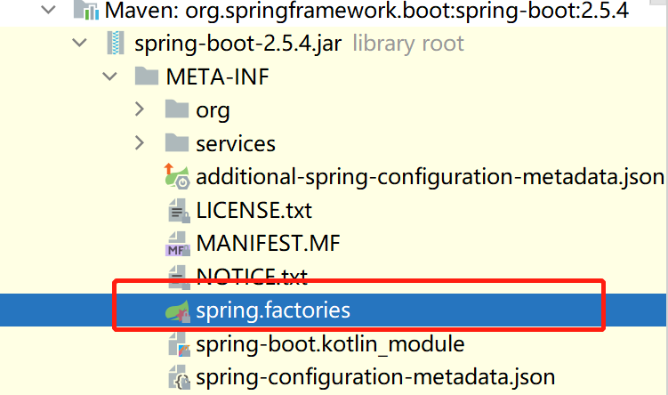
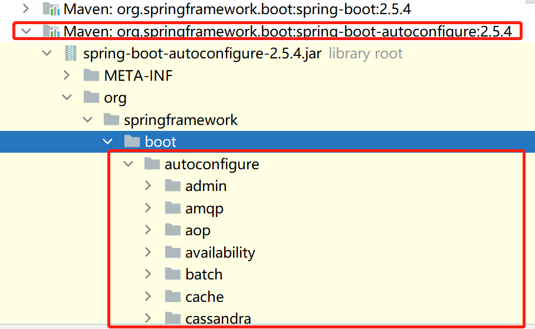
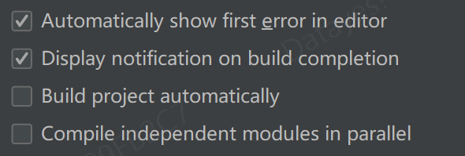
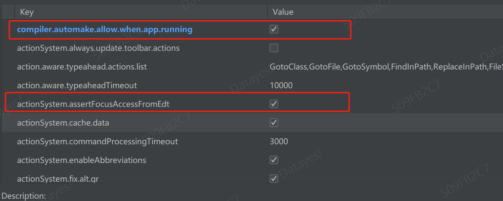

[视频地址](https://www.bilibili.com/video/BV19K4y1L7MT?p=32)

[toc]


# 1、Springboot入门

## 1.pom   

### 1.依赖版本仲裁

```xml
   <parent>
        <groupId>org.springframework.boot</groupId>
        <artifactId>spring-boot-starter-parent</artifactId>
        <version>2.4.1</version>
        <relativePath/>
    </parent>
这个父项目依赖于
  <parent>
    <groupId>org.springframework.boot</groupId>
    <artifactId>spring-boot-dependencies</artifactId>
    <version>2.4.1</version>
  </parent>
用来真正管理Spring Boot应用里面所有的依赖版本！别名：SpringBoot的版本仲裁中心
所以我们导入依赖默认是不需要写版本号的;(没有在dependencies中管理的依赖自然需要声明版本号)
```

### 2.导入的依赖

```xml
  <dependency>
      <groupId>org.springframework.boot</groupId>
       <artifactId>spring-boot-starter-web</artifactId>
 </dependency>
  <!--父项目中存在版本，所以不需要声明版本号-->
```

spring-boot-starter-***：

​    SpringBoot将所有的功能场景都抽取出来了，做成了一个一个starts。使用什么功能，

导入什么starts。

## 2.自动配置原理

```java
@SpringBootApplication//标注一个主程序类，说明是一个SpringBoot应用
public class Application {
    public static void main(String[] args) {
        //启动Spring应用
        SpringApplication.run(Application.class, args);
    }
```

@SpringBootApplication,主程序类

```java
//主要注解
@SpringBootConfiguration
@EnableAutoConfiguration
@ComponentScan(excludeFilters = { @Filter(type = FilterType.CUSTOM, classes = TypeExcludeFilter.class),
        @Filter(type = FilterType.CUSTOM, classes = AutoConfigurationExcludeFilter.class) })
public @interface SpringBootApplication {
```

1.  @SpringBootConfiguration:SpringBoot的==配置类==

   - 底层是使用Spring注解  @Configuration：Spring的配置类

2.  @ComponentScan：@SpringBootApplication标注的类的所在包及下面所有子包里面的所有组件扫描到Spring容器  = ==指定目录下，开启注解==

3.    @EnableAutoConfiguration：**开启自动配置功能** 

   ```java
   @AutoConfigurationPackage
   @Import(AutoConfigurationImportSelector.class)
   public @interface EnableAutoConfiguration {
   ```

   - @AutoConfigurationPackage:自动配置包
   - AutoConfigurationImportSelector.class:  加载所有自动配置类（META-INF/spring.factories，**所有的自动配置类都在里面，没有就需要自己配置**），配置类按照条件进行生效

> 按条件自动装配

1. SpringBoot自动配置类有127个。在META-INF/spring.factories

   

   

2. spring.factories中对应的配置配在**自动配置包**中

   

3. ==SpringBoot每次启动都会配置这127个自动配置类，但是并不是每个都会生效==

   以aop自动配置类为例子：

   ```java
   //部分代码
   @Configuration(
       proxyBeanMethods = false
   )
   @ConditionalOnProperty(
       prefix = "spring.aop",
       name = {"auto"},
       havingValue = "true",
       matchIfMissing = true
   )
   public class AopAutoConfiguration {
       public AopAutoConfiguration() {
       }
   
       @Configuration(
           proxyBeanMethods = false
       )
       @ConditionalOnClass({Advice.class})
       static class AspectJAutoProxyingConfiguration {
           AspectJAutoProxyingConfiguration() {
           }
   
           @Configuration(
               proxyBeanMethods = false
           )
           @EnableAspectJAutoProxy(
               proxyTargetClass = true
           )
           @ConditionalOnProperty(
               prefix = "spring.aop",
               name = {"proxy-target-class"},
               havingValue = "true",
               matchIfMissing = true
           )
           static class CglibAutoProxyConfiguration {
               CglibAutoProxyConfiguration() {
               }
           }
   
           @Configuration(
               proxyBeanMethods = false
           )
           @EnableAspectJAutoProxy(
               proxyTargetClass = false
           )
           @ConditionalOnProperty(
               prefix = "spring.aop",
               name = {"proxy-target-class"},
               havingValue = "false"
           )
           static class JdkDynamicAutoProxyConfiguration {
               JdkDynamicAutoProxyConfiguration() {
               }
           }
       }
   ```

   - @Configuration( proxyBeanMethods = false) **--------**默认配置没有代理对象
   - @ConditionalOnProperty(
         prefix = "spring.aop",
         name = {"auto"},
         havingValue = "true",
         matchIfMissing = true
     ) **---------**==在配置文件==（property、yml文件）以 spring.aop开头配置信息==存在，配置类才生效==，==适用于开发人员自定义配置信息==

   -  @ConditionalOnClass({Advice.class})**--------------**在Advice..class存在时，配置才生效，==只有在对象存在时，才加载bean==，**这是加载所有配置类，但是只有需要的配置类生效的*关键***，*@Conditional还有很多不同条件注解例如，@ConditionalOnBean*

==总结：==

1. SpringBoot先加载所有的自动配置类 xxxxAutoConfigration
2. 配置类按照条件生效，默认都会绑定配置文件指定的值。xxxProperties里面拿。xxxProperties和配置文件进行绑定
3. 生效的配置类就会给Spring容器中装配很多组件，一个个bean
4. 有了这些组件，相关功能就可以用了
5. ==定制化配置==
   - 直接自己使用@bean替换底层的组件
   - 看这个组件是获取的配置文件的什么值就去修改

## 3. 便捷工具

### 热部署

1. 自动重启项目（假热部署）

   - 引入devtools

     ```xml
     <dependency>
             <groupId>org.springframework.boot</groupId>
             <artifactId>spring-boot-devtools</artifactId>
             <optional>true</optional>
         </dependency>
     ```

   - 在父pom添加一个插件

     ```xml
     <build>
     	<plugins>
         	<plugin>
                 <groupId>org.springframework.boot</groupId>
                 <artifactId>spring-boot-maven-plugin</artifactId>
                 <configretion>
                 	<fork>true</fork>
                     <addResources>true</addResources>
                 </configretion>
             </plugin>
         </plugins>
     </build>
     ```

   - 

   - Ctrl+Shift+Alt+/  选择第一个

   - 

2. 实时监控

   [Jrebel](https://www.cnblogs.com/xfyuao/p/12766020.html)

### lombok

- 引入lombok

  ```xml
   <dependency>
    	<groupId>org.projectlombok</groupId>
      <artifactId>lombok</artifactId>
   </dependency>
  ```

- 下载lombok插件
- 在实体类上添加注解


# 2、springBoot配置

—springBoot使用一个全局的配置文件

- application.properties
- applicain.yml或application.yaml


配置文件的作用：修改springBoot自动配置的默认值；springBoot在底层都给我们配置好了

## 2.1、yaml配置

### 编写示例

```yaml
properties:
  username: 徐傲
  boss: true
  time: 2021/10/3
  age: 22
  user:
    username: 张三
    pwd: 123456
#   interest: {1,2,3,4}   String[]
  interest:
    - 1
    - 2
#   strList: {张三,李四,王五,赵六}   List<String>
  strList:
    - 赵三
    - 李四
#   map: {id: 1,sex: 2,age: 3}   Map<String,Object>
  map:
    id: 1
    sex: 2
    age: 3
  userMap:
    my:
      - username: lisi
        pwd: 123456
      - username: lisi
        pwd: 123456
    your:
      - {username: 王五,pwd: 123456}
      - {username: 赵六,pwd: 123456}
  doubleSet:
    - 1.1
    - 2.2
    - 3.3
    
```

### 占位符

1、随机数

```java
${random.value}、${random.int}、${random.long}、${random.int(10)}、${random.int[1024,65536]}、
```

2、占位符获取之前的配置,没有可以赋予默认值

```java
username: lisi_${properties.pwd}
```

### Profiles多环境支持

第一种：在application.yaml文件中扩展其他配置文件，比如添加application-dev.yaml

```java
spring:
  profiles:
    active: dev
```

第二种：jvm参数指定配置文件

```java
VM options : -Dspring.profiles.active=dev
```

第三种：命令行指定启动配置文件

```java
Program arguments: --spring.profiles.active=dev
```

### 配置文件的加载位置

springBoot启动会扫描以下位置的aoolication.yaml/properties文件作为全局默认配置文件

- file: ../config/
- file: ../
- classpath: /config/
- classpath:/

以上是按照**优先级从高到低**的顺序，所有位置的文件都会被加载，高优先级配置内容会覆盖底优先级

可以通过<font color = green>配置spring.config.location</font>来改变默认配置位置 


## 2.2、生成bean

1、`@ConfigrationOnProperties`

```java
@ConfigurationProperties(prefix = "properties")//自动匹配yml开头的数据
@Component//必须是容器组件，才能被@ConfigurationProperties自动注入,
//或者在其他类使用@EnableConfigurationProperties(Properties.class)
public class Properties {
    private String username;
    private Boolean boss;
    private Date time;
    private Integer age;
    private User user;
    private String[] interest;
    private List<String> strList;
    private Map<String,Object> map;
    private Map<String,List<User>> userMap;
    private Set<Double> doubleSet;
}
```

重要：@PropertySource

明确一点：全局配置文件是application.yaml，全局默认配置文件只有一个（可以导入其他配置文件）。 或着**读取配置时指定其他配置文件*：@PropertySource，但是只能是properties文件

```java
@PropertySource("classpath: person.properties")
```

2、@Component、@Controllelr、@Service、@Repository

```java
@Component
public class Properties {
```

3、@bean

```java
@Configuration
public class DirectRabbitConfig {

    @Bean
    public Queue TestDirectQueue() {
        
        return new Queue();
    }
}
```

4、@ImportSource

将spring中xml的配置的bean生成bean

```java
@Configuration
@ImportSource("classpath: spring-xxx.xml")
public class DirectRabbitConfig {
```


## 2.3、注入bean

注入bean的类，必须是spring管理的类：@Component、@Configuration的 类

1、属性注入

```java
	@Autowired
    private  Properties properties;
```

2、private final 注入

```java
 private final Properties properties;
 //可直接用lombok
 public Person(Properties properties){
     this.properties = properties;
 }
```

3、@Value

```java
	@Value("${properties.username}")
    private String username;

	#可直接指定值
     @Value("${properties.username: Xua}")
    private String username;
    
    @Value("#{spel表达式}")
    private String pwd;		
```

==@Value 获取复杂配置格式比较苛刻，比如map，必须：map: {id: 1,sex: 2,age: 3}==

4、通过bean方法的形参进行注入

```java
	@bean	
    public Queue TestDirectQueue(Properties properties) {
        
        return new Queue();
    }
```

5、最优雅的注入  

```java
@Bean
@ConfigurationProperties(prefix = "properties")
public Properties properties(){
    return new Properties();
}
```

6、~~构造器注入~~

```java
 private  Properties properties;
 
 @Autowired 
 public Person(Properties properties){
     this.properties = properties;
 }
```

7、~~setter方法注入~~

```java
 private  Properties properties;

 @Autowired 
 public void setProperties(Properties properties){
     this.properties = properties;
 }
```


## 2.4 @Conditional

必须是@Conditional指定的条件 成立，才会给容器添加组件

```java
@Bean
@ConditionalOnClass(User.class)
public Properties properties(){
    return new Properties();
}

```

@Conditional扩展注解

| 注解                            | 描述                                                         |
| ------------------------------- | :----------------------------------------------------------- |
| @ConditionalOnBean              | 当容 器中至少存在一个指定name或class的Bean时，进行实例化     |
| @ConditionalOnMissingBean       | 当容器中指定name或class的Bean都不存在时，进行实例化          |
| @ConditionalOnClass             | 当类路径下至少存在一个指定的class时，进行实例化              |
| @ConditionalOnMissingClass      | 当容器中指定class都不存在时，进行实例化                      |
| @ConditionalOnSingleCandidate   | 当指定的Bean在容器中只有一个，或者有多个但是指定了首选的Bean时触发实例化 |
| @ConditionalOnProperty          | 当指定的属性有指定的值时进行实例化                           |
| @ConditionalOnResource          | 当类路径下有指定的资源时触发实例化                           |
| @ConditionalOnExpression        | 基于SpEL表达式的条件判断,当为true的时候进行实例化            |
| @ConditionalOnWebApplication    | 当项目是一个Web项目时进行实例化                              |
| @ConditionalOnNotWebApplication | 当项目不是一个Web项目时进行实例化                            |
| @ConditionalOnJava              | 当JVM版本为指定的版本范围时触发实例化                        |
| @ConditionalOnJndi              | 在JNDI存在的条件下触发实例化                                 |


可以配置debug = true 查看哪些配置类生效了

## 2.4、单元测试

引入junit4测试依赖

```java
@RunWith(SpringRunner.class)
@SpringBootTest
class SpringBootDemoApplicationTests {

    @Autowired
    private  Properties properties;

    @Test
    void contextLoads() {
        System.err.println(properties.toString());
    }

}

```


## 2.5、配置自动提示

1、导入相关依赖

```xml
<dependency>
    <groupId>org.springframework.boot</groupId>
    <artifactId>spring-boot-configuration-processor</artifactId>
    <optional>true</optional>
</dependency>
```

2、重启项目

3、配置maven打包时去除这个依赖

```xml
<build>
    <plugins>
        <plugin>
            <groupId>org.springframework.boot</groupId>
            <artifactId>spring-boot-maven-plugin</artifactId>
            <configuration>
                <excludes>
                    <exclude>
                        <groupId>org.springframework.boot</groupId>
                        <artifactId>spring-boot-configuration-processor</artifactId>
                    </exclude>
                </excludes>
            </configuration>
        </plugin>
    </plugins>
</build>
```


# 3、springBoot与日志

springBoot使用slf4j作为抽象层，底层使用logback，并且集成了其他类似junit log 转logback日志框架

## 3.1 默认日志配置

```yaml
logging:
  level: 
     root: info #默认info
  #指定日志存放文件，
  file: 
  #有logging.file就不用path了，指定日志文件存放路劲
  path:
  pattern:
    #在控制台输出的日志的格式	
    console: 
    #指定文件日志输出的格式
    file: 
  
```


演示代码：

```java

    private Logger logger = 			LoggerFactory.getLogger(SpringBootDemoApplicationTests.class);

    @Test
    public void toUser(){
        String name = "Xua";
        logger.error("{name} 转换错误", name);
    }
```


输出：


在yaml配置中，我们最多指定日志输出文件，==日志输出格式一般需要个性化设置==，单独指定日志配置文件


## 3.2 指定配置

在类路径下放上每个日志框架自己的配置文件；springBoot就不适用自己的默认配置文件了

logback-spring.xml

......


# 4、springBoot与Web


## 4.1、静态资源规则和定制化

### 静态资源目录

springBoot静态资源==默认==设置在类路径下：/static   **or **   /public  **or**  /resources  **or**  /META-INF/resources

==修改默认静态资源(*一般不修改*)：==

```yaml
spring:
  web:
    resources:
      static-locations: classpath:/webapp
```

*这样配置，静态资源就只能放在/webapp目录下*

### 访问规则

访问：当前项目跟路径/ +静态资源名(localhost:8080/**)

原理：**默认**静态映射为 /**

请求进来，先找Controller能不能处理，不能处理的所有请求交给静态资源处理器

==修改访问规则：==

```yaml
spring:
  mvc:
    static-path-pattern:/res/**
```

==配置后的访问规则为localhost:8080/res/**==

### 欢迎页和favicon

- 在静态资源目录下，存放index.html就会在访问项目时自动跳转index.html
- 在静态资源目录下，存放favicon.ico就会在页面title前面添加favicon.ico图片

### 底层探索


## 4.2、请求参数处理

### 请求映射

- @xxxMapping；

- Rest风格支持（使用http请求方式动词来表示对资源的操作）

  1. 以前：/getUser     获取用户  /deleteUser  删除用户                 /editUser 修改用户   /saveUser 保存用户

  2. 现在：/user    GET-获取用户    DELETE-删除用户    PUT-修改用户   POST-保存用户

     核心Filter; HiddenHttpMethodFilter

     用法：==表单==method=post   隐藏于 **_method**=put，==其他工具==，如postman可以直接发送put请求
  
  3. SpringBoot需要手动开启Rest风格
  

```yaml
spring:
  mvc:
    hiddenmethod:
      filter:
        enabled: true    #选择开启页面表单的Rest风格
```

```java
@RequestMapping(value = "/user",method = RequestMethod.GET)
    public String getUser() {
        return "";
    }
    @RequestMapping(value = "/user",method = RequestMethod.PUT)
    public String editUser() {
        return "";
    }
    @RequestMapping(value = "/user",method = RequestMethod.POST)
    public String saveUser() {
        return "";
    }
    @RequestMapping(value = "/user",method = RequestMethod.DELETE)
    public String deleteUser() {
        return "";
    }

```

### 请求处理

- SpringBoot自动配置欢迎页的WelcomePageHandleMappering。访问/能访问index.html
- SpringBoot自动配置了默认的RequestMappingHandlerMapping
- 请求进来，挨个尝试所有的HandlerMapping看是否有请求信息
  - 如果有就找到这个请求对应的handler
  - 如果没有就是下一个handlerMapping  

## 4.3、模板引擎


## 4.4、常用参数注解

### @PathVariable

restFul风格请求，路径变量

```java
   @PostMapping("save/{userId}/{username}")
    public User save(@PathVariable("userId") String userId,
                     @PathVariable("username") String username,
                     //所有参数集成到map
                     @PathVariable Map<String,String> pv) {
```

### @RequestHeader

获取请求头

```java
   @PostMapping("save")
    public User save(@RequestHeader("content-encoding") String content_encoding,
                     //所有请求头参数集成到map
                     @RequestHeader Map<String,String> rh) {
```

### @RequestParm

请求参数

```java
@PostMapping("save/")
    public User save(@RequestParam(value = "userId",required = false) String userId) {
```

### 其他controller层注解

| 注解                   | 解释                                                         |
| ---------------------- | ------------------------------------------------------------ |
| @Controller            | 注册为Spring bean。                                          |
| **@RequestMapping**    | 配置请求映射路径,*作用在类、方法*                            |
| **@RequestBody**       | 读到的内容（**json数据**）转换为java对象,**字符格式可以自动映射，json不能自动映射**，==只有post才有请求体。== |
| **@ResponseBody**      | 结合返回值为Object的方法使用，<br/>用来返回JSON数据          |
| **@RequestParam**      | 请求参数属性映射为其他参数，例如请求为id，映射为username     |
| **@PathVariable**      | 请求参数作为url一部分                                        |
| **@Valid**（需要导包） | 校验请求数据 的格式                                          |
| @RequestHeader         | 表示参数来源于请求头                                         |
| @CookieValue           | 表示参数来源于Cookie                                         |
| @ModelAttribute        | 将请求数据转换为对象                                         |
| @InitBinder            | 类型转换，注册属性编辑器                                     |
| @ControllerAdvice      | 统一异常处理，处理全局异常                                   |
| @ExceptionHander       | 异常处理器，处理特定异常的方法                               |
| @RestController        | 将类映射为Controller层，<br/>默认为所有方法添加@ResponseBody注解 |


## 4.5、文件上传

```java
  /**
     * MultipartFile 自动封装上传过来的文件
     *
     */
    @PostMapping("/upload")
    public String upload(@RequestPart("headerImg") MultipartFile headerImg,
                         @RequestPart("photos") MultipartFile[] photos){
        log.info("上传的信息：headerImg:{}",headerImg);
        return "";
    }
```

# 5、

# 6、

# 7、

# 8、


# 9、springBoot与cache

项目地址：https://gitee.com/xuaoGitee/redis

​		数据库的数据是存储在硬盘上的，频繁访问性能较低。如果将一些需要频繁查询的热数据放到[内存](https://so.csdn.net/so/search?q=内存&spm=1001.2101.3001.7020)的缓存中，可以大大减轻数据库的访问压力。

​		SpringCache提供基本的Cache抽象，并没有具体的缓存能力，需要配合具体的缓存实现来完成，目前SpringCache支持redis、ehcache、simple（基于内存）等方式来实现缓存。

​		默认使用simple。


## [9.1、SpringCache必用注解](https://www.cnblogs.com/eedc/p/12098001.html)

### @EnableCaching

**@EnableCaching**：开启缓存功能，一般使用在springboot的启动类或配置类上

```java
@SpringBootApplication
@EnableCaching
public class RedisApplication {
```


### **@Cacheable**

1、标记在一个方法上时表示该方法是支持缓存的，一个==类上时则表示该类所有的方法都是支持缓存==的。

2、对于一个支持缓存的方法，Spring会在==被调用后将其返回值缓存起来，以保证下次利用同样的参数来执行该方法时可以直接从缓存中获取结果，而不需要再次执行该方法==。

3、Spring在缓存方法的返回值时是以`键值`对进行缓存的，`值就是方法的返回结果`，至于键的话，Spring又支持两种策略，默认策略和自定义策略。需要注意的是当一个支持缓存的方法在对象内部被调用时是不会触发缓存功能的。

`@Cacheable的参数如下：`

| @Cacheable属性名 | 用途                                                         | 备注                                                         |
| ---------------- | ------------------------------------------------------------ | ------------------------------------------------------------ |
| cacheNames/value | 指定缓存空间的名称，不同缓存空间的数据是隔离的               |                                                              |
| key              | 同一个缓存空间通过key区别不同的缓存，按照 `SpEL` 表达式编写。默认按照方法的所有参数进行组合，`下文详解` | SpringCache提供了专用元数据，如target、methodName、result、方法参数等@CachePut(value = “demo”, key = “#result==null”) |
| keyGenrator      | key的生成策略，默认情况下将参数值作为键                      |                                                              |
| condition        | condition是在调用方法之前判断条件，满足条件才缓存            | @Cacheable(cacheNames=“book”, condition="#name.length() < 32") |
| unless           | unless是在调用方法之后判断条件，如果SpEL条件成立，则不缓存【**条件满足不缓存**】 | @Cacheable(cacheNames = “hello”,unless="#result.id.contains(‘1’)" ) |
| sync             | 缓存过期之后，如果多个线程同时请求对某个数据的访问，会同时去到数据库，导致数据库瞬间负荷增高。（boolean类型，默认为false）。当设置它为true时，只有一个线程的请求会去到数据库，其他线程都会等待直到缓存可用。这个设置可以减少对数据库的瞬间并发访问 |                                                              |


#### @Cacheable参数KEY详解

key属性是用来指定Spring缓存方法的返回结果时对应的key的。该属性支持SpringEL表达式。当我们没有指定该属性时，Spring将使用默认策略生成key。

==重点：==自定义策略是指我们可以通过Spring的EL表达式来指定我们的key。这里的EL表达式可以使用方法参数及它们对应的属性。使用方法参数时我们可以直接使用“#参数名”或者“#p参数index”。下面是几个使用参数作为key的示例。

```java
@Cacheable(value="users", key="#id")

   public User find(Integer id) {

      returnnull;

   }


   @Cacheable(value="users", key="#p0")

   public User find(Integer id) {

      returnnull;

   }

 
   @Cacheable(value="users", key="#user.id")

   public User find(User user) {

      returnnull;

   }

 
   @Cacheable(value="users", key="#p0.id")

   public User find(User user) {

      returnnull;

   }
```

除了上述使用方法参数作为key之外，Spring还为我们提供了一个**root对象**可以用来生成key。通过该root对象我们可以获取到以下信息。

| **属性名称** | **描述**                    | **示例**             |
| ------------ | --------------------------- | -------------------- |
| methodName   | 当前方法名                  | #root.methodName     |
| method       | 当前方法                    | #root.method.name    |
| target       | 当前被调用的对象            | #root.target         |
| targetClass  | 当前被调用的对象的class     | #root.targetClass    |
| args         | 当前方法参数组成的数组      | #root.args[0]        |
| caches       | 当前被调用的方法使用的Cache | #root.caches[0].name |

当我们要使用root对象的属性作为key时我们也==可以将“#root”省略==，因为Spring默认使用的就是root对象的属性。如：

  ```java
  @Cacheable(value={"users", "xxx"}, key="caches[1].name")
  
    public User find(User user) {
  
     return null;
  
    }
  ```


#### @Cacheable参数condition详解

有的时候我们可能并不希望缓存一个方法所有的返回结果。通过condition属性可以实现这一功能。condition属性默认为空，表示将缓存所有的调用情形。其值是通过SpringEL表达式来指定的，当为true时表示进行缓存处理；当为false时表示不进行缓存处理，即每次调用该方法时该方法都会执行一次。如下示例表示只有当user的id为偶数时才会进行缓存。

  ```java
  @Cacheable(value={"users"}, key="#user.id", condition="#user.id%2==0")
  
    public User find(User user) {
  
     System.out.println("find user by user " + user);
  
     return user;
  
    }
  ```

###  @CachePut

@CachePut ：==更新缓存==。参数规则同@Cacheable

@CachePut标注的方法在执行前不会去检查缓存中是否存在之前执行过的结果，而是每次都会执行该方法，并将执行结果以键值对的形式存入指定的缓存中。

@CachePut也可以标注在类上和方法上。使用@CachePut时我们可以指定的属性跟@Cacheable是一样的。

```java
  @CachePut("users")//每次都会执行方法，并将结果存入指定的缓存中
  public User find(Integer id) {

   return null;

  }
```

### @CacheEvict

@CacheEvict：==清除缓存==   参数有value、key、condition、allEntries和beforeInvocation。

#### allEntries属性

allEntries是boolean类型，表示是否需要==清除缓存中的所有元素==。默认为false，表示不需要。当指定了allEntries为true时，==Spring Cache将忽略指定的key==。有的时候我们需要Cache一下清除所有的元素，这比一个一个清除元素更有效率。

```java
 @CacheEvict(value="users", allEntries=true)

   public void delete(Integer id) {

      System.out.println("delete user by id: " + id);

   }
```

#### beforeInvocation属性

清除操作默认是在对应==方法成功执行之后触发的==，即方法如果因为抛出异常而未能成功返回时也不会触发清除操作。当我们指定该beforeInvocation值为true时，Spring会在调用该方法之前清除缓存中的指定元素。

```java
 @CacheEvict(value="users", beforeInvocation=true)

   public void delete(Integer id) {

      System.out.println("delete user by id: " + id);

   }
```

### @Caching

 @Caching注解可以让我们在一个方法或者类上同时指定多个Spring Cache相关的注解。其拥有三个属性：cacheable、put和evict，分别用于指定@Cacheable、@CachePut和@CacheEvict。

```java
@Caching(cacheable = @Cacheable("users"), evict = { @CacheEvict("cache2"),

         @CacheEvict(value = "cache3", allEntries = true) })

   public User find(Integer id) {

      returnnull;

   }
```

## 9.2、使用自定义注解

Spring允许我们在配置可缓存的方法时使用自定义的注解，前提是自定义的注解上必须使用对应的注解进行标注。如我们有如下这么一个使用@Cacheable进行标注的自定义注解。

```java
@Target({ElementType.*TYPE*, ElementType.*METHOD*})

@Retention(RetentionPolicy.*RUNTIME*)

@Cacheable(value="users")

public @interface MyCacheable {


}
```

那么在我们需要缓存的方法上使用@MyCacheable进行标注也可以达到同样的效果。

```java
  @MyCacheable

  public User findById(Integer id) {

   System.out.println("find user by id: " + id);

   User user = new User();

   user.setId(id);

   user.setName("Name" + id);

   return user;

  }
```

## 9.3、springCache 整合redis

### P、Y、C

- 依赖

添加redis依赖就够了,版本跟着spring父依赖就行

```xml
        <dependency>
            <groupId>org.springframework.boot</groupId>
            <artifactId>spring-boot-starter-data-redis</artifactId>
        </dependency>
```

- 配置yaml

```yaml
spring:
  redis:
    database: 0
    host: www.onething.top
    port: 6379
    password: 123456nw
    #配置jedis客户端，这里也可以jedis替换为lettuce客户端，下级配置都一样
    jedis:
      pool:
        # 连接池中的最大空闲连接 默认8
        max-idle: 8
        # 连接池中的最小空闲连接 默认0
        min-idle: 0
        # 连接池最大连接数 默认8 ，负数表示没有限制
        max-active: 8
        # 连接池最大阻塞等待时间（使用负值表示没有限制） 默认-1
        max-wait: -1
    timeout: 3000
  cache:
    type: redis   # 指定使用的缓存类型
   # redis:    当自定义ChacheManager时，就这里的配置不需要配置，配置了也不起作用
   #   use-key-prefix: true  
   #  key-prefix: "demo:"
   #  time-to-live: 60000  #缓存超时时间 单位：ms
   #  cache-null-values: false #是否缓存空值
    cache-names: user
cache: 
	ttl: '{"user":60,"dept":30}'  #自定义某些缓存空间的过期时间

```

- 配置cacheManager

```java
@Configuration
public class RedisConfiguration {

    // ${cache} 获取配置文件的配置信息   #{}是spring表达式，获取Bean对象的属性
    @Value("#{${cache}}")
    private Map<String, Long> ttlParams;

    /**
     * @param redisConnectionFactory
     * @功能描述 redis作为缓存时配置缓存管理器CacheManager，主要配置序列化方式、自定义
     * <p>
     * 注意：配置缓存管理器CacheManager有两种方式：
     * 方式1：通过RedisCacheConfiguration.defaultCacheConfig()获取到默认的RedisCacheConfiguration对象，
     * 修改RedisCacheConfiguration对象的序列化方式等参数【这里就采用的这种方式】
     * 方式2：通过继承CachingConfigurerSupport类自定义缓存管理器，覆写各方法，参考：
     * https://blog.csdn.net/echizao1839/article/details/102660649
     * <p>
     * 切记：在缓存配置类中配置以后，yaml配置文件中关于缓存的redis配置就不会生效，如果需要相关配置需要通过@value去读取
     */
    @Bean
    public CacheManager cacheManager(RedisConnectionFactory redisConnectionFactory) {
        RedisCacheConfiguration redisCacheConfiguration = RedisCacheConfiguration.defaultCacheConfig();
        redisCacheConfiguration = redisCacheConfiguration
                // 设置key采用String的序列化方式
                .serializeKeysWith(RedisSerializationContext.SerializationPair.fromSerializer(StringRedisSerializer.UTF_8))
                //设置value序列化方式采用jackson方式序列化
                .serializeValuesWith(RedisSerializationContext.SerializationPair.fromSerializer(serializer()))
                //当value为null时不进行缓存
                .disableCachingNullValues()
                // 配置缓存空间名称的前缀
                .prefixCacheNameWith("demo:")
                //全局配置缓存过期时间【可以不配置】
                .entryTtl(Duration.ofMinutes(30L));
        //专门指定某些缓存空间的配置，如果过期时间【主要这里的key为缓存空间名称】
        Map<String, RedisCacheConfiguration> map = new HashMap<>();
        Set<Map.Entry<String, Long>> entries = ttlParams.entrySet();
        for (Map.Entry<String, Long> entry : entries) {
            //指定特定缓存空间对应的过期时间
            map.put("user", redisCacheConfiguration.entryTtl(Duration.ofSeconds(40)));
            map.put(entry.getKey(), redisCacheConfiguration.entryTtl(Duration.ofSeconds(entry.getValue())));
        }
        return RedisCacheManager
                .builder(redisConnectionFactory)
                .cacheDefaults(redisCacheConfiguration)  //默认配置
                .withInitialCacheConfigurations(map)  //某些缓存空间的特定配置
                .build();
    }


    /**
     * 自定义缓存的redis的KeyGenerator【key生成策略】
     * 注意: 该方法只是声明了key的生成策略,需在@Cacheable注解中通过keyGenerator属性指定具体的key生成策略
     * 可以根据业务情况，配置多个生成策略
     * 如: @Cacheable(value = "key", keyGenerator = "cacheKeyGenerator")
     */
    @Bean
    public KeyGenerator keyGenerator() {
        /**
         * target: 类
         * method: 方法
         * params: 方法参数
         */
        return (target, method, params) -> {
            //获取代理对象的最终目标对象
            StringBuilder sb = new StringBuilder();
            sb.append(target.getClass().getSimpleName()).append(":");
            sb.append(method.getName()).append(":");
            //调用SimpleKey的key生成器
            Object key = SimpleKeyGenerator.generateKey(params);
            return sb.append(key);
        };
    }


    /**
     * @param redisConnectionFactory：配置不同的客户端，这里注入的redis连接工厂不同： JedisConnectionFactory、LettuceConnectionFactory
     * @功能描述 ：配置Redis序列化，原因如下：
     * （1） StringRedisTemplate的序列化方式为字符串序列化，
     * RedisTemplate的序列化方式默为jdk序列化（实现Serializable接口）
     * （2） RedisTemplate的jdk序列化方式在Redis的客户端中为乱码，不方便查看，
     * 因此一般修改RedisTemplate的序列化为方式为JSON方式【建议使用GenericJackson2JsonRedisSerializer】
     */
    @Bean
    public RedisTemplate<String, Object> redisTemplate(RedisConnectionFactory redisConnectionFactory) {
        GenericJackson2JsonRedisSerializer genericJackson2JsonRedisSerializer = serializer();
        RedisTemplate<String, Object> redisTemplate = new RedisTemplate<>();
        // key采用String的序列化方式
        redisTemplate.setKeySerializer(StringRedisSerializer.UTF_8);
        // value序列化方式采用jackson
        redisTemplate.setValueSerializer(genericJackson2JsonRedisSerializer);
        // hash的key也采用String的序列化方式
        redisTemplate.setHashKeySerializer(StringRedisSerializer.UTF_8);
        //hash的value序列化方式采用jackson
        redisTemplate.setHashValueSerializer(genericJackson2JsonRedisSerializer);
        redisTemplate.setConnectionFactory(redisConnectionFactory);
        return redisTemplate;
    }

    /**
     * 此方法不能用@Ben注解，避免替换Spring容器中的同类型对象
     */
    public GenericJackson2JsonRedisSerializer serializer() {
        return new GenericJackson2JsonRedisSerializer();
    }
}
```

### 应用

```java
@EnableCaching   //开启缓存的主键
@SpringBootApplication
public class RedisDemoApplication {
    public static void main(String[] args) {
        SpringApplication.run(RedisDemoApplication.class, args);
    }
}
```

```java
 @Cacheable(value = "redis",key = "#id",sync = true)
    public List<Integer> save(String id){
        System.out.println("---------访问save方法------------");
        List<Integer> list = new ArrayList<>();
        list.add(1);
        list.add(1);
        list.add(1);
        list.add(1);
        list.add(1);
        return list;
    }

    @CacheEvict(value = "redis",key = "#id",allEntries=true,beforeInvocation = true)
    public void evict(String id){
        System.out.println("清除缓存");
    }

	//#result表示查询的结果。不是cache的结果，只有cache打头的才是h
    @CachePut(value = "redis",key = "'111'",condition = "#result !=null")
    public List<Integer> put(){
        System.out.println("---------访问put方法------------");
        List<Integer> list = new ArrayList<>();
        list.add(2);
        list.add(2);
        list.add(2);
        list.add(2);
        list.add(2);
        return list;
    }
```


# 10、springBoot与消息

# 11、springBoot与检索

# 12、springBoot与任务

# 13、springBoot与安全

# 14、springBoot与分布式

