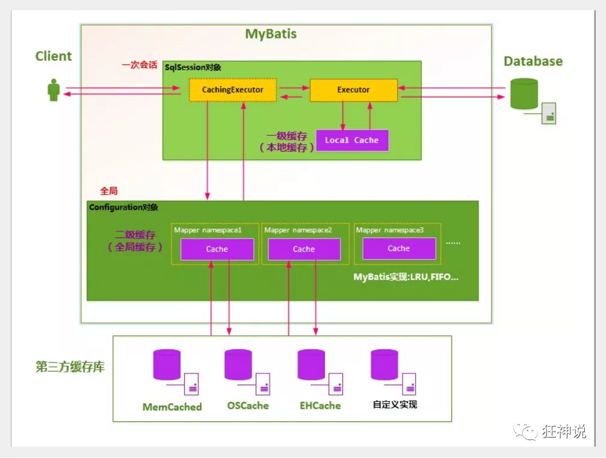

# Mybatis

##  配置MybatisConfig.xml

###  environments

XML 配置文件中包含了对 MyBatis 系统的**核心设置**

- 包括获取数据库连接实例的==数据源==（DataSource）

- 以及决定事务作用域和控制方式的==事务管理器==（TransactionManager）

  ```xml
   <environments default="development">
      <environment id="development">
        <transactionManager type="JDBC"/>//事务类型
        <dataSource type="POOLED">//连接池
          <property name="driver" value="${driver}"/>//动态配置属性值
          <property name="url" value="${url}"/>
          <property name="username" value="${username}"/>
          <property name="password" value="${password}"/>
        </dataSource>
      </environment>
   </environments>
  ```


###  properties 

这些属性可以在外部进行配置，并可以进行动态替换。你既可以在典型的 Java 属性文件中配置这些属性，也可以在 properties 元素的子元素中设置。

```xml
<properties resource="org/mybatis/example/config.properties" />//获取外部配置文件
#也可以在properties标签中添加其他配置
<properties resource="org/mybatis/example/config.properties">
  <property name="username" value="dev_user"/>
  <property name="password" value="F2Fa3!33TYyg"/>
</properties>
```


如果一个属性在不只一个地方进行了配置，那么，MyBatis 将按照下面的顺序来加载：

- 首先读取在 properties 元素体内指定的属性。
- 然后根据 properties 元素中的 resource 属性读取类路径下属性文件，或根据 url 属性指定的路径读取属性文件，并覆盖之前读取过的同名属性。
- 最后读取作为方法参数传递的属性，并覆盖之前读取过的同名属性。

因此，通过方法参数传递的属性具有最高优先级，resource/url 属性中指定的配置文件次之，==最低优先级的则是 properties 元素中指定的属性：==**外部配置文件优先级最高**

###  类型别名（typeAliases）

类型别名可为 Java 类型设置一个缩写名字。 它仅用于 XML 配置，意在降低冗余的全限定类名书写。值得注意的是，typeAliases在配置文件中的[存放顺序需要注意](https://blog.csdn.net/qq_15769147/article/details/83274389)

- 根据全限定类型指定（**数量多不推荐**）

  ```xml
  <typeAliases>
    <typeAlias alias="Author" type="domain.blog.Author"/>
    <typeAlias alias="Blog" type="domain.blog.Blog"/>
    <typeAlias alias="Comment" type="domain.blog.Comment"/>
    <typeAlias alias="Post" type="domain.blog.Post"/>
    <typeAlias alias="Section" type="domain.blog.Section"/>
    <typeAlias alias="Tag" type="domain.blog.Tag"/>
  </typeAliases>
  ```

- 也可以指定一个包名，MyBatis 会在包名下面搜索需要的 Java Bean(**推荐**)

  ```xml
  <typeAliases>
  	<typeAlias name = "domain.blog" />
  </typeAliases>
  ```

  *每一个在包 `domain.blog` 中的 Java Bean，在没有注解的情况下，会使用 Bean 的首字母小写的非限定类名来作为它的别名。 比如 `domain.blog.Author` 的别名为 `author`；若有注解，则别名为其注解值*

  ```java
  @Alias("author")
  public class Author {
      ...
  }
  ```

###  映射器（mappers）

​		既然 MyBatis 的行为已经由上述元素配置完了，我们现在就要来定义 SQL 映射语句了。 但首先，我 		们需要告诉 MyBatis 到哪里去找到这些语句。 在自动查找资源方面，Java 并没有提供一个很好的解		决方案，所以最好的办法是直接告诉 MyBatis 到哪里去找映射文件

- 将包内的映射器接口实现全部注册为映射器(**推荐使用**),其他的配置，接口和xml文件文件名必须相同，必须在同一包下

  ```xml
  <mappers>
      <package name="org.mybatis.builder"/>
  </mappers>
  ```

-  使用相对于类路径的资源引用  

   ```xml
   <mappers>
     <mapper resource="org/mybatis/builder/AuthorMapper.xml"/>
     <mapper resource="org/mybatis/builder/BlogMapper.xml"/>
     <mapper resource="org/mybatis/builder/PostMapper.xml"/>
   </mappers>
   ```

-  使用完全限定资源定位符

   ```xml
   <mappers>
     <mapper class="org.mybatis.builder.AuthorMapper"/>
     <mapper class="org.mybatis.builder.BlogMapper"/>
     <mapper class="org.mybatis.builder.PostMapper"/>
   </mappers>
   ```

- 将包内的映射器接口实现全部注册为映射器

  ```xml
  <mappers>
    <mapper url="file:///var/mappers/AuthorMapper.xml"/>
    <mapper url="file:///var/mappers/BlogMapper.xml"/>
    <mapper url="file:///var/mappers/PostMapper.xml"/>
  </mappers>
  ```

  

##  CRUD

###  select

select 元素允许你配置很多属性来配置每条语句的行为细节

```xml
<select
  id="selectPerson"
  parameterType="int"
  parameterMap="deprecated"
  resultType="hashmap"
  resultMap="personResultMap"
  flushCache="false"
  useCache="true"
  timeout="10"
  fetchSize="256"
  statementType="PREPARED"
  resultSetType="FORWARD_ONLY">
```

| 属性             | 描述                                                         |
| ---------------- | ------------------------------------------------------------ |
| `id`             | 在命名空间中唯一的标识符，可以被用来引用这条语句。           |
| `parameterType`  | 将会传入这条语句的参数的类全限定名或别名。这个属性是可选的，因为 MyBatis 可以通过类型处理器（TypeHandler）推断出具体传入语句的参数，默认值为未设置（unset）。 |
| ~~parameterMap~~ | 用于引用外部 parameterMap 的属性，目前已被废弃。请使用行内参数映射和 parameterType 属性。 |
| `resultType`     | 期望从这条语句中返回结果的类全限定名或别名。 注意，如果返回的是集合，那应该设置为集合包含的类型，而不是集合本身的类型。 resultType 和 resultMap 之间只能同时使用一个。 |
| `resultMap`      | 对外部 resultMap 的命名引用。结果映射是 MyBatis 最强大的特性，如果你对其理解透彻，许多复杂的映射问题都能迎刃而解。 resultType 和 resultMap 之间只能同时使用一个。 |
| `flushCache`     | 将其设置为 true 后，只要语句被调用，都会导致本地缓存和二级缓存被清空，默认值：false。 |
| `useCache`       | 将其设置为 true 后，将会导致本条语句的结果被二级缓存缓存起来，默认值：对 select 元素为 true。 |
| `timeout`        | 这个设置是在抛出异常之前，驱动程序等待数据库返回请求结果的秒数。默认值为未设置（unset）（依赖数据库驱动）。 |
| `fetchSize`      | 这是一个给驱动的建议值，尝试让驱动程序每次批量返回的结果行数等于这个设置值。 默认值为未设置（unset）（依赖驱动）。 |
| `statementType`  | 可选 STATEMENT，PREPARED 或 CALLABLE。这会让 MyBatis 分别使用 Statement，PreparedStatement 或 CallableStatement，默认值：PREPARED。 |
| `resultSetType`  | FORWARD_ONLY，SCROLL_SENSITIVE, SCROLL_INSENSITIVE 或 DEFAULT（等价于 unset） 中的一个，默认值为 unset （依赖数据库驱动）。 |
| `databaseId`     | 如果配置了数据库厂商标识（databaseIdProvider），MyBatis 会加载所有不带 databaseId 或匹配当前 databaseId 的语句；如果带和不带的语句都有，则不带的会被忽略。 |
| `resultOrdered`  | 这个设置仅针对嵌套结果 select 语句：如果为 true，将会假设包含了嵌套结果集或是分组，当返回一个主结果行时，就不会产生对前面结果集的引用。 这就使得在获取嵌套结果集的时候不至于内存不够用。默认值：`false`。 |
| `resultSets`     | 这个设置仅适用于多结果集的情况。它将列出语句执行后返回的结果集并赋予每个结果集一个名称，多个名称之间以逗号分隔。 |

###  insert, update 和 delete

数据变更语句 insert，update 和 delete 的实现非常接近

```xml
<insert
  id="insertAuthor"
  parameterType="domain.blog.Author"
  flushCache="true"
  statementType="PREPARED"
  keyProperty=""
  keyColumn=""
  useGeneratedKeys=""
  timeout="20" >
```

| 属性               | 描述                                                         |
| :----------------- | :----------------------------------------------------------- |
| `id`               | 在命名空间中唯一的标识符，可以被用来引用这条语句。           |
| `parameterType`    | 将会传入这条语句的参数的类全限定名或别名。这个属性是可选的，因为 MyBatis 可以通过类型处理器（TypeHandler）推断出具体传入语句的参数，默认值为未设置（unset）。 |
| `parameterMap`     | 用于引用外部 parameterMap 的属性，目前已被废弃。请使用行内参数映射和 parameterType 属性。 |
| `flushCache`       | 将其设置为 true 后，只要语句被调用，都会导致本地缓存和二级缓存被清空，默认值：（对 insert、update 和 delete 语句）true。 |
| `timeout`          | 这个设置是在抛出异常之前，驱动程序等待数据库返回请求结果的秒数。默认值为未设置（unset）（依赖数据库驱动）。 |
| `statementType`    | 可选 STATEMENT，PREPARED 或 CALLABLE。这会让 MyBatis 分别使用 Statement，PreparedStatement 或 CallableStatement，默认值：PREPARED。 |
| `useGeneratedKeys` | （仅适用于 insert 和 update）这会令 MyBatis 使用 JDBC 的 getGeneratedKeys 方法来取出由数据库内部生成的主键（比如：像 MySQL 和 SQL Server 这样的关系型数据库管理系统的自动递增字段），默认值：false。 |
| `keyProperty`      | （仅适用于 insert 和 update）指定能够唯一识别对象的属性，MyBatis 会使用 getGeneratedKeys 的返回值或 insert 语句的 selectKey 子元素设置它的值，默认值：未设置（`unset`）。如果生成列不止一个，可以用逗号分隔多个属性名称。 |
| `keyColumn`        | （仅适用于 insert 和 update）设置生成键值在表中的列名，在某些数据库（像 PostgreSQL）中，当主键列不是表中的第一列的时候，是必须设置的。如果生成列不止一个，可以用逗号分隔多个属性名称。 |
| `databaseId`       | 如果配置了数据库厂商标识（databaseIdProvider），MyBatis 会加载所有不带 databaseId 或匹配当前 databaseId 的语句；如果带和不带的语句都有，则不带的会被忽略。 |

###  sql

这个元素可以用来定义==可重用==的 SQL 代码片段，以便在其它语句中使用。 参数可以静态地（在加载的时候）确定下来，并且可以在不同的 include 元素中定义不同的参数值

```xml
<sql id="userColumns"> ${alias}.id,${alias}.username,${alias}.password </sql>
```

```xml
<select id="selectUsers" resultType="map">  select    <include refid="userColumns"><property name="alias" value="t1"/></include>,    <include refid="userColumns"><property name="alias" value="t2"/></include>  from some_table t1    cross join some_table t2</select>
```

###  参数

JDBC 要求，如果一个列允许使用 null 值，并且会使用值为 null 的参数，就必须要指定 JDBC 类型（jdbcType）

1. ```xml
   //输出null，转换为指定类型的默认值#{age,javaType=int,jdbcType=NUMERIC}
   ```

   对于数值类型，还可以设置 `numericScale` 指定小数点后保留的位数。

   ```xml
   //指定小数点保留位数#{height,javaType=double,jdbcType=NUMERIC,numericScale=2}
   ```

###  字符串替换

默认情况下，使用 `#{}` 参数语法时，MyBatis 会创建 `PreparedStatement` 参数占位符，并通过占位符安全地设置参数（就像使用 ? 一样）。 这样做更安全，更迅速，通常也是首选做法，不过有时你就是想直接在 SQL 语句中直接插入一个不转义的字符串。 比如 ORDER BY 子句，这时候你可以：

```xml
ORDER BY ${columnName}
```

当 SQL 语句中的元数据（如表名或列名）是**动态生成**的时候，字符串替换将会非常有用。 举个例子，如果你想 `select` 一个表`任意一列`的数据时

```java
@Select("select * from user where ${column} = #{value}")
User findByColumn(@Param("column") String column, @Param("value") String value);
```

###  结果映射

```xml
<resultMap id="detailedBlogResultMap" type="Blog">
  <constructor>
    <idArg column="blog_id" javaType="int"/>
  </constructor>
  <result property="title" column="blog_title"/>
  <association property="author" javaType="Author">
    <id property="id" column="author_id"/>
    <result property="username" column="author_username"/>
    <result property="password" column="author_password"/>
    <result property="email" column="author_email"/>
    <result property="bio" column="author_bio"/>
    <result property="favouriteSection" column="author_favourite_section"/>
  </association>
  <collection property="posts" ofType="Post">
    <id property="id" column="post_id"/>
    <result property="subject" column="post_subject"/>
    <association property="author" javaType="Author"/>
    <collection property="comments" ofType="Comment">
      <id property="id" column="comment_id"/>
    </collection>
    <collection property="tags" ofType="Tag" >
      <id property="id" column="tag_id"/>
    </collection>
    <discriminator javaType="int" column="draft">
      <case value="1" resultType="DraftPost"/>
      <case value="1" resultMap="DraftPost"/>
    </discriminator>
  </collection>
</resultMap>
```

- constructor

  \- 用于在实例化类时，注入结果到构造方法中

  - `idArg` - ID 参数；标记出作为 ID 的结果可以帮助提高整体性能
  - `arg` - 将被注入到构造方法的一个普通结果

- `id` – 一个 ID 结果；标记出作为 ID 的结果可以帮助提高整体性能

- `result` – 注入到字段或 JavaBean 属性的普通结果

- association 

  – 一个复杂类型的关联；许多结果将包装成这种类型

  - 嵌套结果映射 – 关联可以是 `resultMap` 元素，或是对其它结果映射的引用

- collection 

  – 一个复杂类型的集合

  - 嵌套结果映射 – 集合可以是 `resultMap` 元素，或是对其它结果映射的引用

- discriminator 

  \- column：设置要进行鉴别比较值的列名。

  \-javaType：指定列的类型，保证使用相同的Java类型来比较值。

  \-discriminator标签可以有1个或多个case标签，case标签包含以下3个属性：

  - value：该值为discriminator标签column属性用来匹配的值。
  - resultMap：当column的值和value的值匹配时，可以配置使用resultMap指定的映射，resultMap优先级高于resultType。
  - resultType：当column的值和value的值匹配时，用于配置使用resultType指定的映射。

### DDL

```java
@Update("<script> begin <foreach collection='tableList' index='index' item='table' separator=';'>execute immediate 'alter sequence  ${table.seqName} increment by  ${table.addValue}'</foreach> ;end;</script> ")
 Boolean refresh(@Param("tableList") List<Table> tableList);
```


##  动态sql

------

### if标签

```xml
 <select id="selectUser" resultType="com.xa.pojo.User">  select * from user where 1=1      <if test="name != null">          and name = #{name}     </if>       <if test="age != null">          and age = #{age}     </if> </select>
```

### where 标签

如果不用==where 1=1==,我们不知道if标签的**数据是否存在**，name 或者 age 前面的**and**，就不确定加不加了

但是where  1 = 1 不够优雅，我们可以使用==where标签==来代替

```xml
<select id="selectUser" resultType="com.xa.pojo.User"> 
    select * from user  
    <where>   
        <if test="name != null">        
            and name = #{name}  
        </if>     
        <if test="age != null">     
            and age = #{age}  
        </if>    
    </where>
</select>
```

###  set

```xml
<update id="updateUserbyId">	update user     <set>    	<if test="name != null">         	 name = #{name},    	 </if>         <if test="pwd != null">         	 pwd = #{pwd},    	  </if>     	  <if test="age != null">        	  and age = #{age}    	 </if>    </set>   whete id = #{id}</update>
```

### choose标签

if标签并没有==else功能==，要实现多个**方向选一个**，就要用到choose标签

==注意==，choose标签，子标签必须有otherwise标签，表示，其他选择

```xml
<select id="selectById"> 
    select * from user  
    <where>     
        <choose>      
            <when test="title != null">    
                title = #{title}     
            </when>       
            <when test="author != null">   
                and author = #{author}      
            </when>        
            <otherwise>       
                and views = #{views}   
            </otherwise>  
        </choose>  
    </where>
</select>
```

###  foreach

当我们参数为数组或者集合，要获取每一个参数就需要遍历，就要用到foreach标签,例如批量插入

```xml
<insert>
insert into user(id,name,age) values
<foreach item="user" collection="users" separator="," open="(" close=")"index="">
#{user.id},#{user.name},#{user.age}
    </foreach>
</insert>
```

- **item：**集合中元素迭代时的别名，该参数为必选。
- **index**：在list和数组中,index是元素的序号，在map中，index是元素的key，该参数可选
- **open**：foreach代码的开始符号，一般是(和close=")"合用。常用在in(),values()时。该参数可选
- **separator**：元素之间的分隔符,常用有" ，",“union".
- **close:** foreach代码的关闭符号，一般是)和open="("合用。常用在in(),values()时。该参数可选。
- **collection:** 要做foreach的对象，作为入参时，List对象默认用"list"代替作为键，数组对象有"array"代替作为键，Map对象没有默认的键。当然在作为入参时可以使用@Param("keyName")来设置键，设置keyName后，list,array将会失效。 除了入参这种情况外，还有一种作为参数对象的某个字段的时候。举个例子：如果User有属性List ids。入参是User对象，那么这个collection = "ids".***如果User有属性Ids ids;其中Ids是个对象，Ids有个属性List id;入参是User对象，那么collection = "ids.id"***

##   调用mybatis

####  初始化sqlSessionFactory

调用xml中的sql语句，是sqlSession帮我们调用的

**sqlSession**，用于调用数据库，需要时创建，使用完销毁。由**sqlSessionFactory**创建。

- **sqlSessionFactory**由sqlSessionFactoryBuilder创建，sqlSessionFactoryBuilder应该在系统启动被创建
- **sqlSessionFactory**原则上应该只有一个

*所以*，sqlSessionFactory的初始化可以被写在静态方法或者静态代码块中。==需要sqlSession时调用sqlSessionFactory就可以了==。

```java
public class MybatisUtils {

   private static SqlSessionFactory sqlSessionFactory;

   static {
       try {
           String resource = "mybatis-config.xml";
           InputStream inputStream = Resources.getResourceAsStream(resource);
           sqlSessionFactory = new SqlSessionFactoryBuilder().build(inputStream);
      } catch (IOException e) {
           e.printStackTrace();
      }
  }
   //获取SqlSession连接
   public static SqlSession getSession(){
       return sqlSessionFactory.openSession();
  }
}
```

####  测试

5、创建实体类

```java
public class User {      private int id;  //id   private String name;   //姓名   private String pwd;   //密码      //构造,有参,无参   //set/get   //toString()   }
```

6、编写Mapper接口类

```java
import com.kuang.pojo.User;
import java.util.List;
public interface UserMapper { 
    List<User> selectUser();
}
```

7、编写Mapper.xml配置文件

- namespace 十分重要，不能写错！

```xml
<?xml version="1.0" encoding="UTF-8" ?><!DOCTYPE mapper   
    PUBLIC "-//mybatis.org//DTD Mapper 3.0//EN"  
     "http://mybatis.org/dtd/mybatis-3-mapper.dtd">
<mapper namespace="com.kuang.dao.UserMapper"> 
    <select id="selectUser" resultType="com.kuang.pojo.User"> 
        select * from user 
    </select>
</mapper>
```

8、编写测试类

- Junit 包测试

```java
public class MyTest {
   @Test
   public void selectUser() {
       SqlSession session = MybatisUtils.getSession();
       //方法一:
       //List<User> users = session.selectList("com.kuang.mapper.UserMapper.selectUser");
       //方法二:
       UserMapper mapper = session.getMapper(UserMapper.class);
       List<User> users = mapper.selectUser();

       for (User user: users){
           System.out.println(user);
      }
       session.close();
  }
}
```


##  缓存

> 简介

1、什么是缓存 [ Cache ]？

- 存在内存中的临时数据。
- 将用户经常查询的数据放在缓存（内存）中，用户去查询数据就不用从磁盘上(关系型数据库数据文件)查询，从缓存中查询，从而提高查询效率，解决了高并发系统的性能问题。

2、为什么使用缓存？

- 减少和数据库的交互次数，减少系统开销，提高系统效率。

3、什么样的数据能使用缓存？

- 经常查询并且不经常改变的数据。


> Mybatis缓存

- MyBatis包含一个非常强大的查询缓存特性，它可以非常方便地定制和配置缓存。缓存可以极大的提升查询效率。

- MyBatis系统中默认定义了两级缓存：**一级缓存**和**二级缓存**

- - 默认情况下，只有一级缓存开启。（SqlSession级别的缓存，也称为本地缓存）
  - 二级缓存需要手动开启和配置，他是基于namespace级别的缓存。
  - 为了提高扩展性，MyBatis定义了缓存接口Cache。我们可以通过实现Cache接口来自定义二级缓存


> 一级缓存

一级缓存也叫本地缓存：

- 与数据库同一次会话期间查询到的数据会放在本地缓存中。
- 以后如果需要获取相同的数据，直接从缓存中拿，没必须再去查询数据库；


> 测试

1、在mybatis中加入日志，方便测试结果

2、编写接口方法

```java
//根据id查询用户User queryUserById(@Param("id") int id);
```

3、接口对应的Mapper文件

```xml
<select id="queryUserById" resultType="user">
  select * from user where id = #{id}
</select>
```

4、测试

```java
@Test
public void testQueryUserById(){
   SqlSession session = MybatisUtils.getSession();
   UserMapper mapper = session.getMapper(UserMapper.class);

   User user = mapper.queryUserById(1);
   System.out.println(user);
   User user2 = mapper.queryUserById(1);
   System.out.println(user2);
   System.out.println(user==user2);

   session.close();
}
```

5、结果分析

> 一级缓存失效的四种情况

一级缓存是SqlSession级别的缓存，是一直开启的，我们关闭不了它；

一级缓存失效情况：没有使用到当前的一级缓存，效果就是，还需要再向数据库中发起一次查询请求！

1、sqlSession不同

```java
@Test
public void testQueryUserById(){
   SqlSession session = MybatisUtils.getSession();
   SqlSession session2 = MybatisUtils.getSession();
   UserMapper mapper = session.getMapper(UserMapper.class);
   UserMapper mapper2 = session2.getMapper(UserMapper.class);

   User user = mapper.queryUserById(1);
   System.out.println(user);
   User user2 = mapper2.queryUserById(1);
   System.out.println(user2);
   System.out.println(user==user2);

   session.close();
   session2.close();
}
```

观察结果：发现发送了两条SQL语句！

结论：**每个sqlSession中的缓存相互独立**

2、sqlSession相同，查询条件不同

```java
@Testpublic void testQueryUserById(){   SqlSession session = MybatisUtils.getSession();   UserMapper mapper = session.getMapper(UserMapper.class);   UserMapper mapper2 = session.getMapper(UserMapper.class);   User user = mapper.queryUserById(1);   System.out.println(user);   User user2 = mapper2.queryUserById(2);   System.out.println(user2);   System.out.println(user==user2);   session.close();}
```

观察结果：发现发送了两条SQL语句！很正常的理解

结论：**当前缓存中，不存在这个数据**

3、sqlSession相同，两次查询之间执行了增删改操作！

增加方法

```java
//修改用户int updateUser(Map map);
```

编写SQL

```xml
<update id="updateUser" parameterType="map">  update user set name = #{name} where id = #{id}</update>
```

测试

```java
@Testpublic void testQueryUserById(){   SqlSession session = MybatisUtils.getSession();   UserMapper mapper = session.getMapper(UserMapper.class);   User user = mapper.queryUserById(1);   System.out.println(user);   HashMap map = new HashMap();   map.put("name","kuangshen");   map.put("id",4);   mapper.updateUser(map);   User user2 = mapper.queryUserById(1);   System.out.println(user2);   System.out.println(user==user2);   session.close();}
```

观察结果：查询在中间执行了增删改操作后，重新执行了

结论：**因为增删改操作可能会对当前数据产生影响**

4、sqlSession相同，手动清除一级缓存

```java
@Test
public void testQueryUserById(){
   SqlSession session = MybatisUtils.getSession();
   UserMapper mapper = session.getMapper(UserMapper.class);

   User user = mapper.queryUserById(1);
   System.out.println(user);

   session.clearCache();//手动清除缓存

   User user2 = mapper.queryUserById(1);
   System.out.println(user2);

   System.out.println(user==user2);

   session.close();
}
```

一级缓存就是一个map


> 二级缓存

- 二级缓存也叫全局缓存，一级缓存作用域太低了，所以诞生了二级缓存

- 基于namespace级别的缓存，一个名称空间，对应一个二级缓存；

- 工作机制

- - 一个会话查询一条数据，这个数据就会被放在当前会话的一级缓存中；
  - 如果当前会话关闭了，这个会话对应的一级缓存就没了；但是我们想要的是，会话关闭了，一级缓存中的数据被保存到二级缓存中；
  - 新的会话查询信息，就可以从二级缓存中获取内容；
  - 不同的mapper查出的数据会放在自己对应的缓存（map）中；


> 使用步骤

1、开启全局缓存 【mybatis-config.xml】

```xml
<setting name="cacheEnabled" value="true"/>
```

2、去每个mapper.xml中配置使用二级缓存，这个配置非常简单；【xxxMapper.xml】

```xml
<cache/>或者官方示例=====>查看官方文档<cache eviction="FIFO"        flushInterval="60000"        size="512"        readOnly="true"/>这个更高级的配置创建了一个 FIFO 缓存，每隔 60 秒刷新，最多可以存储结果对象或列表的 512 个引用，而且返回的对象被认为是只读的，因此对它们进行修改可能会在不同线程中的调用者产生冲突。
```

3、代码测试

- 所有的实体类先实现序列化接口
- 测试代码

```java
@Testpublic void testQueryUserById(){   SqlSession session = MybatisUtils.getSession();   SqlSession session2 = MybatisUtils.getSession();   UserMapper mapper = session.getMapper(UserMapper.class);   UserMapper mapper2 = session2.getMapper(UserMapper.class);   User user = mapper.queryUserById(1);   System.out.println(user);   session.close();   User user2 = mapper2.queryUserById(1);   System.out.println(user2);   System.out.println(user==user2);   session2.close();}
```

> 结论

- 只要开启了二级缓存，我们在同一个Mapper中的查询，可以在二级缓存中拿到数据
- 查出的数据都会被默认先放在一级缓存中
- 只有会话提交或者关闭以后，一级缓存中的数据才会转到二级缓存中


> 缓存原理图




> EhCache


第三方缓存实现--EhCache: 查看百度百科

Ehcache是一种广泛使用的java分布式缓存，用于通用缓存；

要在应用程序中使用Ehcache，需要引入依赖的jar包

```xml
<!-- https://mvnrepository.com/artifact/org.mybatis.caches/mybatis-ehcache --><dependency>   <groupId>org.mybatis.caches</groupId>   <artifactId>mybatis-ehcache</artifactId>   <version>1.1.0</version></dependency>
```

在mapper.xml中使用对应的缓存即可

```
<mapper namespace = “org.acme.FooMapper” >   <cache type = “org.mybatis.caches.ehcache.EhcacheCache” /></mapper>
```

编写ehcache.xml文件，如果在加载时未找到/ehcache.xml资源或出现问题，则将使用默认配置。

```xml
<?xml version="1.0" encoding="UTF-8"?><ehcache xmlns:xsi="http://www.w3.org/2001/XMLSchema-instance"        xsi:noNamespaceSchemaLocation="http://ehcache.org/ehcache.xsd"        updateCheck="false">   <!--      diskStore：为缓存路径，ehcache分为内存和磁盘两级，此属性定义磁盘的缓存位置。参数解释如下：      user.home – 用户主目录      user.dir – 用户当前工作目录      java.io.tmpdir – 默认临时文件路径    -->   <diskStore path="./tmpdir/Tmp_EhCache"/>      <defaultCache           eternal="false"           maxElementsInMemory="10000"           overflowToDisk="false"           diskPersistent="false"           timeToIdleSeconds="1800"           timeToLiveSeconds="259200"           memoryStoreEvictionPolicy="LRU"/>   <cache           name="cloud_user"           eternal="false"           maxElementsInMemory="5000"           overflowToDisk="false"           diskPersistent="false"           timeToIdleSeconds="1800"           timeToLiveSeconds="1800"           memoryStoreEvictionPolicy="LRU"/></ehcache>
```


​      defaultCache：默认缓存策略，当ehcache找不到定义的缓存时，则使用这个缓存策略。只能定义一个。
​    

​     name:缓存名称。
​     maxElementsInMemory:缓存最大数目
​     maxElementsOnDisk：硬盘最大缓存个数。
​     eternal:对象是否永久有效，一但设置了，timeout将不起作用。
​     overflowToDisk:是否保存到磁盘，当系统当机时
​     timeToIdleSeconds:设置对象在失效前的允许闲置时间（单位：秒）。仅当eternal=false对象不是永久有效时使用，可选属性，默认值是0，也就是可闲置时间无穷大。
​     timeToLiveSeconds:设置对象在失效前允许存活时间（单位：秒）。最大时间介于创建时间和失效时间之间。仅当eternal=false对象不是永久有效时使用，默认是0.，也就是对象存活时间无穷大。
​     diskPersistent：是否缓存虚拟机重启期数据 Whether the disk store persists between restarts of the Virtual Machine. The default value is false.
​     diskSpoolBufferSizeMB：这个参数设置DiskStore（磁盘缓存）的缓存区大小。默认是30MB。每个Cache都应该有自己的一个缓冲区。
​     diskExpiryThreadIntervalSeconds：磁盘失效线程运行时间间隔，默认是120秒。
​     memoryStoreEvictionPolicy：当达到maxElementsInMemory限制时，Ehcache将会根据指定的策略去清理内存。默认策略是LRU（最近最少使用）。你可以设置为FIFO（先进先出）或是LFU（较少使用）。
​     clearOnFlush：内存数量最大时是否清除。
​     memoryStoreEvictionPolicy:可选策略有：LRU（最近最少使用，默认策略）、FIFO（先进先出）、LFU（最少访问次数）。
​     FIFO，first in first out，这个是大家最熟的，先进先出。
​     LFU， Less Frequently Used，就是上面例子中使用的策略，直白一点就是讲一直以来最少被使用的。如上面所讲，缓存的元素有一个hit属性，hit值最小的将会被清出缓存。
​     LRU，Least Recently Used，最近最少使用的，缓存的元素有一个时间戳，当缓存容量满了，而又需要腾出地方来缓存新的元素的时候，那么现有缓存元素中时间戳离当前时间最远的元素将被清出缓存。


## 日志**（等待编写）**


# SpringMVC

##  1.底层原理

[博客连接](https://blog.csdn.net/weixin_51098159/article/details/118409011)

图为SpringMVC的一个较完整的流程图，实线表示SpringMVC框架提供的技术，不需要开发者实现，虚线表示需要开发者实现。

**简要分析执行流程**

1. DispatcherServlet表示前置控制器，是整个SpringMVC的控制中心。用户发出请求，DispatcherServlet接收请求并拦截请求。

   我们假设请求的url为 : http://localhost:8080/SpringMVC/hello

   

   **如上url拆分成三部分：**

   http://localhost:8080服务器域名

   SpringMVC部署在服务器上的web站点

   hello表示控制器

   通过分析，如上url表示为：请求位于服务器localhost:8080上的SpringMVC站点的hello控制器。

2. HandlerMapping为处理器映射。DispatcherServlet调用HandlerMapping,HandlerMapping根据请求url查找Handler。

3. HandlerExecution表示具体的Handler,其主要作用是根据url查找控制器，如上url被查找控制器为：hello。

4. HandlerExecution将解析后的信息传递给DispatcherServlet,如解析控制器映射等。

5. HandlerAdapter表示处理器适配器，其按照特定的规则去执行Handler。

6. Handler让具体的Controller执行。

7. Controller将具体的执行信息返回给HandlerAdapter,如ModelAndView。

8. HandlerAdapter将视图逻辑名或模型传递给DispatcherServlet。

9. DispatcherServlet调用视图解析器(ViewResolver)来解析HandlerAdapter传递的逻辑视图名。

10. 视图解析器将解析的逻辑视图名传给DispatcherServlet。

11. DispatcherServlet根据视图解析器解析的视图结果，调用具体的视图。

12. 最终视图呈现给用户。

##  2.MVC配置

###  ~~xml配置版本~~

1、新建一个Moudle ， springmvc-02-hello ， 添加web的支持！

2、确定导入了SpringMVC 的依赖！

3、配置web.xml  ， 注册DispatcherServlet

```xml
<?xml version="1.0" encoding="UTF-8"?>
<web-app xmlns="http://xmlns.jcp.org/xml/ns/javaee"
        xmlns:xsi="http://www.w3.org/2001/XMLSchema-instance"
        xsi:schemaLocation="http://xmlns.jcp.org/xml/ns/javaee http://xmlns.jcp.org/xml/ns/javaee/web-app_4_0.xsd"
        version="4.0">

   <!--1.注册DispatcherServlet-->
   <servlet>
       <servlet-name>springmvc</servlet-name>
       <servlet-class>org.springframework.web.servlet.DispatcherServlet</servlet-class>
       <!--关联一个springmvc的配置文件:【servlet-name】-servlet.xml-->
       <init-param>
           <param-name>contextConfigLocation</param-name>
           <param-value>classpath:springmvc-servlet.xml</param-value>
       </init-param>
       <!--启动级别-1-->
       <load-on-startup>1</load-on-startup>
   </servlet>

   <!--/ 匹配所有的请求；（不包括.jsp）-->
   <!--/* 匹配所有的请求；（包括.jsp）-->
   <servlet-mapping>
       <servlet-name>springmvc</servlet-name>
       <url-pattern>/</url-pattern>
   </servlet-mapping>

</web-app>
```

4、编写SpringMVC 的 配置文件！名称：springmvc-servlet.xml  : [servletname]-servlet.xml

说明，这里的名称要求是按照官方来的

```xml
<?xml version="1.0" encoding="UTF-8"?><beans xmlns="http://www.springframework.org/schema/beans"           xmlns:xsi="http://www.w3.org/2001/XMLSchema-instance"      xsi:schemaLocation="http://www.springframework.org/schema/beans                                                                                     http://www.springframework.org/schema/beans/spring-beans.xsd"></beans>
```

5、添加 处理映射器

```xml
<bean class="org.springframework.web.servlet.handler.BeanNameUrlHandlerMapping"/>
```

6、添加 处理器适配器

```xml
<bean class="org.springframework.web.servlet.mvc.SimpleControllerHandlerAdapter"/>
```

7、添加 视图解析器

```xml
<!--视图解析器:DispatcherServlet给他的ModelAndView--><bean class="org.springframework.web.servlet.view.InternalResourceViewResolver" id="InternalResourceViewResolver">      <!--前缀-->      <property name="prefix" value="/WEB-INF/jsp/"/>     <!--后缀-->      <property name="suffix" value=".jsp"/></bean>
```

8、编写我们要操作业务Controller ，要么实现Controller接口，要么增加注解；需要返回一个ModelAndView，装数据，封视图；

```java
//注意：这里我们先导入Controller接口public class HelloController implements Controller {   public ModelAndView handleRequest(HttpServletRequest request, HttpServletResponse response) throws Exception {       //ModelAndView 模型和视图       ModelAndView mv = new ModelAndView();       //封装对象，放在ModelAndView中。Model       mv.addObject("msg","HelloSpringMVC!");       //封装要跳转的视图，放在ModelAndView中       mv.setViewName("hello"); //: /WEB-INF/jsp/hello.jsp       return mv;  }
```

9、将自己的类交给SpringIOC容器，注册bean

```xml
<!--Handler--><bean id="/hello" class="com.kuang.controller.HelloController"/>
```

###  **半注解**

1. 配置web.xml

   ```xml
   <?xml version="1.0" encoding="UTF-8"?>
   <web-app xmlns="http://xmlns.jcp.org/xml/ns/javaee"
           xmlns:xsi="http://www.w3.org/2001/XMLSchema-instance"
           xsi:schemaLocation="http://xmlns.jcp.org/xml/ns/javaee http://xmlns.jcp.org/xml/ns/javaee/web-app_4_0.xsd"
           version="4.0">
   
      <!--1.注册servlet-->
      <servlet>
          <servlet-name>SpringMVC</servlet-name>
          <servlet-class>org.springframework.web.servlet.DispatcherServlet</servlet-class>
          <!--通过初始化参数指定SpringMVC配置文件的位置，进行关联-->
          <init-param>
              <param-name>contextConfigLocation</param-name>
              <param-value>classpath:springmvc-servlet.xml</param-value>
          </init-param>
          <!-- 启动顺序，数字越小，启动越早 -->
          <load-on-startup>1</load-on-startup>
      </servlet>
   
      <!--所有请求都会被springmvc拦截 -->
      <servlet-mapping>
          <servlet-name>SpringMVC</servlet-name>
          <url-pattern>/</url-pattern>
      </servlet-mapping>
   
   </web-app>
   ```

2. **添加Spring MVC配置文件**

3. 在resource目录下添加springmvc-servlet.xml配置文件，配置的形式与Spring容器配置基本类似，为了支持基于注解的IOC，设置了自动扫描包的功能，具体配置信息

4. ```xml
   <?xml version="1.0" encoding="UTF-8"?>
   <beans xmlns="http://www.springframework.org/schema/beans"
         xmlns:xsi="http://www.w3.org/2001/XMLSchema-instance"
         xmlns:context="http://www.springframework.org/schema/context"
         xmlns:mvc="http://www.springframework.org/schema/mvc"
         xsi:schemaLocation="http://www.springframework.org/schema/beans
          http://www.springframework.org/schema/beans/spring-beans.xsd
          http://www.springframework.org/schema/context
          https://www.springframework.org/schema/context/spring-context.xsd
          http://www.springframework.org/schema/mvc
          https://www.springframework.org/schema/mvc/spring-mvc.xsd">
   
      <!-- 自动扫描包，让指定包下的注解生效,由IOC容器统一管理 -->
      <context:component-scan base-package="com.kuang.controller"/>
      <!-- 让Spring MVC不处理静态资源 -->
      <mvc:default-servlet-handler />
      <!--
      支持mvc注解驱动
          在spring中一般采用@RequestMapping注解来完成映射关系
          要想使@RequestMapping注解生效
          必须向上下文中注册DefaultAnnotationHandlerMapping
          和一个AnnotationMethodHandlerAdapter实例
          这两个实例分别在类级别和方法级别处理。
          而annotation-driven配置帮助我们自动完成上述两个实例的注入。
       -->
      <mvc:annotation-driven />
   
      <!-- 视图解析器 -->
      <bean class="org.springframework.web.servlet.view.InternalResourceViewResolver"
            id="internalResourceViewResolver">
          <!-- 前缀 -->
          <property name="prefix" value="/WEB-INF/jsp/" />
          <!-- 后缀 -->
          <property name="suffix" value=".jsp" />
      </bean>
   
   </beans>
   ```

5. Controller控制层

   ```java
   @Controller@RequestMapping("/HelloController")public class HelloController {   //真实访问地址 : 项目名/HelloController/hello   @RequestMapping("/hello")   public String sayHello(Model model){       //向模型中添加属性msg与值，可以在JSP页面中取出并渲染       model.addAttribute("msg","hello,SpringMVC");       //web-inf/jsp/hello.jsp       return "hello";  }}
   ```

## 3.controller方法返回值类型

方法的返回值，主要有四种类型：

1. ModelAndView 表示返回的为数据模型和视图

   controller方法中定义ModelAndView对象并返回，对象中可添加model数据、指定view。

   ```java
     @RequestMapping(value = "/itemEdit.action")    public ModelAndView toEdit(Integer id,            HttpServletRequest request,HttpServletResponse response            ,HttpSession session,Model model){                    //查询一个商品        Items items = itemService.selectItemsById(id);        ModelAndView mav = new ModelAndView();        //数据        mav.addObject("item", items);        mav.setViewName("editItem");        return mav;    }
   ```

2. String 表示返回的是视图
   返回值是String类型的，有三种写法，每种写法所解析的意思都是不一样的
   普通字符串——>表示视图名称

   - “forward:”+url——>转发 （这种写法：使用的是当前的Request对象，而处理此对象的JSP页面是URL 指定的页面。

   - “redirect:”+url——>重定向（重定向，新的Request和JSP页面对象）

3. void 将请求的url作为视图名称，很少使用

4. Object 表示返回的是数据模型（一般返回的是json数据）

##  4.Controller注解

| 注解                   | 解释                                                         |
| ---------------------- | ------------------------------------------------------------ |
| @Controller            | 注册为Spring bean。                                          |
| **@RequestMapping**    | 配置请求映射路径,*作用在类、方法*                            |
| **@RequestBody**       | 读到的内容（**json数据**）转换为java对象,**字符格式可以自动映射，json不能自动映射**，==只有post才有请求体。== |
| **@ResponseBody**      | 结合返回值为Object的方法使用，<br/>用来返回JSON数据          |
| **@RequestParam**      | 请求参数属性映射为其他参数，例如请求为id，映射为username     |
| **@PathVariable**      | 请求参数作为url一部分                                        |
| **@Valid**（需要导包） | 校验请求数据 的格式                                          |
| @RequestHeader         | 表示参数来源于请求头                                         |
| @CookieValue           | 表示参数来源于Cookie                                         |
| @ModelAttribute        | 将请求数据转换为对象                                         |
| @InitBinder            | 类型转换，注册属性编辑器                                     |
| @ControllerAdvice      | 统一异常处理，处理全局异常                                   |
| @ExceptionHander       | 异常处理器，处理特定异常的方法                               |
| @RestController        | 将类映射为Controller层，<br/>默认为所有方法添加@ResponseBody注解 |

### @RequestMapping注解

- @RequestMapping:通过@RequestMapping注解可以定义不同的处理器映射规则。

```java
@RequestMapping(value = {"/itemlist.action","/samePage.action"})
public String itemList();
return "itemList";
}
```

- 限定请求方式：GET、POST、PUT、DELETE等。主要意思是，通过URL访问controller层方法时，一般都有POST，GET方式，如果想限定这个方法只能是POST 或 都 GET 请求的一种才能访问，这个时候，就需要限请求方式。

```java
@RequestMapping(path = "/test5",method = RequestMethod.GET)
@GetMapping(value = "/test5")
public String test5(){
        return "hello";
 }
 @RequestMapping(path = "/test6",method = RequestMethod.POST)
 @PostMapping(path = "/test6")
 public String test6(){
   return "hello";
 }
```

- params 限定请求参数，必须符合指定条件；
  表达的意思是，有URL路径中，URL必须包容参数，参数的限定条件就是在params属性中定义的。

```java
@RequestMapping(path = "/test7",params = {"id","username=admin","password!=123"})public String test7(){    return "hello";}
```

- headers 限定请求的头部，必须符合指定条件

```java
@RequestMapping(path = "/test8",headers = {"Cookie","Accept-Language=zh-CN,zh;q=0.9"})public String test8(){  return "hello";}
```


### @RequestBody和@ResponseBody注解

1. @RequestBody注解用于读取http请求的内容(字符串)，通过springmvc提供的HttpMessageConverter接口将读到的内容（json数据）转换为java对象并绑定到Controller方法的参数上。

2. @ResponseBody注解用于将Controller的方法返回的对象，通过springmvc提供的HttpMessageConverter接口转换为指定格式的数据如：json,xml等，通过Response响应给客户端 

```java
 //json数据交互    @RequestMapping(value = "/json.action")    public @ResponseBody    Items json(@RequestBody Items items){        return items;    }  pojo类public class Items {    private Integer id;     private String name;     private Float price;     private String pic;     private String detail;
```

### @RequestParam

@RequestParam主要是用来解决前端页面的name属性值与服务端controller方法中定义的形参值名称不一样，比如下图所示，把前端页面name为itemId的值给注入到controller方法定义的形参id中去，required默认为ture，必须有值

```java
@RequestMapping("/itemEdit")
public String queryItemById(@RequestParam(value = "itemId", 
                            required = true, defaultValue = "1") Integer id,
       				        ModelMap modelMap) {
    // 根据id查询商品数据
    Item item = this.itemService.queryItemById(id);
    // 把商品数据放在模型中
    modelMap.addAttribute("item", item);
    return "itemEdit";
}
```

### PathVariable注解

使用注解@RequestMapping("item/{id}")声明请求的url,{xxx}叫做占位符，请求的URL可以是“item /1"或"item/2"。@RequestParam获取请求参数的（包括post表单提交）

```java
// TODO: 2021/7/2 用正则表达式限定占位符内值的格式，用{变量:正则表达式} 来确定义
@RequestMapping(value = "/hello/{id:\\d+}/{password}")
public String showhello(@PathVariable int id, @PathVariable(value = "password") String pwd) {
    System.out.println(id + ";" + pwd);
    return "hello";
}
注意@PathVariable和@RequestParam区别
```

###  @Valid

1、导包

```xml
        <dependency>
            <groupId>org.hibernate</groupId>
            <artifactId>hibernate-validator</artifactId>
            <version>5.4.1.Final</version>
        </dependency>
        <!-- https://mvnrepository.com/artifact/org.hibernate.validator/hibernate-validator-annotation-processor -->
        <dependency>
            <groupId>org.hibernate.validator</groupId>
            <artifactId>hibernate-validator-annotation-processor</artifactId>
            <version>6.0.2.Final</version>
        </dependency>

```

2、添加注解

```java
 @RequestMapping("/user")
    public User user(@Valid User user){
        return user;
    }
```

3、为pojo类添加验证规则

- @Range ，该属性的取值范围

- @NotEmpty,不能为空

- @Pattern ，正则表达式

- @Length
- @Email

```java
@Datapublic class User {    @Range(min = 100)    private Integer id;    @NotEmpty(message = "不能为空")    private String pwd;    @Pattern(regexp = "\\w{6,10}")//正则表达式注解，表明    private String username;    @Length(min = 16,max = 16,message = "输入的数据不符合要求 ")    private String IDCard;    @Email(message = "输入的格式不正确")    private String email;    }
```

###  @RequestHeader、@CookieValue

​	@RequestHeader 注解，可以把Request请求header部分的值绑定到方法的参数上。

​	@CookieValue 可以把Request header中关于cookie的值绑定到方法的参数上。	

```java
@RequestMapping("/iteamList.action")  
public void editList(@RequestHeader("Accept-Encoding") String encoding,  
                             @CookieValue("JSESSIONID") String cookie)  { 
          System.out.println(encoding);
          System.out.println(cookie);
 }
 
```

### @SessionAttributes

@SessionAttributes-该注解用来绑定HttpSession中的attribute对象的值，便于在方法中的参数里使用,该注解有value、types两个属性，可以通过名字和类型指定要使用的attribute 对象；

==注意:@SessionAttributes只能使用在类定义上。==

```java
@Controller  
@RequestMapping("/item")  
 
@SessionAttributes(value={"username","password")
@SessionAttributes(types=User.class)
@SessionAttributes(types={User.class,Item.class},value={"username","password"})
public class ItemController{  
  
    @RequestMapping("/editIteam.action")
    public String editItem(Model model){
        User user = new User("jack","123456");
        model.addAttribute("user", user);
        model.addAttribute("username","jack");
        return "success";
    } 
}  
```

### @ModelAttribute

该注解有两个用法，一个是用于方法上，一个是用于参数上；

1. 用于方法上时： 通常用来在处理@RequestMapping之前，为请求绑定需要从后台查询的model；

   被@ModelAttribute注释的方法会在此controller每个方法执行前被执行，因此对于一个controller映射多个URL的用法来说，要谨慎使用。

2. 用于参数上时： 用来通过名称对应，把相应名称的值绑定到注解的参数bean上；要绑定的值来源于：


## 4.统一异常处理

- @ControllerAdvice+@ExceptionHandler

```java
@Slf4j
@ControllerAdvice
public class GlobalExceptionHandler {

    @ResponseBody
    @ExceptionHandler(NullPointerException.class)
    public BaseResult globalException(HttpServletResponse response,NullPointerException ex){


        log.info("GlobalExceptionHandler...");
log.info("错误代码："  + response.getStatus());
BaseResult result = new WebResult(WebResult.RESULT_FAIL,"request error:"+response.getStatus()
                                        ,"GlobalExceptionHandler:"+ex.getMessage());
        return result;
}

}
```

- 自定义异常


```java
@Data
@NoArgsConstructor
public class UserException extends RuntimeException {
    private String code;
    public UserException(String code, String msg){
        super(msg);
        this.code = code;
    }
}
```


# Spring 


##  简介

- **Spring** : 春天 --->给软件行业带来了春天
- Spring理念 : 使现有技术更加实用 . 本身就是一个大杂烩 , 整合现有的框架技术
- 官网 : http://spring.io/
- 官方下载地址 : https://repo.spring.io/libs-release-local/org/springframework/spring/
- GitHub : https://github.com/spring-projects

##  优点

1. Spring是一个开源免费的框架 , 容器  .

2. Spring是一个轻量级的框架 , 非侵入式的 .

3. 控制反转 IoC  , 面向切面 Aop

4.  对事物的支持 , 对框架的支持

.......

一句话概括：

**Spring是一个轻量级的控制反转(IoC)和面向切面(AOP)的容器（框架）。**

##  Spring Boot与Spring Cloud

- Spring Boot 是 Spring 的一套快速配置脚手架，可以基于Spring Boot 快速开发单个微服务;
- Spring Cloud是基于Spring Boot实现的；
- Spring Boot专注于快速、方便集成的单个微服务个体，Spring Cloud关注全局的服务治理框架；
- Spring Boot使用了约束优于配置的理念，很多集成方案已经帮你选择好了，能不配置就不配置 , Spring Cloud很大的一部分是基于Spring Boot来实现，Spring Boot可以离开Spring Cloud独立使用开发项目，但是Spring Cloud离不开Spring Boot，属于依赖的关系。
- SpringBoot在SpringClound中起到了承上启下的作用，如果你要学习SpringCloud必须要学习SpringBoot。

## IOC

###  IOC基础思想

```JAVA
public class UserServiceImpl implements UserService {
   private UserDao userDao = new UserDaoImpl();
   @Override
   public void getUser() {
       userDao.getUser();
  }
}
```

这样写也可以实现业务。==但是!==,我们的业务是需要**迭代更新**的，UserDaoImpl，升级为UserDaoImpl2的时候，这个时候就需要修改UserServiceImpl的代码。**显然**，这并不是一个**优秀**的代码。

```java
public class UserServiceImpl implements UserService {
    private UserDao userDao;
   // 利用set实现
   public void setUserDao(UserDao userDao) {
       this.userDao = userDao;
  }
   @Override
   public void getUser() {
       userDao.getUser();
  }
}
```

修改的方式，是将userDao设置为动态的。这就是==IOC的本质==，将程序主动**主动new的对象**，设置为**被动接受的对象**。==有效的降低了耦合度==

###  IOC本质

- **控制反转IoC(Inversion of Control)，是一种设计思想，DI(依赖注入)是实现IoC的一种方法**

- **IoC是Spring框架的核心内容**，使用多种方式完美的实现了IoC，可以使用XML配置，也可以使用注解，新版本的Spring也可以零配置实现IoC。

Spring容器在初始化时先读取配置文件，根据配置文件或元数据创建与组织对象存入容器中，程序使用时再从Ioc容器中取出需要的对象。

采用XML方式配置Bean的时候，Bean的定义信息是和实现分离的，而采用注解的方式可以把两者合为一体，Bean的定义信息直接以注解的形式定义在实现类中，从而达到了零配置的目的。

##  ~~Spring，配置版~~

###  一个简单的bean创建

1. 创建maven项目，引入依赖

```xml
<dependency>
   <groupId>org.springframework</groupId>
   <artifactId>spring-webmvc</artifactId>
   <version>5.1.10.RELEASE</version>
</dependency>
```

2. 编写实体类

```java
public class User{
    private String username;
    private String pwd;

    public User() {
        System.out.println("创建bean");
    }

    public User(String username, String pwd) {
        this.username = username;
        this.pwd = pwd;
    }

    public void setUsername(String username) {
        System.out.println("setUsername");
        this.username = username;
    }

    public void setPwd(String pwd) {
        System.out.println("setPwd");
        this.pwd = pwd;
    }

    public String getUsername() {
        return username;
    }

    public String getPwd() {
        return pwd;
    }

    @Override
    public String toString() {
        return "User{" +
                "username='" + username + '\'' +
                ", pwd='" + pwd + '\'' +
                '}';
    }
}

```

3. 编写applicationContext.xml配置文件

```xml
<?xml version="1.0" encoding="UTF-8"?>
<beans xmlns="http://www.springframework.org/schema/beans"
       xmlns:xsi="http://www.w3.org/2001/XMLSchema-instance"
       xsi:schemaLocation="http://www.springframework.org/schema/beans
       http://www.springframework.org/schema/beans/spring-beans.xsd">

    <!--bean就是java对象 , 由Spring创建和管理-->
    <bean id="user" class="com.xa.beans.User">
        <property name="username" value="xuao"/>
        <property name="pwd" value="123"/>
    </bean>

</beans>
```

4. 测试

```java
 @Test
    public void test(){
        //解析beans.xml文件 , 生成管理相应的Bean对象
        ApplicationContext context = new ClassPathXmlApplicationContext("applicationContext.xml");
        User user = (User) context.getBean("user");
        System.err.println(user.toString());
    }
```

输出如下

```java
创建bean
setUsername
setPwd
User{username='xuao', pwd='123'}
```

==结论：==

- Spring创建bean也是调用构造方法
- **默认调用无参构造方法**，==没有无参构造方法，默认会报错==
- 参数设置的方式为set方法

*注意：*

- ApplicationContext实例化bean，在配置文件加载的时候。其中管理的对象都已经初始化了！
- 或者实用BeanFactory实例化bean,**getBean("user")**的时候才会初始化bean

###  Spring其他配置

#### 通过无参构造器

```xml
<!-- 第一种根据参数名字设置 --> 一般使用这个
 <bean id="user" class="com.xa.beans.User">
   <!-- name指参数名 -->
   <constructor-arg name="name" value="kuangshen2"/>
</bean>


<!-- 第二种根据index参数下标设置 -->
 <bean id="user" class="com.xa.beans.User">
   <!-- index指构造方法 , 下标从0开始 -->
   <constructor-arg index="0" value="kuangshen2"/>
</bean>
<!-- 第三种根据参数类型设置 -->
 <bean id="user" class="com.xa.beans.User">
   <constructor-arg type="java.lang.String" value="kuangshen2"/>
</bean>
```

####  别名

```xml
<alias name="user" alias="userNew"/> //在初始化时，user和userNew都是获取同一个id
```

####  bean

```xml
<bean id="user" name="user1,user2" class="com.xa.beans.User">
        <property name="username" value="xuao"/>
        <property name="pwd" value="123"/>
    </bean>
<!--bean就是java对象,由Spring创建和管理-->

<!--
   id 是bean的标识符,要唯一,如果没有配置id,name就是默认标识符
   如果配置id,又配置了name,那么name是别名
   name可以设置多个别名,可以用逗号,分号,空格隔开
   如果不配置id和name,可以根据applicationContext.getBean(.class)获取对象;

class是bean的全限定名=包名+类名
```

####  import

```xml
<import resource="{path}/beans.xml"/>
有多个配置文件，可以在主配置文件，import其它配置文件
```

###  DI（依赖注入）

####  简介

- 依赖注入（Dependency Injection,DI）。
- 依赖 : 指Bean对象的创建依赖于容器 . Bean对象的依赖资源 .
- 注入 : 指Bean对象所依赖的资源 , 由容器来设置和装配 .

####  注入方式

- 构造器注入
- set注入（set方法）—— 要求被注入的属性 , 必须有set方法 , set方法的方法名由set + 属性首字母大写 , 如果属性是boolean类型 , 没有set方法 , 是 is

####  测试pojo

```java
@Data
public class Student {
    private String name;
    private User user;
    private String[] books;
    private List<String> hobbys;
    private Map<String,String> card;
    private Set<String> games;
    private String wife;
    private Properties info;
}
```

1. 常量注入

```xml
<bean id="student" class="com.xa.beans.Student" scope="singleton">
        <property name="name" value="徐傲"/>
    </bean>
```

2. bean注入

**注意点：这里的值是一个引用，ref**,user是一个bean类型，直接引用配置文件的id

```xml
 <property name="user" ref="user"/>
```

3. 数组注入

```xml
 <property name="books">
         <array>
             <value>西游记</value>
             <value>红楼梦</value>
             <value>水浒传</value>
         </array>
     </property>
```

4. List注入

```xml
 <property name="hobbys">
     <list>
         <value>听歌</value>
         <value>看电影</value>
         <value>爬山</value>
     </list>
 </property>
```

5. Map注入

```xml
 <property name="card">
     <map>
         <entry key="中国邮政" value="456456456465456"/>
         <entry key="建设" value="1456682255511"/>
     </map>
 </property>
```

6. Set注入

```xml
<property name="games">
     <set>
         <value>LOL</value>
         <value>BOB</value>
         <value>COC</value>
     </set>
 </property>
```

7. NULL注入

```xml
 <property name="wife"><null/></property>
```

8. Properties注入

```xml
 <property name="info">
     <props>
         <prop key="学号">20190604</prop>
         <prop key="性别">男</prop>
         <prop key="姓名">小明</prop>
     </props>
 </property>
```

测试结果：

```java
创建bean
setUsername
setPwd  ，进一步证明加载配置文件，就初始化了所有bean
Student(name=徐傲, user=User{username='xuao', pwd='123'}, books=[西游记, 红楼梦, 水浒传], hobbys=[听歌, 看电影, 爬山], card={中国邮政=456456456465456, 建设=1456682255511}, games=[LOL, BOB, COC], wife=null, info={学号=20190604, 性别=男, 姓名=小明})
```

####  其他方式注入

1、P命名空间注入 : 需要在头文件中加入约束文件

```xml
 导入约束 : xmlns:p="http://www.springframework.org/schema/p"
 
 <!--P(属性: properties)命名空间 , 属性依然要设置set方法-->
 <bean id="user" class="com.kuang.pojo.User" p:name="狂神" p:age="18"/>
```

2、c 命名空间注入 : 需要在头文件中加入约束文件

```xml
 导入约束 : xmlns:c="http://www.springframework.org/schema/c"
 <!--C(构造: Constructor)命名空间 , 属性依然要设置set方法-->
 <bean id="user" class="com.kuang.pojo.User" c:name="狂神" c:age="18"/>
```

###  Bean的作用域

在Spring中，那些组成应用程序的主体及由Spring IoC容器所管理的对象，被称之为bean。简单地讲，bean就是由IoC容器初始化、装配及管理的对象 .


几种作用域中，request、session作用域仅在基于web的应用中使用（不必关心你所采用的是什么web应用框架），只能用在基于web的Spring ApplicationContext环境。==bean默认的作用域是单例模式==

#### Singleton

当一个bean的作用域为Singleton，那么Spring IoC容器中只会存在一个共享的bean实例，并且所有对bean的请求，只要id与该bean定义相匹配，则只会返回bean的同一实例。Singleton是单例类型，就是在创建起容器时就同时自动创建了一个bean的对象，不管你是否使用，他都存在了，每次获取到的对象都是同一个对象。注意，Singleton作用域是Spring中的缺省作用域。要在XML中将bean定义成singleton，可以这样配置：

```
 <bean id="ServiceImpl" class="cn.csdn.service.ServiceImpl" scope="singleton">
```

测试：

```java
 @Test
 public void test03(){
     ApplicationContext context = new ClassPathXmlApplicationContext("applicationContext.xml");
     User user = (User) context.getBean("user");
     User user2 = (User) context.getBean("user");
     System.out.println(user==user2);
 }
```

#### Prototype

当一个bean的作用域为Prototype，表示一个bean定义对应多个对象实例。Prototype作用域的bean会导致在每次对该bean请求（将其注入到另一个bean中，或者以程序的方式调用容器的getBean()方法）时都会创建一个新的bean实例。Prototype是原型类型，它在我们创建容器的时候并没有实例化，而是当我们获取bean的时候才会去创建一个对象，而且我们每次获取到的对象都不是同一个对象。根据经验，对有状态的bean应该使用prototype作用域，而对无状态的bean则应该使用singleton作用域。在XML中将bean定义成prototype，可以这样配置：

```xml
 <bean id="account" class="com.foo.DefaultAccount" scope="prototype"/>  
  或者
 <bean id="account" class="com.foo.DefaultAccount" singleton="false"/>
```

#### Request

当一个bean的作用域为Request，表示在一次HTTP请求中，一个bean定义对应一个实例；即每个HTTP请求都会有各自的bean实例，它们依据某个bean定义创建而成。该作用域仅在基于web的Spring ApplicationContext情形下有效。考虑下面bean定义：

```xml
 <bean id="loginAction" class=cn.csdn.LoginAction" scope="request"/>
```

针对每次HTTP请求，Spring容器会根据loginAction bean的定义创建一个全新的LoginAction bean实例，且该loginAction bean实例仅在当前HTTP request内有效，因此可以根据需要放心的更改所建实例的内部状态，而其他请求中根据loginAction bean定义创建的实例，将不会看到这些特定于某个请求的状态变化。当处理请求结束，request作用域的bean实例将被销毁。

#### Session

当一个bean的作用域为Session，表示在一个HTTP Session中，一个bean定义对应一个实例。该作用域仅在基于web的Spring ApplicationContext情形下有效。考虑下面bean定义：

```xml
 <bean id="userPreferences" class="com.foo.UserPreferences" scope="session"/>
```

针对某个HTTP Session，Spring容器会根据userPreferences bean定义创建一个全新的userPreferences bean实例，且该userPreferences bean仅在当前HTTP Session内有效。与request作用域一样，可以根据需要放心的更改所创建实例的内部状态，而别的HTTP Session中根据userPreferences创建的实例，将不会看到这些特定于某个HTTP Session的状态变化。当HTTP Session最终被废弃的时候，在该HTTP Session作用域内的bean也会被废弃掉。

###  ~~xml自动装配bean~~（不推荐使用）

- 默认配置bean

```xml
<?xml version="1.0" encoding="UTF-8"?>
<beans xmlns="http://www.springframework.org/schema/beans"
      xmlns:xsi="http://www.w3.org/2001/XMLSchema-instance"
      xsi:schemaLocation="http://www.springframework.org/schema/beans
       http://www.springframework.org/schema/beans/spring-beans.xsd">

   <bean id="dog" class="com.kuang.pojo.Dog"/>
   <bean id="cat" class="com.kuang.pojo.Cat"/>

   <bean id="user" class="com.kuang.pojo.User">
       <property name="cat" ref="cat"/>
       <property name="dog" ref="dog"/>
       <property name="str" value="qinjiang"/>
   </bean>
</beans>
```

- 使用过xml自动装配

  - autowire="ByType”

    ```xml
    <bean id="user" class="com.xa.beans.User autowire="byType">
    ```

    **注意:**当一个bean节点带有 autowire byName的属性时,如果存在多个bean，会报错

  - autowire="byName”

    ```xml
    <bean id="user" class="com.xa.beans.User" autowire="byName">
    </bean>
    ```

    **注意：**当一个bean节点带有 autowire byName的属性时。

    1. 将查找其类中所有的set方法名，例如setCat，获得将set去掉并且首字母小写的字符串，即cat。
    2. 去spring容器中寻找是否有此字符串名称id的对象。
    3. 如果有，就取出注入；如果没有，就报空指针异常。

##  Spring注解版

###  半注解

- 半注解：使用配置文件开启注解注入，扫描包路径

1. 在spring配置文件中引入context文件头

```xml
xmlns:context="http://www.springframework.org/schema/context"

http://www.springframework.org/schema/context
http://www.springframework.org/schema/context/spring-context.xsd
```

2. 开启属性注解支持！

```xml
    <context:annotation-config/>#开启注解支持
```

3. 扫描包路径

```xml
<context:component-scan base-package="com.xa.bean"/>
```

3. 在指定包下编写类，增加注解

```java
@Component //默认的值为类型小写首字母 user
public class User{
    private String username;
    private String pwd;
```

- **@Component三个衍生注解**

  为了更好的进行分层，Spring可以使用其它三个注解，功能一样，目前使用哪一个功能都一样。

  - @Controller：web层
  - @Service：service层
  - @Repository：dao层

  ==写上这些注解，就相当于将这个类交给Spring管理装配了!==

- @scope

  - singleton：默认的，Spring会采用单例模式创建这个对象。关闭工厂 ，所有的对象都会销毁。
  - prototype：多例模式。关闭工厂 ，所有的对象不会销毁。内部的垃圾回收机制会回收

  ```java
  @Component
  @Scope("singleton")
  public class User{
      @Value("张三")
      private String username;
      @Value("123")
      private String pwd;
  ```

4. 依赖注入

​          @Autowired :根据类型注入，**配合@Qualifier注解使用**

​          @Qualifier(value="service")：根据名称注入（例如@Service（value="service"））

​          @Resource 根据类型或者name，不是Spring注解

```java
@Service(value="service")
public class HouseServiceImpl implements HouseService 
    @Autowired
    @Qualifier(value = "service")
    private HouseService houseService;
    @Resource//根据类型
    private HouseService houseService;
    @Resource(name="service")//根据name
    private HouseService houseService;
```

​           @Value 注入普通属性的值

```java
@Value(value="123")
private String name;
```

5. **XML与注解比较**

   - XML可以适用任何场景 ，结构清晰，维护方便
   - 注解不是自己提供的类使用不了，开发简单方便

   ==xml与注解整合开发== ：推荐最佳实践

   - xml管理Bean
   - 注解完成属性注入
   - 使用过程中， 可以不用扫描，扫描是为了类上的注解


###  全注解

JavaConfig 原来是 Spring 的一个子项目，它通过 Java 类的方式提供 Bean 的定义信息，在 Spring4 的版本， JavaConfig 已正式成为 Spring4 的核心功能 。

测试：

1、编写一个实体类

```java
@Component  //将这个类标注为Spring的一个组件，放到容器中！
public class User {
   public String name = "张三";
}
```

2、新建一个config配置包，编写一个SpringConfig配置类

```java
@Configuration
@ComponentScan("com.xa.beans")
public class SpringConfig {
    
    /**
    通过方法注册一个bean，这里的返回值就Bean的类型，方法名就是bean的id！
    */
    @Bean
    public User dog(){
        return new User();
    }
}
//@Configuration 注解里面有自动开启注解配置
 @AliasFor(
        annotation = Component.class
    )
```

3、测试

```java
 @Test
    public void test(){
        //解析beans.xml文件 , 生成管理相应的Bean对象
        ApplicationContext context = new AnnotationConfigApplicationContext(SpringConfig.class);
        Student user = (Student) context.getBean("student");
        System.err.println(user.toString());
    }
}

创建bean
Student(name=张三, user=User{username='张三', pwd='123'}, books=null, hobbys=null, card=null, games=null, wife=null, info=null)
```

 

## AOP

AOP，面向切面编程，指在不改变原代码的情况，增强功能。例如，登录功能，我们需要在原有的登录功能上，添加一个权限判断，在不改变源代码的情况下实现。==基于代理模式实现==

###  代理模式

####  静态代理

1、创建一个抽象角色，比如咋们平时做的用户业务，抽象起来就是增删改查！

```java
//基本业务
public interface UserService {
   void add();
   void delete();
   void update();
   void query();
}
```

2、我们需要一个真实对象来完成这些增删改查操作

```java
//业务的一个实现类
public class UserServiceImpl implements UserService {

   public void add() {
       System.out.println("增加了一个用户");
  }

   public void delete() {
       System.out.println("删除了一个用户");
  }

   public void update() {
       System.out.println("更新了一个用户");
  }

   public void query() {
       System.out.println("查询了一个用户");
  }
}
```

3、设置一个代理类来处理日志！代理角色

```java
//代理角色，在这里面增加日志的实现
public class UserServiceProxy implements UserService {
   private UserServiceImpl userService;

   public void setUserService(UserServiceImpl userService) {
       this.userService = userService;
  }

   public void add() {
       log("add");
       userService.add();
  }

   public void delete() {
       log("delete");
       userService.delete();
  }

   public void update() {
       log("update");
       userService.update();
  }

   public void query() {
       log("query");
       userService.query();
  }

   public void log(String msg){
       System.out.println("执行了"+msg+"方法");
  }

}
```

5、测试访问类：

```java
public class Client {
   public static void main(String[] args) {
       //真实业务
       UserServiceImpl userService = new UserServiceImpl();
       //代理类
       UserServiceProxy proxy = new UserServiceProxy();
       //使用代理类实现日志功能！
       proxy.setUserService(userService);

       proxy.add();
  }
}
```

代理模式的核心就是，==横向展开：==对一个或者的多个方法做增强处理。上面这个例子就是对每个方法都做了日志处理。**最重要的是**，我们并没有修改UserServiceImpl这个类。**（面向对象七大原则之一，不要修改原有的代码）**

我们在不改变原来的代码的情况下，实现了对原有功能的增强，这是AOP中最核心的思想。

*但是*，上面的代码明显有很大的缺点。如果UserServiceImpl这个类方法**非常多**(成百上千的那种)，那我们的代理对象，也需要一 一 的去实现原有的方法。所以，就有了动态代理。

####  动态代理

- 动态代理的角色和静态代理的一样 .

- 动态代理的代理类是动态生成的 . 静态代理的代理类是我们提前写好的

- 动态代理分为两类 : 一类是基于接口动态代理 , 一类是基于类的动态代理

- - 基于接口的动态代理----JDK动态代理
  - 基于类的动态代理--cglib
  - 现在用的比较多的是 javasist 来生成动态代理 . 百度一下javasist
  - 我们这里使用JDK的原生代码来实现，其余的道理都是一样的！、

**JDK的动态代理需要了解两个类**

核心 : InvocationHandler   和   Proxy  ， 打开JDK帮助文档看看

【InvocationHandler：调用处理程序】

【Proxy  : 代理】

```java
Object invoke(Object proxy, 方法 method, Object[] args)；
//参数
//proxy - 调用该方法的代理实例
//method -所述方法对应于调用代理实例上的接口方法的实例。方法对象的声明类将是该方法声明的接口，它可以是代理类继承该方法的代理接口的超级接口。
//args -包含的方法调用传递代理实例的参数值的对象的阵列，或null如果接口方法没有参数。原始类型的参数包含在适当的原始包装器类的实例中，例如java.lang.Integer或java.lang.Boolean 。
```

```java
//生成代理类
public Object getProxy(){
   return Proxy.newProxyInstance(this.getClass().getClassLoader(),
                                 rent.getClass().getInterfaces(),this);
}
```

**代码实现** 

抽象角色和真实角色和之前的一样！

Rent . java 即抽象角色

```java
//抽象角色：租房
public interface Rent {
   public void rent();
}
```

Host . java 即真实角色

```java
//真实角色: 房东，房东要出租房子
public class Host implements Rent{
   public void rent() {
       System.out.println("房屋出租");
  }
}
```

ProxyInvocationHandler. java 即代理角色

```java
public class ProxyInvocationHandler implements InvocationHandler {
   private Rent rent;

   public void setRent(Rent rent) {
       this.rent = rent;
  }

   //生成代理类，重点是第二个参数，获取要代理的抽象角色！之前都是一个角色，现在可以代理一类角色
   public Object getProxy(){
       return Proxy.newProxyInstance(this.getClass().getClassLoader(),
               rent.getClass().getInterfaces(),this);
  }

   // proxy : 代理类 method : 代理类的调用处理程序的方法对象.
   // 处理代理实例上的方法调用并返回结果
   @Override
   public Object invoke(Object proxy, Method method, Object[] args) throws Throwable {
       seeHouse();
       //核心：本质利用反射实现！
       Object result = method.invoke(rent, args);
       fare();
       return result;
  }

   //看房
   public void seeHouse(){
       System.out.println("带房客看房");
  }
   //收中介费
   public void fare(){
       System.out.println("收中介费");
  }

}
```

Client . java

```java
//租客
public class Client {

   public static void main(String[] args) {
       //真实角色
       Host host = new Host();
       //代理实例的调用处理程序
       ProxyInvocationHandler pih = new ProxyInvocationHandler();
       pih.setRent(host); //将真实角色放置进去！
       Rent proxy = (Rent)pih.getProxy(); //动态生成对应的代理类！
       proxy.rent();
  }

}
```

核心：**一个动态代理 , 一般代理某一类业务 , 一个动态代理可以代理多个类，代理的是接口！、**


> #### 深化理解

我们来使用动态代理实现代理我们后面写的UserService！

我们也可以编写一个通用的动态代理实现的类！所有的代理对象设置为Object即可！

```java
public class ProxyInvocationHandler implements InvocationHandler {
   private Object target;

   public void setTarget(Object target) {
       this.target = target;
  }

   //生成代理类
   public Object getProxy(){
       return Proxy.newProxyInstance(this.getClass().getClassLoader(),
               target.getClass().getInterfaces(),this);
  }

   // proxy : 代理类
   // method : 代理类的调用处理程序的方法对象.
   public Object invoke(Object proxy, Method method, Object[] args) throws Throwable {
       log(method.getName());
       Object result = method.invoke(target, args);
       return result;
  }

   public void log(String methodName){
       System.out.println("执行了"+methodName+"方法");
  }

}
```

测试！

```java
public class Test {
   public static void main(String[] args) {
       //真实对象
       UserServiceImpl userService = new UserServiceImpl();
       //代理对象的调用处理程序
       ProxyInvocationHandler pih = new ProxyInvocationHandler();
       pih.setTarget(userService); //设置要代理的对象
       UserService proxy = (UserService)pih.getProxy(); //动态生成代理类！
       proxy.delete();
  }
}
```

测试，增删改查，查看结果！

### Aop

> 使用Spring实现Aop

【重点】使用AOP织入，需要导入一个依赖包！

```xml
<!-- https://mvnrepository.com/artifact/org.aspectj/aspectjweaver -->
<dependency>
   <groupId>org.aspectj</groupId>
   <artifactId>aspectjweaver</artifactId>
   <version>1.9.4</version>
</dependency>
```

**第一种方式**

**通过 Spring API 实现**

首先编写我们的业务接口和实现类

```java
public interface UserService {

   public void add();

   public void delete();

   public void update();

   public void search();

}
public class UserServiceImpl implements UserService{

   @Override
   public void add() {
       System.out.println("增加用户");
  }

   @Override
   public void delete() {
       System.out.println("删除用户");
  }

   @Override
   public void update() {
       System.out.println("更新用户");
  }

   @Override
   public void search() {
       System.out.println("查询用户");
  }
}
```

然后去写我们的增强类 , 我们编写两个 , 一个前置增强 一个后置增强

```java
public class Log implements MethodBeforeAdvice {

   //method : 要执行的目标对象的方法
   //objects : 被调用的方法的参数
   //Object : 目标对象
   @Override
   public void before(Method method, Object[] objects, Object o) throws Throwable {
       System.out.println( o.getClass().getName() + "的" + method.getName() + "方法被执行了");
  }
}
public class AfterLog implements AfterReturningAdvice {
   //returnValue 返回值
   //method被调用的方法
   //args 被调用的方法的对象的参数
   //target 被调用的目标对象
   @Override
   public void afterReturning(Object returnValue, Method method, Object[] args, Object target) throws Throwable {
       System.out.println("执行了" + target.getClass().getName()
       +"的"+method.getName()+"方法,"
       +"返回值："+returnValue);
  }
}
```

最后去spring的文件中注册 , 并实现aop切入实现 , 注意导入约束 .

```java
<?xml version="1.0" encoding="UTF-8"?>
<beans xmlns="http://www.springframework.org/schema/beans"
      xmlns:xsi="http://www.w3.org/2001/XMLSchema-instance"
      xmlns:aop="http://www.springframework.org/schema/aop"
      xsi:schemaLocation="http://www.springframework.org/schema/beans
       http://www.springframework.org/schema/beans/spring-beans.xsd
       http://www.springframework.org/schema/aop
       http://www.springframework.org/schema/aop/spring-aop.xsd">

   <!--注册bean-->
   <bean id="userService" class="com.kuang.service.UserServiceImpl"/>
   <bean id="log" class="com.kuang.log.Log"/>
   <bean id="afterLog" class="com.kuang.log.AfterLog"/>

   <!--aop的配置-->
   <aop:config>
       <!--切入点 expression:表达式匹配要执行的方法-->
       <aop:pointcut id="pointcut" expression="execution(* com.kuang.service.UserServiceImpl.*(..))"/>
       <!--执行环绕; advice-ref执行方法 . pointcut-ref切入点-->
       <aop:advisor advice-ref="log" pointcut-ref="pointcut"/>
       <aop:advisor advice-ref="afterLog" pointcut-ref="pointcut"/>
   </aop:config>

</beans>
```

测试

```java
public class MyTest {
   @Test
   public void test(){
       ApplicationContext context = new ClassPathXmlApplicationContext("beans.xml");
       UserService userService = (UserService) context.getBean("userService");
       userService.search();
  }
}
```

Aop的重要性 : 很重要 . 一定要理解其中的思路 , 主要是思想的理解这一块 .

Spring的Aop就是将公共的业务 (日志 , 安全等) 和领域业务结合起来 , 当执行领域业务时 , 将会把公共业务加进来 . 实现公共业务的重复利用 . 领域业务更纯粹 , 程序猿专注领域业务 , 其本质还是动态代理 . 


**第二种方式**

**自定义类来实现Aop**

目标业务类不变依旧是userServiceImpl

第一步 : 写我们自己的一个切入类

```java
public class DiyPointcut {

   public void before(){
       System.out.println("---------方法执行前---------");
  }
   public void after(){
       System.out.println("---------方法执行后---------");
  }
   
}
```

去spring中配置

```xml
<!--第二种方式自定义实现-->
<!--注册bean-->
<bean id="diy" class="com.kuang.config.DiyPointcut"/>

<!--aop的配置-->
<aop:config>
   <!--第二种方式：使用AOP的标签实现-->
   <aop:aspect ref="diy">
       <aop:pointcut id="diyPonitcut" expression="execution(* com.kuang.service.UserServiceImpl.*(..))"/>
       <aop:before pointcut-ref="diyPonitcut" method="before"/>
       <aop:after pointcut-ref="diyPonitcut" method="after"/>
   </aop:aspect>
</aop:config>
```

测试：

```java
public class MyTest {
   @Test
   public void test(){
       ApplicationContext context = new ClassPathXmlApplicationContext("beans.xml");
       UserService userService = (UserService) context.getBean("userService");
       userService.add();
  }
}
```


**第三种方式**

**使用注解实现**

第一步：编写一个注解实现的增强类

```java
package com.kuang.config;

import org.aspectj.lang.ProceedingJoinPoint;
import org.aspectj.lang.annotation.After;
import org.aspectj.lang.annotation.Around;
import org.aspectj.lang.annotation.Aspect;
import org.aspectj.lang.annotation.Before;

@Aspect
public class AnnotationPointcut {
   @Before("execution(* com.kuang.service.UserServiceImpl.*(..))")
   public void before(){
       System.out.println("---------方法执行前---------");
  }

   @After("execution(* com.kuang.service.UserServiceImpl.*(..))")
   public void after(){
       System.out.println("---------方法执行后---------");
  }

   @Around("execution(* com.kuang.service.UserServiceImpl.*(..))")
   public void around(ProceedingJoinPoint jp) throws Throwable {
       System.out.println("环绕前");
       System.out.println("签名:"+jp.getSignature());
       //执行目标方法proceed
       Object proceed = jp.proceed();
       System.out.println("环绕后");
       System.out.println(proceed);
  }
}
```

第二步：在Spring配置文件中，注册bean，并增加支持注解的配置

```xml
<!--第三种方式:注解实现-->
<bean id="annotationPointcut" class="com.kuang.config.AnnotationPointcut"/>
<aop:aspectj-autoproxy/>
```

aop:aspectj-autoproxy：说明

```xml
通过aop命名空间的
<aop:aspectj-autoproxy />
声明自动为spring容器中那些配置@aspectJ切面的bean创建代理，织入切面。当然，spring 在内部依旧采用AnnotationAwareAspectJAutoProxyCreator进行自动代理的创建工作，但具体实现的细节已经被
<aop:aspectj-autoproxy />隐藏起来了

<aop:aspectj-autoproxy />有一个proxy-target-class属性，默认为false，表示使用jdk动态代理织入增强，当配为<aop:aspectj-autoproxy  poxy-target-class="true"/>时，表示使用CGLib动态代理技术织入增强。不过即使proxy-target-class设置为false，如果目标类没有声明接口，则spring将自动使用CGLib动态代理。
```

###  术语

1.连接点

​      类中可以被增强的方法

2.切入点

​      类中增强的方法

3.通知（增强）

​      方法中增强的部分  

​              分为：前置通知

​                    后置通知

​                    环绕通知

​                    异常通知

​                    最终通知(finally)  

4.切面

##  Spring事务（**等待编写**）

##  整合SpringMVC和Mybatis

###  [整合Mybatis](https://www.jianshu.com/p/e482130edba2)

我们在其它几篇文章中已经介绍了MyBatis的工作流程、核心模块和底层原理。了解了MyBatis的原生API里面有三个核心对象:
 SqlSessionFactory、SqlSession和MapperProxy
 大部分时候我们不会在项目中单独使用MyBatis的工程，而是集成到Spring中使用，但是却没有看到这三个对象在代码里面出现。我们都是直接注入一个Mapper接口，然后调用Mapper接口的方法。所以有下面几个问题，我们要弄清楚：

- SqlSessionFactory是什么时候创建的

- SqlSession去哪里了？为什么不用它来获取Mapper?

- 为什么@Autowired注入一个接口，在使用的时候却变成了一个代理对象？在IOC的容器里面我们注入的是什么？注入的时候发生了什么事情？

1. 除了MyBatis的依赖之外，我们还需要在pom中添加MyBatis和Spring整合的依赖

```java
<dependency>
    <groupId>org.mybatis</groupId>
    <artifactId>mybatis-spring</artifactId>
    <version>2.0.0</version>
</dependency>
```

2. 在Spring的applicationContext.xml中配置SqlSessionFactoryBean，它是用来帮助我们创建会话的，其中还要指定全局配置文件和mapper映射器文件的路径

```java
<!-- 在Spring启动时创建 sqlSessionFactory -->
<bean id="sqlSessionFactory" class="org.mybatis.spring.SqlSessionFactoryBean">
    <property name="configLocation" value="classpath:mybatis-config.xml"></property>
    <property name="mapperLocations" value="classpath:mapper/*.xml"></property>
    <property name="dataSource" ref="dataSource"/>
</bean>
```

3. 扫描mapper

   在mapper接口上加@mapper或者@repository注解。

  这两种注解的区别在于：

  1、使用@mapper后，不需要在spring配置中设置扫描地址，通过mapper.xml里面的namespace属性对应相关的mapper类，spring将动态的生成Bean后注入到ServiceImpl中。

  2、@repository则需要在Spring中配置扫描包地址，然后生成dao层的bean，之后被注入到ServiceImpl中


还有一种是使用注解@MapperScan，比如我们在配置类上加上一个注解

```java
@Configration
@MapperScan("com.yrk.mybatis")
public class Configration {
  
   
}
```

4. 有了sqlSessionFactory，我们可以直接拿到sqlSession去操作数据库

```java
@SpringBootTest
public class MyTest {
    
   @AutoWird
   SqlSessionFactory sqlSessionFactory;
    
   @Test
   public void selectUser() {
       SqlSession session = sqlSessionFactory.getSession();
      
       UserMapper mapper = session.getMapper(UserMapper.class);
       List<User> users = mapper.selectUser();

       for (User user: users){
           System.out.println(user);
      }
       session.close();
  }
}
```

​	这样明显不是**最简操作sqlSession**的方式。

5. 动态代理sqlSession（==具体待学习==）


