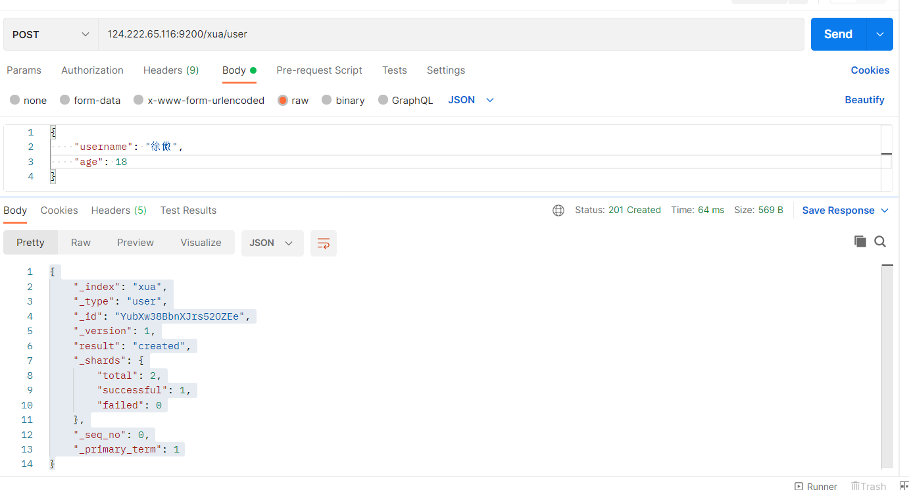

# [安装Elasticsearch](https://www.jianshu.com/p/804fe0fa6702)

## elasticSearch

1、安装Elasticsearch，kibana，**kibana的版本一定要和elasticsearch的版本一样。**

```css
docker pull elasticsearch:7.10.1
docker pull kibana:7.10.1
```

2、配置

```bash
mkdir -p /mydata/elasticsearch/config
mkdir -p /mydata/elasticsearch/data
echo "http.host: 0.0.0.0" >/mydata/elasticsearch/config/elasticsearch.yml
chmod -R 777 /mydata/elasticsearch/
```

==elasticsearch.yml中添加“http.host: 0.0.0.0”，配置Elasticsearch可被任意主机连接==

3、启动elasticsearch

```bash
docker run --name elasticsearch -p 9200:9200 -p 9300:9300 \
-e  "discovery.type=single-node" \
-e ES_JAVA_OPTS="-Xms64m -Xmx512m" \
-v /mydata/elasticsearch/config/elasticsearch.yml:/usr/share/elasticsearch/config/elasticsearch.yml \
-v /mydata/elasticsearch/data:/usr/share/elasticsearch/data \
-v  /mydata/elasticsearch/plugins:/usr/share/elasticsearch/plugins \
-d elasticsearch:7.6.2 
```

设置开机启动elasticsearch

```shell
docker update elasticsearch --restart=always
```


## DataGrip访问es

[下载驱动](https://my.oschina.net/mdxlcj/blog/5059805)


# [ElasticSearch基本操作]()

## 1、基本概念

Elasticsearch也是基于Lucene的全文检索库，本质也是存储数据，很多概念与MySQL类似的。

```
索引（indices）----------------------Databases 数据库

  类型（type）--------------------------Table 数据表

     文档（Document）----------------------Row 行

	    字段（Field）-------------------------Columns 列 
```

**要注意的是：**Elasticsearch本身就是分布式的，因此即便你只有一个节点，Elasticsearch默认也会对你的数据进行分片和副本操作，当你向集群添加新数据时，数据也会在新加入的节点中进行平衡。


## 2、索引操作

### 查询索引

查看es中有哪些索引  **xxx代表ip+端口**

```
Get xxx/_cat/indices?v
```

|     字段名     | 含义说明                                                     |
| :------------: | :----------------------------------------------------------- |
|     health     | green(集群完整) yellow(单点正常、集群不完整) red(单点不正常) |
|     status     | 是否能使用                                                   |
|     index      | 索引名                                                       |
|      uuid      | 索引统一编号                                                 |
|      pri       | 主节点几个                                                   |
|      rep       | 从节点几个                                                   |
|   docs.count   | 文档数                                                       |
|  docs.deleted  | 文档被删了多少                                               |
|   store.size   | 整体占空间大小                                               |
| pri.store.size | 主节点占                                                     |

查看所有节点

```
Get xxx/_cat/nodes
```

查看es健康状况

```
Get /_cat/health
```

查看主节点

```
Get /_cat/master
```

### 创建索引

```
PUT /索引名
```

参数可选：指定分片及副本，默认分片为3，副本为2。

```
{
    "settings": {
        "number_of_shards": 3,
        "number_of_replicas": 2
      }
}
```

演示：说明索引创建成功


### 查看索引具体信息

```
GET /索引名
```


### 删除索引

```
DELETE /索引库名
```


## 3、创建类型Type

==注意：==

> 这里一定要歪一嘴，ES在7版本开始，就逐渐不再支持多个Type了，这也是出现很多版本不适应问题的原因
> 7版本支持多个type，8版本好像就移除了
> 文档看这里https://www.elastic.co/cn/blog/moving-from-types-to-typeless-apis-in-elasticsearch-7-0
> 这是查询的接口http://localhost:9200/test/_doc/1（_doc是默认type）

==类型可以理解为，在数据库中添加表。==  这一节内容可以直接跳过。记住重点：<font>只有一个type：_doc</font>


只有配置清楚，Elasticsearch才会帮我们进行索引库的创建==（这个说法是错的）==

### 创建映射字段

```
PUT /索引库名/_mapping/类型名称?include_type_name=true
{
  "properties": {
    "字段名": {
      "type": "类型",
      "index": true，
      "store": true，
      "analyzer": "分词器"
    }
  }
}
```

类型名称：就是前面将的type的概念，类似于数据库中的不同表

字段名：类似于列名，properties下可以指定许多字段。

每个字段可以有很多属性。例如：

- type：类型，可以是text、long、short、date、integer、object等
- index：是否索引，默认为true
- store：是否存储，默认为false
- analyzer：分词器，这里使用ik分词器：`ik_max_word`或者`ik_smart`

> 示例

```json
{
    "properties": {
        "username": {
            "type": "text"
        },
        "age": {
            "type": "long"
        }
    }
}
```

### 查看映射关系

语法：

```\
Get /索引/_mapping
```

## 4、新增文档

有了索引、映射，就可以对文档进行增删改查操作了

### 基本玩法

**PUT和POST都可以**
POST新增。如果不指定id，会自动生成id。指定id就会修改这个数据，并新增版本号；
PUT可以新增也可以修改。PUT必须指定id；由于PUT需要指定id，我们一般用来做修改操作，不指定id会报错。


如果我们想要自己新增的时候指定id,发put请求。不指定id发post请求

```
PUT /索引/类型/id值
{
    ...
}

POST /索引/类型
{
    ...
}
```


> 示例



- `_source`：源文档信息，所有的数据都在里面。
- `_id`：这条文档的唯一标示，与文档自己的id字段没有关联。

### 智能判断

 <font>你不需要给索引库设置任何mapping映射，它也可以根据你输入的数据来判断类型，动态添加数据映射。</font>

测试：

```
POST 124.222.65.116:9200/xua/user
{
    "username": "徐傲",
    "age": 20,
    "stu_no": "12345",
    "c_no": "123",
    "stroe": 100
}
```

额外添加了 stu_no,c_no,store字段。我们看看查询的结果： `  Get /xua/user/_search`

```json
{
                "_index": "xua",
                "_type": "user",
                "_id": "Y-bhw38BbnXJrs5285Ee",
                "_score": 1.0,
                "_source": {
                    "username": "徐傲",
                    "age": 20,
                    "stu_no": "12345",
                    "c_no": "123",
                    "stroe": 100
                }
            }
```

这样的映射必然添加了新的字段。看看索引的映射关系：`GET /xua/_mapping`

```json
{
    "xua": {
        "mappings": {
            "properties": {
                "age": {
                    "type": "long"
                },
                "c_no": {
                    "type": "text",
                    "fields": {
                        "keyword": {
                            "type": "keyword",
                            "ignore_above": 256
                        }
                    }
                },
                "stroe": {
                    "type": "long"
                },
                "stu_no": {
                    "type": "text",
                    "fields": {
                        "keyword": {
                            "type": "keyword",
                            "ignore_above": 256
                        }
                    }
                },
                "username": {
                    "type": "text"
                }
            }
        }
    }
}
```

**新的字段都被成功映射了**


## 5、删除数据

删除使用DELETE请求，同样，需要根据id进行删除：

```
DELETE  /索引/类型/id
```

> 示例

```json
delete /xua/user/YubXw38BbnXJrs52OZEe

{
    "_index": "xua",
    "_type": "user",
    "_id": "YubXw38BbnXJrs52OZEe",
    "_version": 2,
    "result": "deleted",
    "_shards": {
        "total": 2,
        "successful": 1,
        "failed": 0
    },
    "_seq_no": 4,
    "_primary_term": 1
}
```


# [ElasticSearch组合查询]()

之前已经见识了查询功能

查询所有：

```
GET /{index}/_search
```

根据id查询：

```
GET /{index}/{type}/{id}
```

除了上述简单查询之外。elasticsearch作为搜索引擎，最复杂最强大的功能就是搜索查询功能。包括：匹配查询、词条查询、模糊查询、组合查询、范围查询、高亮、排序、分页等等查询功能。


基本查询语法如下：

```json
GET /索引库名/_search
{
    "query":{
        "查询类型":{
            "查询条件":"查询条件值"
        }
    }
}
```

这里的query代表一个查询对象，里面可以有不同的查询属性

- 查询类型：
  - 例如：`match_all`， `match`，`term` ， `range` 等等
- 查询条件：查询条件会根据类型的不同，写法也有差异，后面详细讲解


## 2.2.   匹配查询（match）

`文本字段，使用match。`

`非文本字段，使用trem。`

> 匹配所有

```json
GET /atguigu/_search
{
    "query":{
        "match_all": {}
    }
}
```

- `query`：代表查询对象
- `match_all`：代表查询所有


> 条件匹配

```json
GET /atguigu/_search
{
  "query": {
    "match": {
      "title": "小米手机"
    }
  }
}
```

查询出很多数据，不仅包括`小米手机`，而且与`小米`或者`手机`相关的都会查询到，说明多个词之间是`or`的关系。

==注意：==换成mysql语法来讲就是

**match**：分词匹配    ->   **like** %小米%   or   **like**  %手机%

**match_phrase**: 包含匹配   ->   **like**  %小米手机%

 "**查询条件**.keyword"：完整匹配   ->  **=** 小米手机

**或者**:

某些情况下，我们需要更精确查找，我们希望这个关系变成`and`，可以这样做：

```json
GET /atguigu/_search
{
  "query": {
    "match": {
      "title": {
        "query": "小米手机",
        "operator": "and"
      }
    }
  }
}
```

查询结果：

```josn
{
  "took" : 26,
  "timed_out" : false,
  "_shards" : {
    "total" : 2,
    "successful" : 2,
    "skipped" : 0,
    "failed" : 0
  },
  "hits" : {
    "total" : 1,
    "max_score" : 1.7037868,
    "hits" : [
      {
        "_index" : "atguigu",
        "_type" : "goods",
        "_id" : "1",
        "_score" : 1.7037868,
        "_source" : {
          "title" : "小米手机",
          "images" : "http://image.jd.com/12479122.jpg",
          "price" : 1999,
          "stock" : 200,
          "attr" : {
            "category" : "手机",
            "brand" : "小米"
          }
        }
      }
    ]
  }
}
```


> 子属性匹配

```json
GET /atguigu/_search
{
  "query": {
    "match": {
      "attr.brand": "小米"
    }
  }
}
```


> 多字段匹配

`match`只能根据一个字段匹配查询，如果要根据多个字段匹配查询可以使用`multi_match`

```json
GET /atguigu/_search
{
    "query":{
        "multi_match": {
            "query": "小米",
            "fields": ["title", "attr.brand.keyword"]
        }
	}
}
```


## 2.3.   词条查询（term）

`term` 查询被用于精确值 匹配，这些精确值可能是数字、时间、布尔或者那些*未分词*的**非文本字段**字符串。

```json
GET /atguigu/_search
{
    "query":{
        "term":{
            "price": 4999
        }
    }
}
```


## 2.4.   范围查询（range）

`range` 查询找出那些落在指定区间内的数字或者时间

```json
GET /atguigu/_search
{
    "query":{
        "range": {
            "price": {
                "gte":  1000,
                "lt":   3000
            }
    	}
    }
}
```

`range`查询允许以下字符：

| 操作符 |   说明   |
| :----: | :------: |
|   gt   |   大于   |
|  gte   | 大于等于 |
|   lt   |   小于   |
|  lte   | 小于等于 |


## 2.5.   布尔组合（bool)

布尔查询又叫**组合查询**

`bool`把各种其它查询通过`must`（与）、`must_not`（非）、`should`（或）的方式进行组合

```json
GET /atguigu/_search
{
    "query":{
        "bool":{
        	"must": [
        	  {
        	    "range": {
        	      "price": {
        	        "gte": 1000,
        	        "lte": 3000
        	      }
        	    }
        	  },
        	  {
        	    "range": {
        	      "price": {
        	        "gte": 2000,
        	        "lte": 4000
        	      }
        	    }
        	  }
        	]
        }
    }
}
```

注意：一个组合查询里面只能出现一种组合，不能混用


## 2.6.   过滤（filter）

所有的查询都会影响到文档的评分及排名。如果我们需要在查询结果中进行过滤，并且不希望过滤条件影响评分，那么就不要把过滤条件作为查询条件来用。而是使用`filter`方式：

```json
GET /atguigu/_search
{
  "query": {
    "bool": {
      "must": {
        "match": { "title": "小米手机" }
      },
      "filter": {
        "range": {
          "price": { "gt": 2000, "lt": 3000 }
        }
      }
    }
  }
}
```

注意：`filter`中还可以再次进行`bool`组合条件过滤。


## 2.7.   排序（sort）

`sort` 可以让我们按照不同的字段进行排序，并且通过`order`指定排序的方式

```json
GET /atguigu/_search
{
  "query": {
    "match": {
      "title": "小米手机"
    }
  },
  "sort": [
    {
      "price": { "order": "desc" }
    },
    {
      "_score": { "order": "desc"}
    }
  ]
}
```


## 2.8.   分页（from/size）

```json
GET /atguigu/_search
{
  "query": {
    "match": {
      "title": "小米手机"
    }
  },
  "from": 2,
  "size": 2
}
```

from：从那一条开始

size：取多少条


## 2.9.   高亮（highlight）

发现：高亮的本质是给关键字添加了<em>标签，在前端再给该标签添加样式即可。


```
GET /atguigu/_search
{
  "query": {
    "match": {
      "title": "小米"
    }
  },
  "highlight": {
    "fields": {"title": {}}, 
    "pre_tags": "<em>",
    "post_tags": "</em>"
  }
}
```

fields：高亮字段

pre_tags：前置标签

post_tags：后置标签


## 2.10.   结果字段过滤（_source）

默认情况下，elasticsearch在搜索的结果中，会把文档中保存在`_source`的所有字段都返回。

如果我们只想获取其中的部分字段，可以添加`_source`的过滤

```json
GET /atguigu/_search
{
  "_source": ["title","price"],
  "query": {
    "term": {
      "price": 2699
    }
  }
}
```

返回结果，只有两个字段：

```
{
  "took" : 9,
  "timed_out" : false,
  "_shards" : {
    "total" : 2,
    "successful" : 2,
    "skipped" : 0,
    "failed" : 0
  },
  "hits" : {
    "total" : 1,
    "max_score" : 1.0,
    "hits" : [
      {
        "_index" : "atguigu",
        "_type" : "goods",
        "_id" : "9",
        "_score" : 1.0,
        "_source" : {
          "price" : 2699,
          "title" : "vivo手机"
        }
      }
    ]
  }
}
```

## 2.11 聚合


#  [SpringData-Elasticsearch]()

## 1、module、pom、yaml

module创建过程直接省略。

- 修改pom文件

```xml
	 <properties>
        <java.version>1.8</java.version>
        <elasticsearch.version>7.6.2</elasticsearch.version>
    </properties>

		<dependency>
            <groupId>org.springframework.boot</groupId>
            <artifactId>spring-boot-starter-data-elasticsearch</artifactId>
        </dependency>
```


**引入spring-boot-starter-data-elasticsearch**，值得注意的是，elasticsearch中间件版本与springboot中elasticsearch客户端的版本是有对应关系的。需要在父项目pom的properties重新指定elastic版本


- 添加yaml

```yaml
spring:
  elasticsearch:
    rest:
      uris: 124.222.65.116:9200
      username:                          ---用户名
      password:                          ---密码
      connection-timeout: 1000           ---连接超时时间
      read-timeout: 1000 
```


## 2、配置configration

```java
@Configuration
public class ElasticSearchConfig {
    @Bean
    public RestHighLevelClient restHighLevelClient(){
        return new RestHighLevelClient(RestClient.builder(new HttpHost(
                "124.222.65.116",9200,"http"
        )));
    }
}
```

## 3、创建实体

```java
@Data
@Document(indexName = "user_dao", shards = 3, replicas = 2,createIndex = true)
public class User {
    @Id
    private Long id;
    @Field(type = FieldType.Text, analyzer = "ik_max_word")
    private String username;
    @Field(type = FieldType.Integer)
    private Integer age;
    @Field(type = FieldType.Keyword)
    private String password;

}
```

## **4、CRUD**

创建实体类对应的repository

```java
@Component
public interface UserElasticRepository extends ElasticsearchRepository<User,Long> {

}
```


### 增删改查示例

```java
@Component("elastic")
public class UserElasticServiceImpl implements UserElasticService{

    @Autowired
    ElasticsearchRestTemplate elasticsearchRestTemplate;

    @Autowired
    UserElasticRepository userRepository;//建议使用这个

    /**
     * 保存、覆盖数据。以ID区分
     * @param user
     */
    @Override
    public void save(User user) {
        //template
        elasticsearchRestTemplate.save(user);

        //repository
        //userRepository.save(user);

    }

    /**
     * 批量保存
     * @param userList
     */
    @Override
    public void saveAll(List<User> userList) {

        elasticsearchRestTemplate.save(userList);

        //userRepository.saveAll(userList);
    }

    /**
     * 删除
     * @param id
     */
    @Override
    public void delete(Long id) {
        //根据ID删除-indexName默认取@Document中的indexName
        elasticsearchRestTemplate.delete("1", User.class);
        //userRepository.deleteById(id);


        //自定义条件、自定义索引
        BoolQueryBuilder queryBuilder = QueryBuilders.boolQuery();
        queryBuilder.filter(QueryBuilders.matchQuery("name", "张三"));
        NativeSearchQueryBuilder builder = new NativeSearchQueryBuilder();
        builder.withQuery(queryBuilder);
        NativeSearchQuery build = builder.build();
        elasticsearchRestTemplate.delete(build, User.class);
       // userRepository.deleteAllById(); //一般都是通过id精准删除
    }

    /**
     * 更新
     * @param user
     */
    @Override
    public void update(User user) {
        //删除1：直接覆盖 save()
        elasticsearchRestTemplate.save(user);
        //userRepository.save(user);

        //删除2：通过id查询出来,修改部分信息,然后save
        User repository = userRepository.findById(user.getId()).get();
        repository.setAge(30);
        //--------------
        // save()
    }

    /**
     * 查询 
     * @return
     */
    @Override
    public List<User> search() {
        
       NativeSearchQuery query = new NativeSearchQueryBuilder()
                .withQuery(QueryBuilders.boolQuery()
                        .must(QueryBuilders.fuzzyQuery("username", "xua123"))
                        .mustNot(QueryBuilders.fuzzyQuery("age", 20L))
                        .should(QueryBuilders.fuzzyQuery("age", 10L)))
                .withPageable( PageRequest.of(0, 2))
                .withSort(SortBuilders.fieldSort("id").order(SortOrder.DESC)).build();

        SearchHits<User> searchHits = elasticsearchRestTemplate.search(query, User.class);

        return searchHits.get().map(SearchHit::getContent).collect(Collectors.toList());
        
    }

    /**
     * 查询所有
     * @return
     */
    @Override
    public List<User> findAll() {
        List<User> userList = new ArrayList<>();
         userRepository.findAll().forEach(p -> userList.add(p));
        return userList;
    }
}
```


上述代码可以解决简单的增删改。==但是==，elasticsearch强大的是搜索引擎，我们需要掌握复杂组合查询。

关键在于查询条件Query的构建。**详细了解一下Query：**

- elasticsearchRestTemplate.search是查询一个列表，用的就是ElasticsearchRestTemplate的一个对象实例；

- `NativeSearchQuery` ：是springdata中的查询条件；

- NativeSearchQueryBuilder ：用于建造一个NativeSearchQuery查询对象；

- ### **QueryBuilders** ：设置查询条件，是ES中的类；

- SortBuilders ：设置排序条件；

- HighlightBuilder ：设置高亮显示；

### 精准查询

精确，指的是查询关键字（或者关键字分词后），必须与目标分词结果完全匹配。

1.指定字符串作为关键词查询，关键词支持分词

```java
//查询title字段中，包含 ”开发”、“开放" 这个字符串的document；
QueryBuilders.queryStringQuery("开发开放").defaultField("title");
//不指定feild，查询范围为所有feild
QueryBuilders.queryStringQuery("青春");
//指定多个feild
QueryBuilders.queryStringQuery("青春").field("title").field("content");

```

2.以关键字“开发开放”，关键字不支持分词

```java
QueryBuilders.termQuery("title", "开发开放")
QueryBuilders.termsQuery("fieldName", "fieldlValue1","fieldlValue2...")

```

3.以关键字“开发开放”，关键字支持分词

```java
QueryBuilders.matchQuery("title", "开发开放")
QueryBuilders.multiMatchQuery("fieldlValue", "fieldName1", "fieldName2", "fieldName3")

```

### 模糊查询


模糊，是指查询关键字与目标关键字可以模糊匹配。

1.左右模糊查询，其中fuzziness的参数作用是在查询时，es动态的将查询关键词前后增加或者删除一个词，然后进行匹配

```java
QueryBuilders.fuzzyQuery("title", "开发开放").fuzziness(Fuzziness.ONE)
```


2.前缀查询，查询title中以“开发开放”为前缀的document；

```java
QueryBuilders.prefixQuery("title", "开发开放")
```


3.通配符查询，支持*和？，？表示单个字符；注意不建议将通配符作为前缀，否则导致查询很慢

```java
QueryBuilders.wildcardQuery("title", "开*放")
QueryBuilders.wildcardQuery("title", "开？放")
```

注意，
在分词的情况下，针对fuzzyQuery、prefixQuery、wildcardQuery不支持分词查询，即使有这种doucment数据，也不一定能查出来，因为分词后，不一定有“开发开放”这个词；

### 范围查询

```java
//闭区间查询
QueryBuilders.rangeQuery("fieldName").from("fieldValue1").to("fieldValue2");
//开区间查询，默认是true，也就是包含
QueryBuilders.rangeQuery("fieldName").from("fieldValue1").to("fieldValue2").includeUpper(false).includeLower(false);
//大于
QueryBuilders.rangeQuery("fieldName").gt("fieldValue");
//大于等于
QueryBuilders.rangeQuery("fieldName").gte("fieldValue");
//小于
QueryBuilders.rangeQuery("fieldName").lt("fieldValue");
//小于等于
QueryBuilders.rangeQuery("fieldName").lte("fieldValue");

```

### 多个关键字组合查询boolQuery()

```java
QueryBuilders.boolQuery()
QueryBuilders.boolQuery().must();//文档必须完全匹配条件，相当于and
QueryBuilders.boolQuery().mustNot();//文档必须不匹配条件，相当于not
QueryBuilders.boolQuery().should();//至少满足一个条件，这个文档就符合should，相当于or

```

### SortBuilders排序

```java
//按照id字段降序
.withSort(SortBuilders.fieldSort("id").order(SortOrder.DESC))

```

注意排序时，有个坑，就是在以id排序时，比如降序，结果可能并不是我们想要的。因为根据id排序，es实际上会根据_id进行排序，但是_id是string类型的，排序后的结果会与整型不一致。

```java
@Id
@Field(type = FieldType.Long, store = true)
private Long myId;

@Field(type = FieldType.Text, store = true, analyzer = "ik_smart")
private String title;

@Field(type = FieldType.Text, store = true, analyzer = "ik_smart")
private String content;

```

这样，后续排序可以使用myId进行排序。

### 排序

```java
 .withPageable( PageRequest.of(0, 50))
```

注意，如果不指定分页参数，es默认只显示10条。


## 5、自定义查询

Spring Data 的另一个强大功能，是根据方法名称自动实现功能。

比如：你的方法名叫做：findByTitle，那么它就知道你是根据title查询，然后自动帮你完成，无需写实现类。

当然，方法名称要符合一定的约定：

| Keyword               | Sample                                                       | Elasticsearch Query String                                   |
| :-------------------- | :----------------------------------------------------------- | :----------------------------------------------------------- |
| `And`                 | `findByNameAndPrice`                                         | `{"bool" : {"must" : [ {"field" : {"name" : "?"}}, {"field" : {"price" : "?"}} ]}}` |
| `Or`                  | `findByNameOrPrice`                                          | `{"bool" : {"should" : [ {"field" : {"name" : "?"}}, {"field" : {"price" : "?"}} ]}}` |
| `Is`                  | `findByName`                                                 | `{"bool" : {"must" : {"field" : {"name" : "?"}}}}`           |
| `Not`                 | `findByNameNot`                                              | `{"bool" : {"must_not" : {"field" : {"name" : "?"}}}}`       |
| `Between`             | `findByPriceBetween`                                         | `{"bool" : {"must" : {"range" : {"price" : {"from" : ?,"to" : ?,"include_lower" : true,"include_upper" : true}}}}}` |
| `LessThanEqual`       | `findByPriceLessThan`                                        | `{"bool" : {"must" : {"range" : {"price" : {"from" : null,"to" : ?,"include_lower" : true,"include_upper" : true}}}}}` |
| `GreaterThanEqual`    | `findByPriceGreaterThan`                                     | `{"bool" : {"must" : {"range" : {"price" : {"from" : ?,"to" : null,"include_lower" : true,"include_upper" : true}}}}}` |
| `Before`              | `findByPriceBefore`                                          | `{"bool" : {"must" : {"range" : {"price" : {"from" : null,"to" : ?,"include_lower" : true,"include_upper" : true}}}}}` |
| `After`               | `findByPriceAfter`                                           | `{"bool" : {"must" : {"range" : {"price" : {"from" : ?,"to" : null,"include_lower" : true,"include_upper" : true}}}}}` |
| `Like`                | `findByNameLike`                                             | `{"bool" : {"must" : {"field" : {"name" : {"query" : "?*","analyze_wildcard" : true}}}}}` |
| `StartingWith`        | `findByNameStartingWith`                                     | `{"bool" : {"must" : {"field" : {"name" : {"query" : "?*","analyze_wildcard" : true}}}}}` |
| `EndingWith`          | `findByNameEndingWith`                                       | `{"bool" : {"must" : {"field" : {"name" : {"query" : "*?","analyze_wildcard" : true}}}}}` |
| `Contains/Containing` | `findByNameContaining`                                       | `{"bool" : {"must" : {"field" : {"name" : {"query" : "**?**","analyze_wildcard" : true}}}}}` |
| `In`                  | `findByNameIn(Collection<String>names)`                      | `{"bool" : {"must" : {"bool" : {"should" : [ {"field" : {"name" : "?"}}, {"field" : {"name" : "?"}} ]}}}}` |
| `NotIn`               | `findByNameNotIn(Collection<String>names)                                                     ` | `{"bool" : {"must_not" : {"bool" : {"should" : {"field" : {"name" : "?"}}}}}}` |
| `Near`                | `findByStoreNear`                                            | `Not Supported Yet !`                                        |
| `True`                | `findByAvailableTrue`                                        | `{"bool" : {"must" : {"field" : {"available" : true}}}}`     |
| `False`               | `findByAvailableFalse`                                       | `{"bool" : {"must" : {"field" : {"available" : false}}}}`    |
| `OrderBy`             | `findByAvailableTrueOrderByNameDesc`                         | `{"sort" : [{ "name" : {"order" : "desc"} }],"bool" : {"must" : {"field" : {"available" : true}}}}` |


根据手机名查找手机

```java
//自定义方法,根据Title查询
  @Test
  public void findByTitle(){
    Item item = this.itemRepository.findByTitle("坚果pro");
    System.out.println(item);
  }
```

区间查询

```java
//根据区间查询
  @Test
  public void queryByPriceBetween(){
    List<Item> list = this.itemRepository.findByPriceBetween(2000.00, 3500.00);
    for (Item item : list) {
      System.out.println("item = " + item);
    }
  }
```

模糊查询

```java
//模糊查询
  @Test
  public void queryLikeTitle(){
    List<Item> list = this.itemRepository.findByTitleLike("R2");
    for (Item item : list){
      System.out.println(item);
    }
  }
```

使用自定义方法需要在接口里面申明方法

```java
public interface ItemRepository extends ElasticsearchCrudRepository<Item,Long> {
  Item findByTitle(String title);
  List<Item> findByPriceBetween(double price1, double price2);
  List<Item> findByTitleLike(String title);
}
```


 
