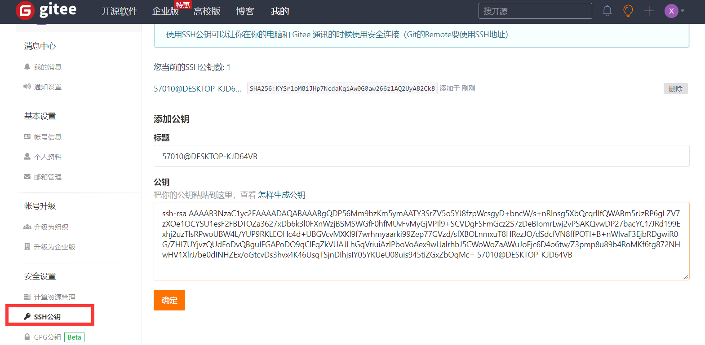
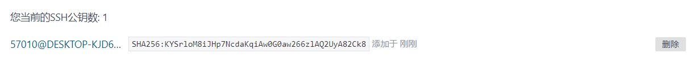

# git操作手册

[toc]

## 基本配置

- 查看配置

```shell
git config -l //配置清单

git config --system --list //系统配置

git config --global  --list //用户自己的配置
```

- 配置文件在本地！！！系统配置在git安装目录的etc/[gitconfig](file://D:\Program Files\Git\etc\gitconfig)中，用户配置在[用户文件夹](C://用户/57010/.gitconfig)

```java
git config --global user.name "" //配置用户名

git config --global user.email 570105240@qq.com
```

## 核心理论

- 本地仓库有一个==远程分支==，版本不会自动同步。需要手动更新，fetch

- 提交代码时，远程仓库的分支，会和本地仓库的分支对比版本，版本不一致需要更新
- 拉取远程仓库的版本，合并到本地，有两种方法
  - merge，合并本地仓库并覆盖工作区代码，==换言之==，merge前需要提交，否则工作区代码没了
  - rebase，合并到本地仓库，不覆盖工作区代码


## 创建本地仓库

- 创建全新的仓库，需要用GIT管理的项目的根目录执行

```shell
#在当前目录新建一个Git代码库
git  init
#在远程库创建仓库，浏览器上点击创建 gitee.com
#将本地库上传至gitee
git remote add orgin 仓库名(git remote add origin https://gitee.com/xuaoGitee/rabbit-mq.git)
//如果报错 error: remote origin already exists.
#删除远程仓库
git remote rm origin
```

- 克隆远程仓库

```shell
git clone [url]
#查看远程仓库
查看远程仓库：$ git remote -v
```


##  分支

- 查看分支

  ```shell
  查看本地分支：$ git branch
  查看远程分支：$ git branch -r
  查看关联关系: $ git branch -vv
  ```

- 创建分支

  ```shell
  创建本地分支：$ git branch [name]
  ```

- 切换分支

  ```shell
  切换分支：$ git checkout [name]
  创建新分支切换：$ git checkout -b [name]
  ```

- 关联分支 

  ```shell
  创建远程分支(本地分支push到远程)：$ git push --set-upstream origin [name]
  也可以直接$ git push
  ```

- 删除分支

  ```shell
  删除分支：$ git branch -d [name] ---- -d选项只能删除已经参与了合并的分支，对于未有合并的分支是无法删除的。如果想强制删除一个分支，可以使用-D选项
  删除远程分支：$ git push origin :heads/[name]
  ```

- ==重点：==合并分支

  ```shell
  #更新本地的远程仓库与远程仓库一致
  git fetch orifin 分支名
  #合并目标分支到当前分支(工作区代码会更新)
  git merge origin/分支名
  ```

##  提交代码

```shell
#查看状态
git status 
#将工作区所有，添加暂存区
git add.  
#提交到本地库
git commit -m "日志"
#拉去远程分支最新版本到本地
git pull
#提交到远程库，默认是当前分支-----
git push  

---------------------
#当本地push到远程，本地回滚了版本,然后本地仓库有了新的commit，这个时候git push 是不会成功的
git push -fore (简写  -f)   强制覆盖

```


## **提交代码 非正常玩法**

```sh
#将一个分支的commit提交到另一个分支
1、可以使用git log 命令 或去gitlab界面找 commit的ID号，比如 026d0203

2、切换到目标分支上(即在要合并到的分支上)，执行命令：

git cherry-pick aabb4d0203
```


## 忽略部分文件提交

.gitignore文件  一般添加如下配置：

```java
**/mvnw
**/mvnw.cmd
**/.mvn
**/target
.idea
**/.gitignore
```


##  回滚版本

通过查看提交历史，复制版本号！！！

```bash
git reset --mixed head^/head~1 //不删除工作空间改动代码，撤销commit，撤销add
git reset --soft//不删除工作空间改动代码，撤销commit，不撤销add
git reset --hard HEAD//删除工作空间改动代码，撤销commit，撤销add
```

切换分支时，不想提交代码

```bash
git stash //将目前还不想提交的但是已经修改的内容进行保存至堆栈中
#进行任意操作，修改其他分支代码；pull代码；
git stash pop //将堆栈中的内容恢复到其他任意指定的分支上
```

## 申请合并分支

- merge Request

  待编写

## 码云

1.注册gitee


2.设置本机绑定ssh公钥，实现免密码登录！

```
//生成公钥，文件保存在用户目录的.ssh目录
ssh-keygen -t rsa  //-t 后面接加密算法
//将公钥(带pub)复制到    码云设置中的ssh公钥
```





##  Linux安装git

###  yum安装git

- 在linux上使用yum安装git非常简单，只需要一行命令

```shell
yum install git
```

- 查看版本号

```shell
输入git --version检查git是否安全完成，以及查看其版本号。
```

顺便说一下，yum安装git被安装在/usr/libexec/git-core目录下。
==yum安装的git的版本是1.8.3，版本很低，所以我们从gitHub上下载最新的安装==

### github下载、安装git

yum安装这么简单，为什么还要学从github上下载最新的源码编译后安装呢？
刚才输入git --version命令的时候相信大家也看到了，是1.8.3.1版本，这个版本还是蛮旧的。yum安装就是这个缺点，版本你不好控制。如果想要使用最新版的git，那还是得自己下载源码安装。具体怎么做呢？

我们还是从一个什么都没安装的linux服务器开始示范。

1.进入git在github上的发布版本页面https://github.com/git/git/releases。在这个页面我们可以找到所有git已发布的版本。这里我们选择最新版的tar.gz包。


git在github上的仓库
2.获取到最新包的下载链接后，我们进入linux服务器，开始下载。

wget https://codeload.github.com/git/git/tar.gz/v2.13.0-rc1
耐心等待下载完成。我们可以看到下载后的文件名是v2.13.0-rc1，并不是压缩包的格式，不用担心，这只是链接的问题，手动修改文件名为v2.13.0-rc1.tar.gz。

```shell
mv v2.13.0-rc1 v2.13.0-rc1.tar.gz

下载git源码
解压压缩包

tar -zxvf v2.13.0-rc1.tar.gz
进入解压后的文件夹

cd git-2.13.0-rc1

源码解压完成
3.拿到解压后的源码以后我们需要编译源码了，不过在此之前需要安装编译所需要的依赖。输入如下命令。

yum install curl-devel expat-devel gettext-devel openssl-devel zlib-devel gcc perl-ExtUtils-MakeMaker
耐心等待安装完成，中途出现提示的时候输入y并按回车。


编译源码依赖安装完成
4.提示，安装编译源码所需依赖的时候，yum自动帮你安装了git，这时候你需要先卸载这个旧版的git。

yum remove git
耐心等待删除完成，中途出现提示的时候输入y并按回车。


移除旧版git
5.编译git源码

make prefix=/usr/local/git all
耐心等待编译完成，中途可能会花费几分钟的时间。


git源码编译完成
6.安装git至/usr/local/git路径

make prefix=/usr/local/git install
等待安装完成


git安装完成
7.打开环境变量配置文件

vim /etc/profile
在底部加上git相关配置

PATH=$PATH:/usr/local/git/bin
export PATH

修改环境变量
刷新环境变量

source /etc/profile
8.输入git --version检查git是否安全完成，以及查看其版本号。
```


# 命令大全

**将远程库代码 克隆到本地**

git clone ...  // 后面的 ... 是你远程仓库的地址,可以是https、https 或者 ssh地址，如果是第一次安装使用需要设置邮箱 

```shell
      git config user.name 你的用户名
      git config user.email 你的邮箱
```

使用http和https第一次拉取时需要输入你在远程仓库中设置的 克隆账号和密码 （这个应该是单独设置的）

使用ssh地址拉取

注：ssh地址需要你 在本地生成公钥和私钥，然后将公钥设置到你所使用的代码库中 (可以查看本人的 配置 SSH 密钥 这篇文章 )

## 拉取远程代码以及提交本地修改的代码

上面我们将远程的代码库拉取到了本地，第一次拉取默认为master分支

```shell
拉取远程代码以及提交本地修改的代码
git pull                                                                     // 拉取并合并远程代码到本地
git add .                                                                   // 保存全部已经修改的文件
git commit -m "aaa"                                               // 做了哪些修改可写入 "" 双引号里 可以为数字、中文、英文、标点（我只用过基本的标点）
git push                                                                  // 推送到远程仓库
git push -u origin/branch                                       // 远程已有branch分支但未关联本地分支localBranch且本地已经切换到localBranch
git push origin localBranch:remoteBranch            // 远程没有remoteBranch分支并，本地已经切换到localBranch
只提交部分修改了的文件
 git status -s                   // 查看仓库状态
 git add .                         // src/components/文件名 添加需要提交的文件名（加路径--参考git status 打印出来的文件路径）
 git stash -u -k                // 忽略其他文件，把现修改的隐藏起来，这样提交的时候就不会提交未被add的文件
 git commit -m "aaa"      // 做了哪些修改可写入 "" 双引号里 可以为数字、中文、英文、标点（我只用过基本的标点）
 git pull                           // 拉取合并
 git push                         // 推送到远程仓库
 git stash pop                // 恢复之前忽略的文件（非常重要的一步）
分支创建切换删除
git fetch                                                  // 同步远程分支与代码到本地
git fetch origin test                                //  拉取远程的 test 分支到本地
git branch dev                                       // 创建一个名字为 dev 的分支 
git branch                                              // 查看本地分支
git branch -a                                          // 查看所有分支（本地和远程）
git branch -d dev                                   // 删除本地名字为dev的分支（需要切换到非dev分支）
git branch -D dev                                  // 强制删除本地分支（需要切换到非dev分支）
git push origin --delete dev                 //  删除远程分支名字为dev的分支
git checkout dev                                   // 切换到dev分支上（记着切换分支前要清理存储树）否则会切换失败
git checkout -b dev                              // 创建名字为 dev 的分支  并切换到 dev 分支
git checkout -b localDev origin/dev     // 创建名字为 localDev 的本地分，并且同步绑定分支名为 dev 的远程分支
git 版本回滚
使用 commit 日志回退
git log                       // 查看提交的代码日志 从近到远 （ --pretty=oneline 只看提交id和信息 ）
git reset --hard id     // 根据 id 回退到指定的版本
使用 tag 回退
git tag -a v1.01                                // 打标签，-a 是添加标签，后面是新标签号，可以加 -m 后面的字符串是对该标签的描述 例：git tag -a v1.01 -m "Relase version 1.01"
git tag 或 git tag -l                          // 查看标签
git push origin --tags                     // 提交标签到远程仓库 (像 git push origin master) --tags可以把本地的打的标签全部提交到远程仓库。
git tag -d v1.01                                // 删除标签
git push origin :refs/tags/v1.01     // 删除远程标签
使用 git reflog 回滚（一般用于操作失误，这里举例：误删远程分支）
git reflog --date=iso                                   // 选项 --date=iso，表示以标准时间格式展示
git checkout -b branch commitid              // branch 为你要检出的分支名字一般为一个新分支，commitid  为执行git reflog 之后会显示
git push origin branch                              // branch 为要同步的远程分支名字
```

## git stash 使用  

应用场景：copy这位大佬，详细的解释git stash：https://blog.csdn.net/stone_yw/article/details/80795669

1 当正在dev分支上开发某个项目，这时项目中出现一个bug，需要紧急修复，但是正在开发的内容只是完成一半，还不想提交，这时可以用git stash命令将修改的内容保存至堆栈区，然后顺利切换到hotfix分支进行bug修复，修复完成后，再次切回到dev分支，从堆栈中恢复刚刚保存的内容。

2 由于疏忽，本应该在dev分支开发的内容，却在master上进行了开发，需要重新切回到dev分支上进行开发，可以用git stash将内容保存至堆栈中，切回到dev分支后，再次恢复内容即可。

总的来说，git stash命令的作用就是将目前还不想提交的但是已经修改的内容进行保存至堆栈中，后续可以在某个分支上恢复出堆栈中的内容。这也就是说，stash中的内容不仅仅可以恢复到原先开发的分支，也可以恢复到其他任意指定的分支上。git stash作用的范围包括工作区和暂存区中的内容，也就是说没有提交的内容都会保存至堆栈中。

以下命令总结

 

```shell
git stash save "aaa"                       // 执行存储时，添加备注，方便查找，只有git stash 也要可以的，但查找时不方便识别。
git stash list                                   // 查看stash了哪些存储
git stash show                               // 显示做了哪些改动，默认show第一个存储,如果要显示其他存贮，后面加stash@{$num}，比如第二个 git stash show stash@{1}
git stash show -p                           // 显示第一个存储的改动，如果想显示其他存存储，命令：git stash show  stash@{$num}  -p ，比如第二个：git stash show  stash@{1}  -p
git stash apply                               // 应用某个存储,但不会把存储从存储列表中删除，默认使用第一个存储,即stash@{0}，如果要使用其他个，git stash apply stash@{$num} ， 比如第二个：git stash apply stash@{1} 
git stash pop                                  // 命令恢复之前缓存的工作目录，将缓存堆栈中的对应stash删除，并将对应修改应用到当前的工作目录下,默认为第一个stash,即stash@{0}，如果要应用并删除其他stash，命令：git stash pop stash@{$num} ，比如应用并                                                              删除第二个：git stash pop stash@{1}
git stash drop stash@{$num}       // 丢弃stash@{$num}存储，从列表中删除这个存储
git stash clear                                // 删除所有缓存的stash
git rebase 使用
使用场景：这个命令会让你的git分支看起来非常的整齐，会将分支合并为一条线避免出现Git历史记录因为各种切分支合并分支导致的历史线非常乱。（左图为3人开发的历史线，右图是两开发的历史线）
```

具体命令如下

 

```shell
git checkout master              // 切换到需要合并的本地分支
git pull                                    // 同步本地分支，拉取远程分支内容
git checkout localBreach       // 切换回修改了的本地分支（已经commit过）
git rebase -i HEAD~2             // 合并提交 2表示合并两个 也可以直接rebase 
git rebase master                   // git rebase master -> 解决冲突 -> git rebase --continue
git checkout master               // 切换到需要合并的分支
git merge localBreach            // 合并分支
git push                                  // 推送到远程
```

git cherry-pick 使用

使用场景：将代码从一个分支转移到另一个分支是常见需求，这个命令可以将任意分支中你需要的commit 拣选到你当前的分支，可以先去看看[阮一峰大哥的笔记](http://www.ruanyifeng.com/blog/2020/04/git-cherry-pick.html)

