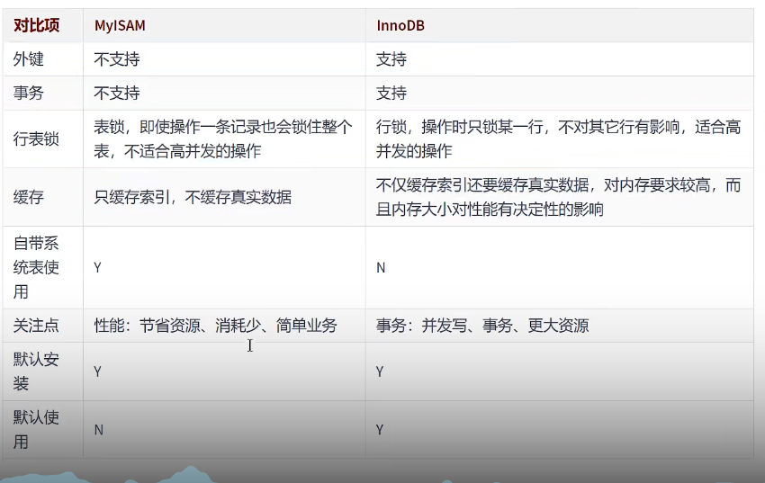

# 存储引擎

为了管理方便，人们把`连接管理`、`查询缓存`、`语法解析`、`查询优化`这些
并不涉及真实数据存储的功能划分为Mysql server的功能，把真实存取数据的功能划分为存储引擎的功能。所以在Mysql server完成了查询优化后，只需按照生成的`执行计划`调用底层引擎提供的API，获取到数据后返回给客户端就好了。
Mysql中提到了存储引擎的概念。简而言之，`存储引擎就是指表的类型`。其实存储引擎以前叫做`表处理器`。

## 1、查看存储引擎

- 查看mysql提供什么存储引擎:
 ```bash
 show engines;
 ```

查看默认的存储引擎:

``` bash
show variables like '%storage_engine% ' ;
#或者
SELECT @default_storage_engine;
```

## 2、修改默认的存储引擎

如果在创建表的语句中没有显式指定表的存储引擎，那就会默认使用InnoDB作为表的存储引擎。如果我们想修改表的默认存储引擎的话，可以这样写启动服务器的命令行:

```bash
SET DEFAULT_STORAGE_ENGINE=MyISAM;
```

或者修改my.cnf文件:

```bash
default-store-engine=MyISAM
#重启服务
systemctl restart mysqld.service、
```

1

## 3、设置表的存储引擎

存储引擎是负责对表中的数据进行提取和写入工作的，我们可以为不同的表设置不同的存储引擎，也就是说不同的表可以有不同的物理存储结构，不同的提取和写入方式。

### 3.1创建表时指定存储引擎

创建表默认使用`InnoDB`。如果我们想显式的指定一下表的存储引擎，可以这么写:i'sh

```bash 
create table表明(
	建表语句;
)engine =存储引擎名称;
#例如
create table test (
	id int;
) engine = MyISAM;
```


## 4、引擎介绍
### 4.1 InnoDB引擎:具备外键支持功能的事务存储引擎

- Mysql从3.23开始就包含InnoDB存储引擎。`大于5.5之后，默认采用InnoDB引擎`- InnoDB是mysql的默认事务型引擎，它被用来设计处理大量的短期事务。可以确保事务的完整提交和回滚
- 除了增加和查询外，还需要更新、删除操作。那么，应优先选择InnoDB引擎
- **除非有非常特别的原因需要使用其他的存储引擎，否则应该有限考虑InnoDB引擎**
- InnoDB是**为处理巨大数据量的最大性能设计**
- 对比MyISAM的存储引擎，InnoDB写的处理效率差一些，并且会占用更多的次哦按空间以保存数据和索引
- MyISAM只缓存索引，不缓存真实数据;InnoDB不仅缓存索引还要缓存真实数据，`对内存要求较高`，而且内存大小对性能有决定性的影响。

### MyISAM引擎：主要得非事务处理存储引擎

- 不支持事务，行级锁，外键。有一个毫无疑问得缺陷就是崩溃后无法安全恢复
- 5.5之前默认得存储引擎
- 优势是访问的`速度快`
- 应用场景：只读应用或者以读为主的业务



# 索引的数据结构

## 1、为什么使用索引

`索引是存储引擎用于快熟找到数据记录的一种数据结构`，就好比一本教课书的目录部分，通过目录中找到对应文章的页码，便可快速点味道需要的文章。Mysql中也是一样的道理，进行数据查找时，首先查看条件是否命中某条索引，符合则`快速索引查找`相关数据，如果不符合则需要`全表扫描`，即一条一条地查找记录，知道找到与条件符合的记录。


主要体现在`减少磁盘I/O的次数`


## 2、索引及其优缺点

### 2.1、索引概述

Mysql官方对索引的定义为：==索引（Index）是帮助Mysql高效获取数据的数据结构==

`索引的本质：`索引是数据结构。这些数据结构以某种方式指向数据，这样就可以在这些数据结构的基础上实现`高级查找算法`

**索引是在存储引擎中实现的，**因此每种存储引擎的索引不一定完全相同，并且每种存储引擎不一定支持所有索引类型。同时，存储引擎可以定义每张表的最大索引数和最大索引长度。所有存储引擎支持每个表至少16哥索引，总索引长度至少为256字节。有些存储引擎支持更多的索引输和更大的索引长度。

### 优点

1. 降低数据库`I/O`成本。类似于，一个图书馆有100w册图书，没有索引目录就需要一个一个去查看书的详细信息。查找一次就相当于一次I/O，非常耗费资源
2. 创建唯一索引，可以保证`数据的唯一性`
3. 对有依赖的子表和父表连接时速度更快
4. 在使用分组和排序子句进行查询时，可以显著`减少查询中分组和排序的时间`


## 3、InnoDB中索引的推演

### 3.1、索引之前的查找

```sql
select * from table where xxx = 'xxx'
```

1、在一个页中查找

假设目前表中的记录比较少，所有的记录都可以被存放到一个页中，根据搜索条件分为两种

- 以主键为搜索条件

  可以在页目录中使用`二分法`快速定位到对应的槽，然后再遍历该槽对应分组中的记录即可以快速找到指定的记录

- 以其他列作为搜索条件

  数据没有对非主键建立所谓的页目录。只能从`最小`记录开始`依次遍历`

2、在很多页中查找


